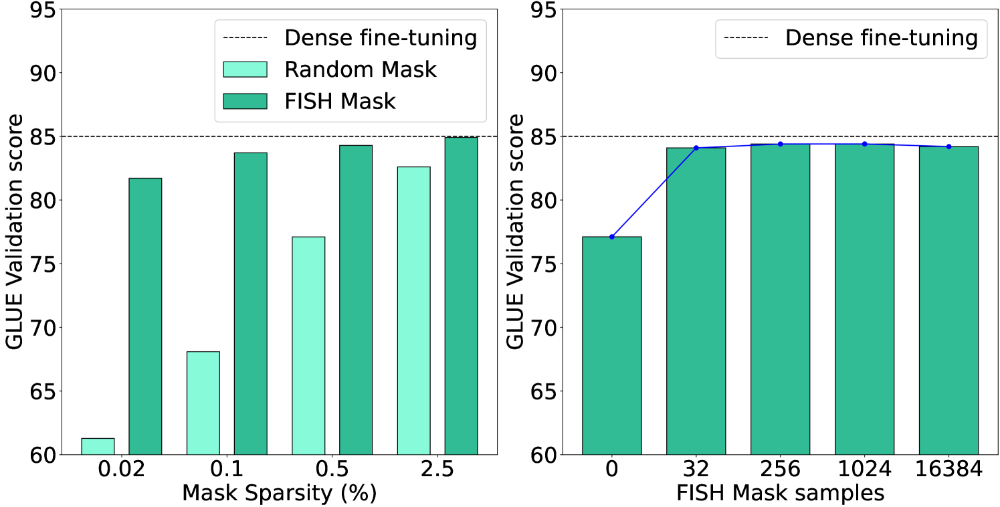
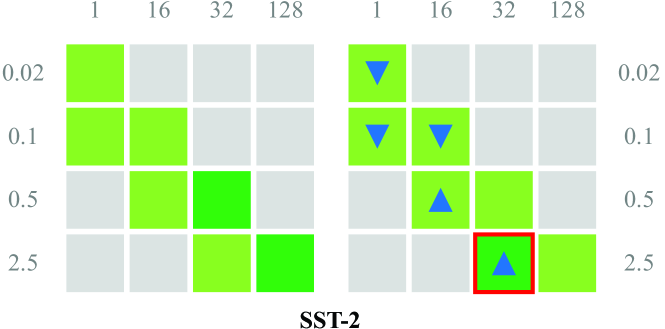
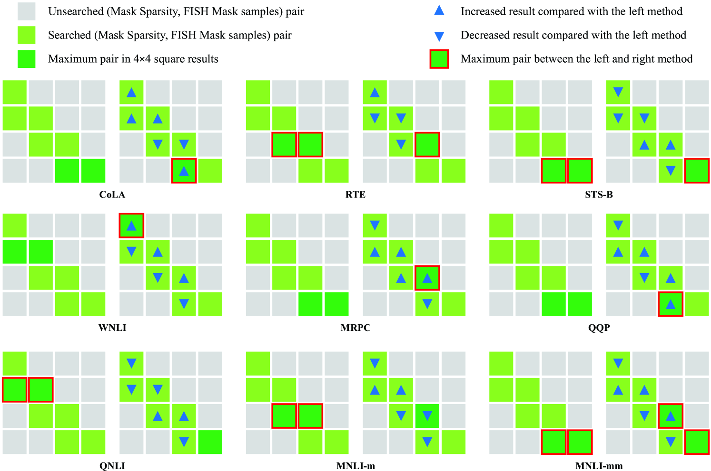
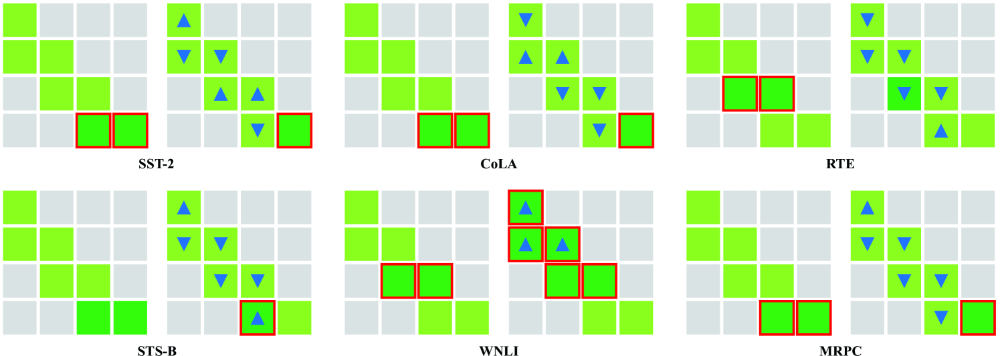

# [本研究提出一种面向数据的动态微调参数选取策略，专为FISH Mask高效微调设计。该策略旨在针对不同的数据集特性，智能地选取并调整FISH Mask模型的微调参数，以实现更高效、精准的模型优化。]

发布时间：2024年03月13日

`LLM应用` `模型微调`

> Data-oriented Dynamic Fine-tuning Parameter Selection Strategy for FISH Mask based Efficient Fine-tuning

> 面对LLMs庞大的参数量，全面调整成本高昂，因而针对特定参数进行精细化微调更显明智。多数PEFT技术侧重于参数挑选策略，比如附加法、选择性法及基于重参数化的方法，但鲜有研究关注数据样本对参数选择的影响，其中鱼Mask方法即为一例。鱼Mask随机抽取部分数据样本并在参数筛选阶段同等对待，导致其难以适应动态变化的数据分布，从而选出最佳参数组合。本研究从数据角度出发，创新性地提出了IRD算法，旨在逐步缩小搜索范围，为FISH Mask寻找最优样本-参数搭配。该算法每轮迭代都会探寻信息量更大的样本与参数集合，以期在不同规模下寻得更优的样本-参数对。我们通过在GLUE基准上的实验证明了这一策略的有效性和合理性，实验结果表明，这一策略成功优化了参数选择过程，并获得了理想的性能表现。

> In view of the huge number of parameters of Large language models (LLMs) , tuning all parameters is very costly, and accordingly fine-tuning specific parameters is more sensible. Most of parameter efficient fine-tuning (PEFT) concentrate on parameter selection strategies, such as additive method, selective method and reparametrization-based method. However, there are few methods that consider the impact of data samples on parameter selecting, such as Fish Mask based method. Fish Mask randomly choose a part of data samples and treat them equally during parameter selection, which is unable to dynamically select optimal parameters for inconstant data distributions. In this work, we adopt a data-oriented perspective, then proposing an IRD ($\mathrm{\underline I}$terative sample-parameter $\mathrm{\underline R}$ange $\mathrm{\underline D}$ecreasing) algorithm to search the best setting of sample-parameter pair for FISH Mask. In each iteration, by searching the set of samples and parameters with larger Fish information, IRD can find better sample-parameter pair in most scale. We demonstrate the effectiveness and rationality of proposed strategy by conducting experiments on GLUE benchmark. Experimental results show our strategy optimizes the parameter selection and achieves preferable performance.

[Arxiv](https://arxiv.org/abs/2403.08484)