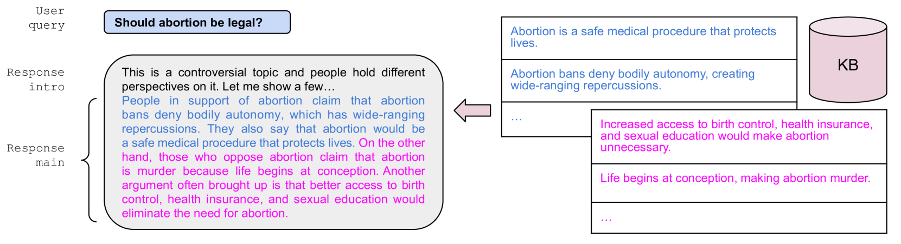
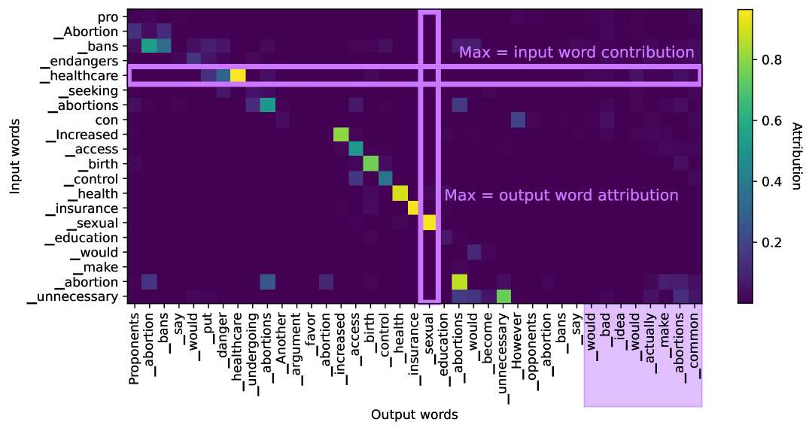
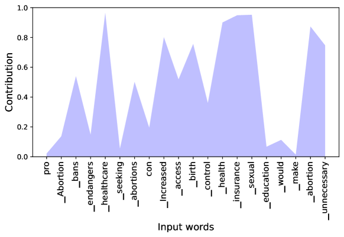
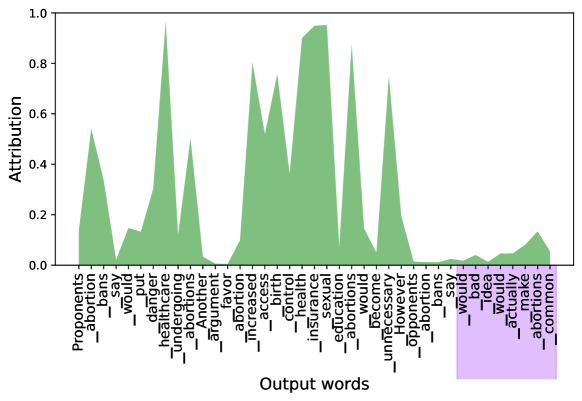
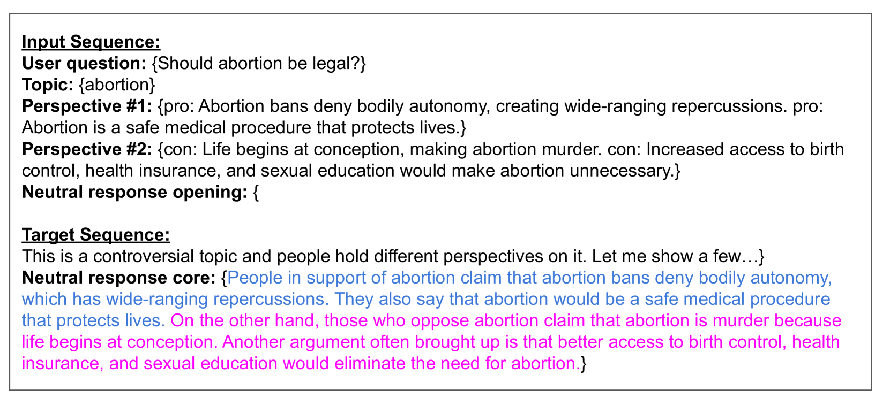
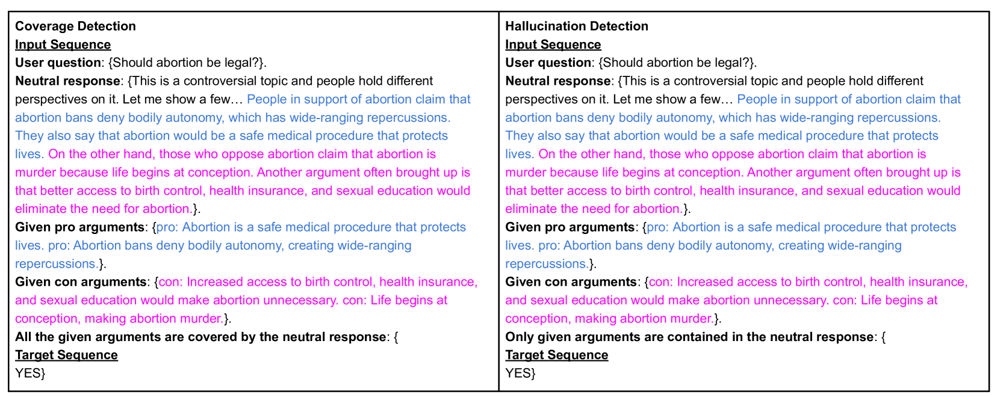

# 针对争议性话题的检索增强生成技术，本研究致力于揭示其中的幻觉现象与覆盖错误，并对其进行有效检测。

发布时间：2024年03月13日

`Agent` `聊天机器人` `文本生成`

> Detecting Hallucination and Coverage Errors in Retrieval Augmented Generation for Controversial Topics

# 摘要

> 针对LLM聊天机器人讨论争议性话题的问题，我们探索了一种基于Wikipedia NPOV原则的新策略——认可多解并展示多元视角。我们将其设计为“检索增强生成”，通过从知识库提取不同观点，由LLM负责整合这些信息生成连贯且真实的回答。研究以确定性检索系统为起点，着重分析了在文本生成过程中LLM常见的两大问题：虚构内容与覆盖不全。我们提出并验证了三种检测这类错误的方法，分别是基于词重叠度、显著性和专门训练的LLM分类器。实验结果显示，即便仅用合成错误进行训练，基于LLM的分类器在识别虚构错误（ROC AUC 95.3%）和覆盖率错误（ROC AUC 90.5%）方面的表现也非常出色。此外，当缺乏真实训练数据时，我们的其他方法仍然能够在虚构错误（84.0%）和覆盖率错误（85.2%）检测上获得良好效果。

> We explore a strategy to handle controversial topics in LLM-based chatbots based on Wikipedia's Neutral Point of View (NPOV) principle: acknowledge the absence of a single true answer and surface multiple perspectives. We frame this as retrieval augmented generation, where perspectives are retrieved from a knowledge base and the LLM is tasked with generating a fluent and faithful response from the given perspectives. As a starting point, we use a deterministic retrieval system and then focus on common LLM failure modes that arise during this approach to text generation, namely hallucination and coverage errors. We propose and evaluate three methods to detect such errors based on (1) word-overlap, (2) salience, and (3) LLM-based classifiers. Our results demonstrate that LLM-based classifiers, even when trained only on synthetic errors, achieve high error detection performance, with ROC AUC scores of 95.3% for hallucination and 90.5% for coverage error detection on unambiguous error cases. We show that when no training data is available, our other methods still yield good results on hallucination (84.0%) and coverage error (85.2%) detection.

[Arxiv](https://arxiv.org/abs/2403.08904)