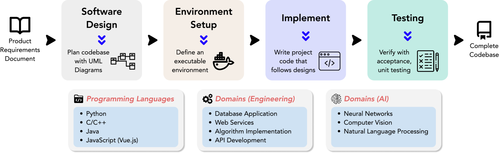
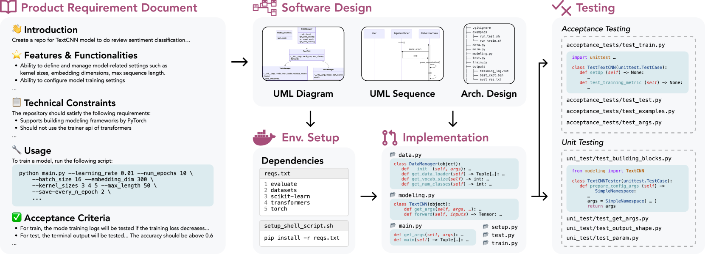
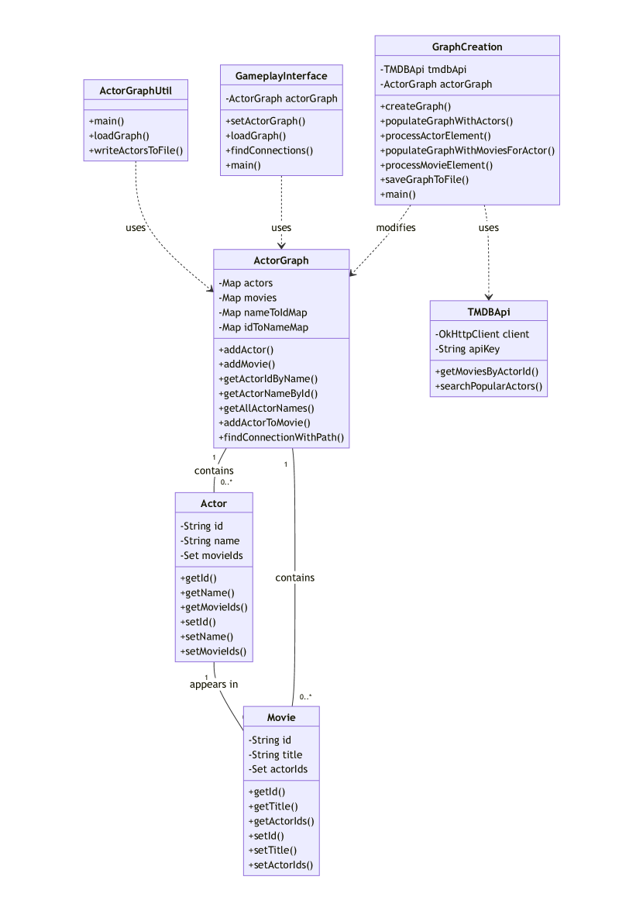
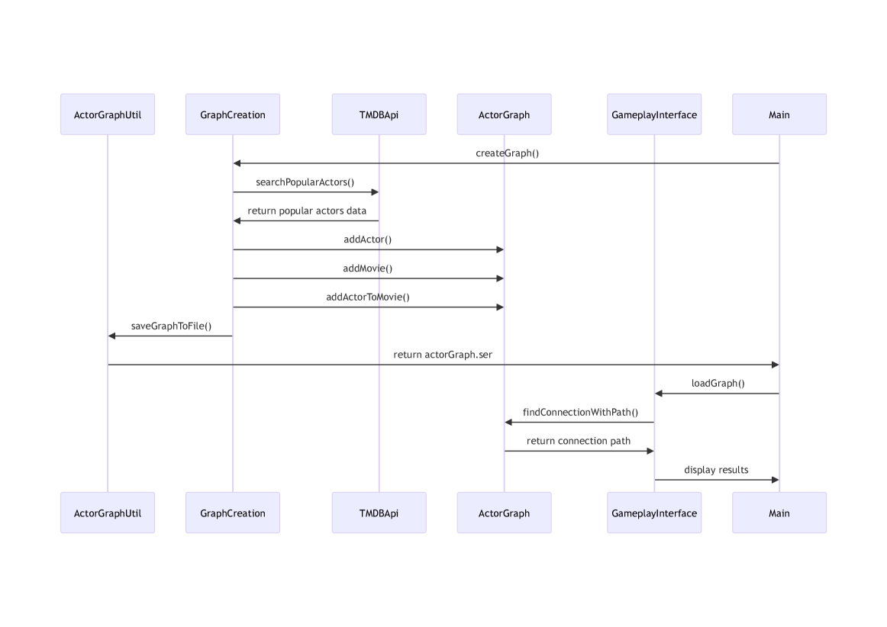
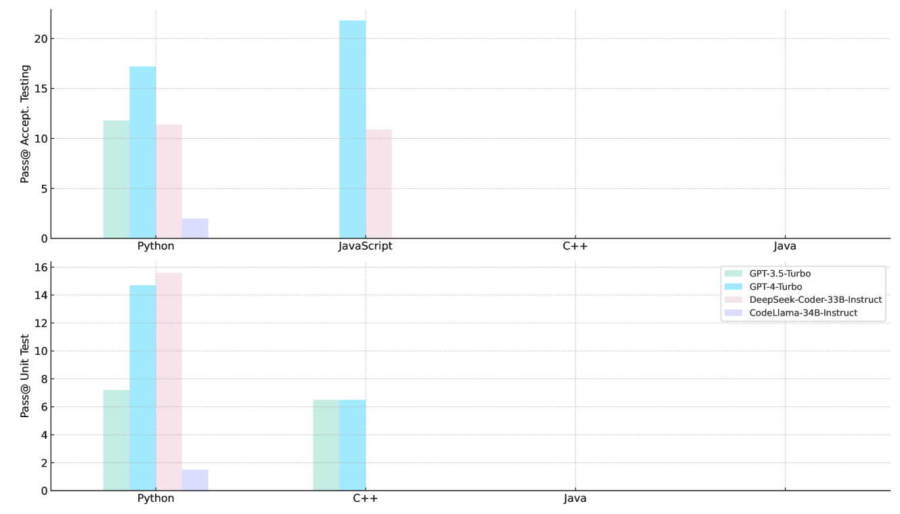

# DevBench 是一款综合全面的软件开发基准测试平台，旨在为开发者提供衡量和比较不同开发环境、工具及实践效果的标准参照。

发布时间：2024年03月13日

`LLM应用` `软件开发`

> DevBench: A Comprehensive Benchmark for Software Development

# 摘要

> 近年来 LLMS 在编码领域的突破性进展显著提升了它们的能力，但现有基准多侧重于编程的单一或孤立侧面，例如单个文件代码生成或代码仓库问题调试，尚无法全面覆盖实际编程活动所带来的全套难题。为此，我们创新推出 DevBench 这一综合评测基准，它横跨整个软件开发生命周期的不同阶段，如软件设计、环境搭建、实施、验收测试及单元测试，来评估 LLMs 的性能。DevBench 支持多种编程语言和领域，以高标准采集数据，并针对每项任务精心设计并验证了各项评价指标。经实证研究发现，当前的 LLMs 包括 GPT-4-Turbo 在应对 DevBench 所设挑战时仍显力不从心。分析揭示，模型在理解代码仓库中复杂的组织结构、驾驭编译流程以及领悟高端编程概念等方面存在问题。这些发现为我们指引了未来研发更适用于真实编程应用场景的 LLMs 的具体方向。现在，您可以在 https://github.com/open-compass/DevBench 上获取这一基准测试工具。

> Recent advancements in large language models (LLMs) have significantly enhanced their coding capabilities. However, existing benchmarks predominantly focused on simplified or isolated aspects of programming, such as single-file code generation or repository issue debugging, falling short of measuring the full spectrum of challenges raised by real-world programming activities. To this end, we propose DevBench, a comprehensive benchmark that evaluates LLMs across various stages of the software development lifecycle, including software design, environment setup, implementation, acceptance testing, and unit testing. DevBench features a wide range of programming languages and domains, high-quality data collection, and carefully designed and verified metrics for each task. Empirical studies show that current LLMs, including GPT-4-Turbo, fail to solve the challenges presented within DevBench. Analyses reveal that models struggle with understanding the complex structures in the repository, managing the compilation process, and grasping advanced programming concepts. Our findings offer actionable insights for the future development of LLMs toward real-world programming applications. Our benchmark is available at https://github.com/open-compass/DevBench

[Arxiv](https://arxiv.org/abs/2403.08604)