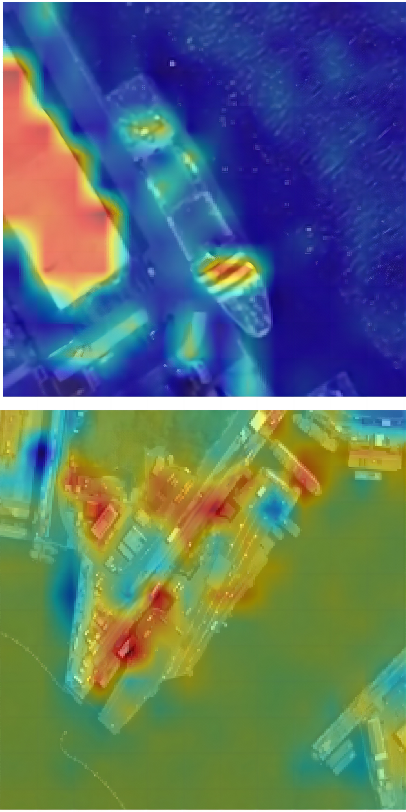
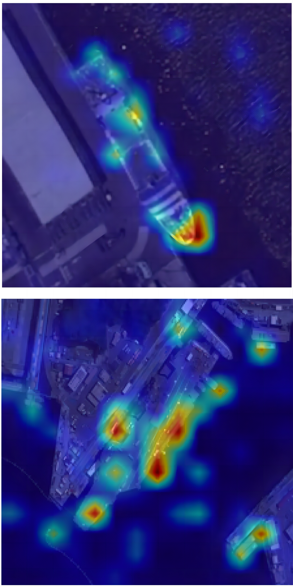
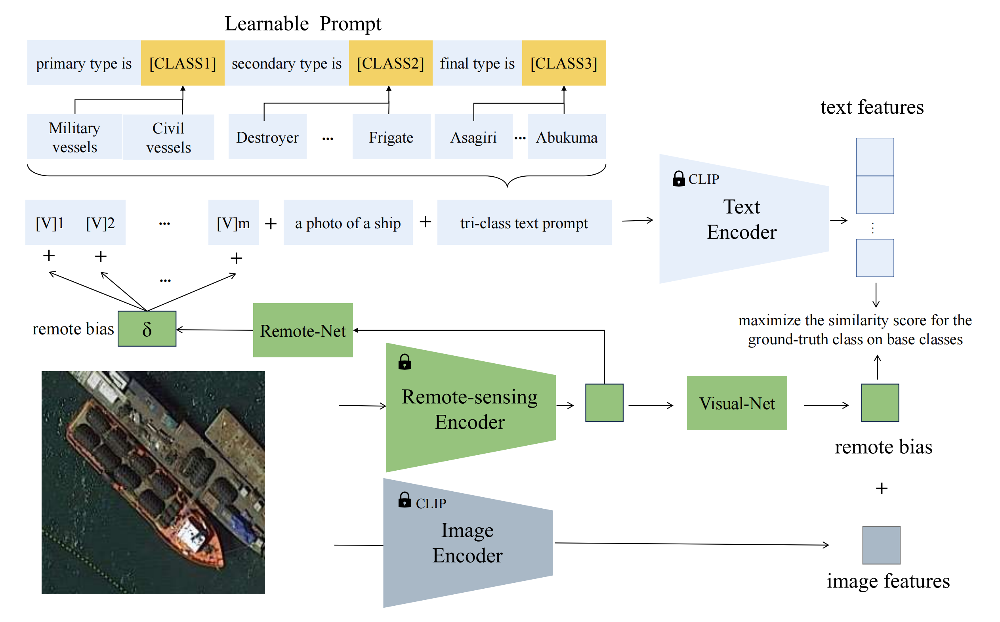
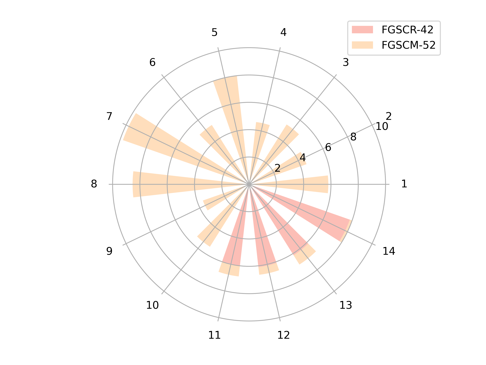
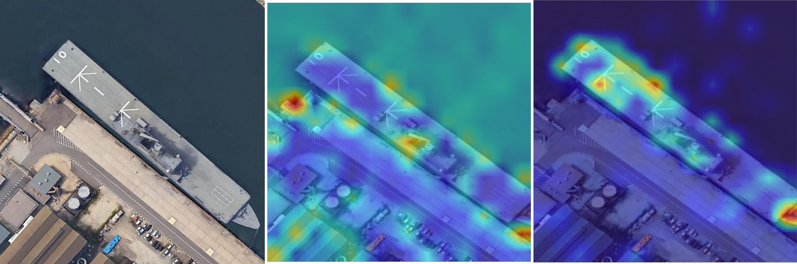
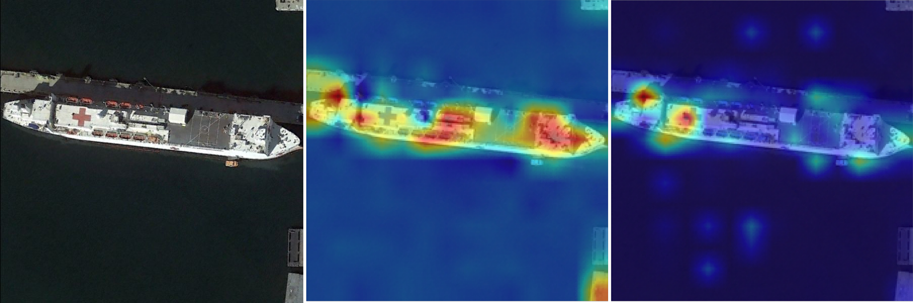
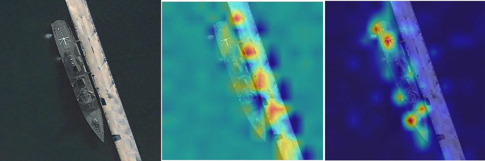
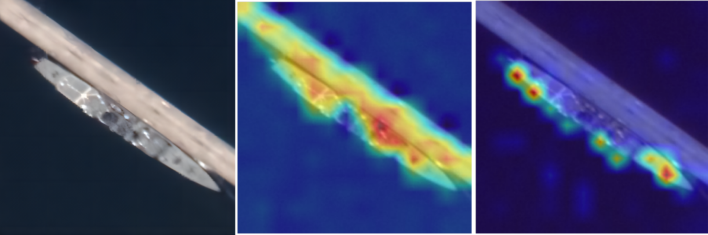

# 在细粒度船舶分类任务上，我们提出了一种高效的方法来对大型视觉-语言模型进行提示调优，以提升其性能表现。

发布时间：2024年03月13日

`Agent` `船舶识别`

> Efficient Prompt Tuning of Large Vision-Language Model for Fine-Grained Ship Classification

> 面对 RS-FGSC 任务中的细粒度船舶区分难题，由于同类船只间的高相似度以及有标签数据的稀缺性，传统的监督分类法难以发挥有效作用。近期大型预训练的视觉-语言模型（VLMs）在少量样本甚至零样本学习上展现出了卓越的图像理解能力。本研究旨在挖掘 VLMs 的潜能，提升对于未曾见过的船舶类别的分类精准度，这一成果对于那些受制于成本或隐私问题而仅有有限数据的场景尤为重要。然而，直接对 RS-FGSC 微调 VLMs 时，往往容易陷入对已知类别的过拟合陷阱，从而导致对未知类别的泛化性能不佳，凸显了识别复杂背景与捕捉独特船舶特征之难。因此，我们创新性地提出一种层级多粒度的提示调优技术，通过一个小巧可训练网络学习到的偏置项来融入遥感船舶领域的先验知识。这种方法不仅提升了模型的泛化性能，还能更好地解析复杂背景并习得区分度高的船舶特征。同时，我们推出综合型数据集 FGSCM-52，大大丰富了现有数据集的内容，尤其是对较少见船舶类别的详细标注。经过广泛的实验验证，我们提出的解决方案超越了当前业界最先进的技术水平。后续我们将公开此研究的源代码。

> Fine-grained ship classification in remote sensing (RS-FGSC) poses a significant challenge due to the high similarity between classes and the limited availability of labeled data, limiting the effectiveness of traditional supervised classification methods. Recent advancements in large pre-trained Vision-Language Models (VLMs) have demonstrated impressive capabilities in few-shot or zero-shot learning, particularly in understanding image content. This study delves into harnessing the potential of VLMs to enhance classification accuracy for unseen ship categories, which holds considerable significance in scenarios with restricted data due to cost or privacy constraints. Directly fine-tuning VLMs for RS-FGSC often encounters the challenge of overfitting the seen classes, resulting in suboptimal generalization to unseen classes, which highlights the difficulty in differentiating complex backgrounds and capturing distinct ship features. To address these issues, we introduce a novel prompt tuning technique that employs a hierarchical, multi-granularity prompt design. Our approach integrates remote sensing ship priors through bias terms, learned from a small trainable network. This strategy enhances the model's generalization capabilities while improving its ability to discern intricate backgrounds and learn discriminative ship features. Furthermore, we contribute to the field by introducing a comprehensive dataset, FGSCM-52, significantly expanding existing datasets with more extensive data and detailed annotations for less common ship classes. Extensive experimental evaluations demonstrate the superiority of our proposed method over current state-of-the-art techniques. The source code will be made publicly available.

[Arxiv](https://arxiv.org/abs/2403.08271)