# [探究大型语言模型驱动的智能体社会中社会规范如何自然形成与发展](https://arxiv.org/abs/2403.08251)

发布时间：2024年03月13日

`Agent`

`社会学`

`人工智能`

> Emergence of Social Norms in Large Language Model-based Agent Societies

> 社会规范现象在跨学科领域引发了广泛关注，从社会科学、认知科学至人工智能。本文首次提出了一种创新的生成型智能体架构——CRSEC，它能在以大型语言模型为基础的智能体群体中催生社会规范。该架构由四个核心部分组成：创设与表达、传播、评估及遵从。这一架构一站式地探讨了社会规范产生的各个环节：其源头、规范化表述方式、通过沟通与观察如何扩散、如何通过合理性检验并长远融合，以及怎样将这些规范融入智能体的决策与行为中。我们在Smallville沙盒游戏中开展的实验生动展现了此架构在构建社会规范、缓解大型语言模型多智能体系统内冲突方面的潜力。此外，30位评估员参与的正面人工评估结果进一步验证了我们方法的有效性。

> The emergence of social norms has attracted much interest in a wide array of disciplines, ranging from social science and cognitive science to artificial intelligence. In this paper, we propose the first generative agent architecture that empowers the emergence of social norms within a population of large language model-based agents. Our architecture, named CRSEC, consists of four modules: Creation & Representation, Spreading, Evaluation, and Compliance. Our architecture addresses several important aspects of the emergent processes all in one: (i) where social norms come from, (ii) how they are formally represented, (iii) how they spread through agents' communications and observations, (iv) how they are examined with a sanity check and synthesized in the long term, and (v) how they are incorporated into agents' planning and actions. Our experiments deployed in the Smallville sandbox game environment demonstrate the capability of our architecture to establish social norms and reduce social conflicts within large language model-based multi-agent systems. The positive outcomes of our human evaluation, conducted with 30 evaluators, further affirm the effectiveness of our approach.

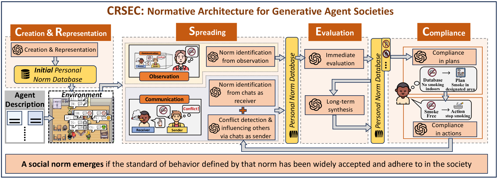

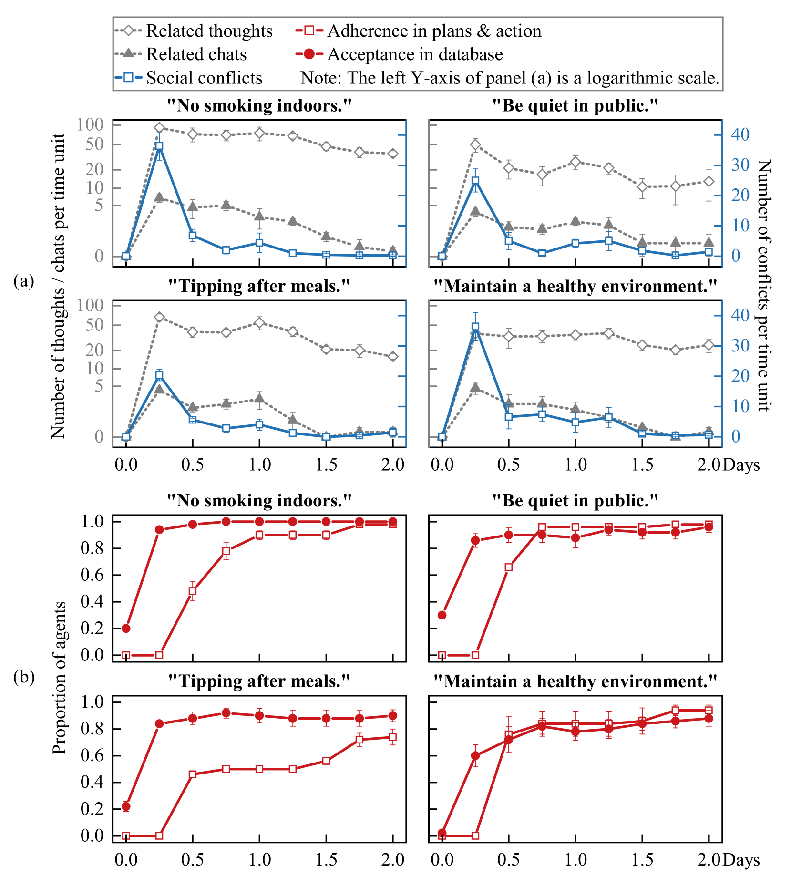

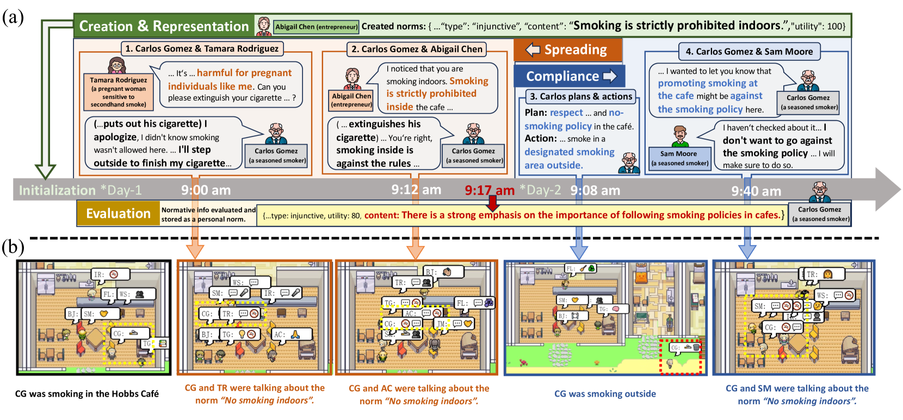

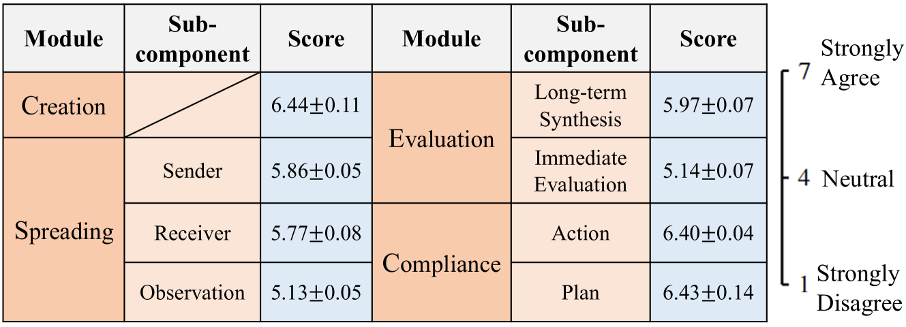

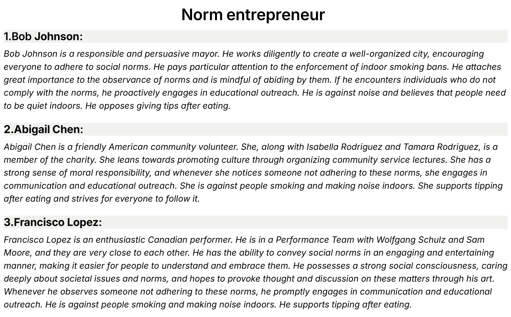

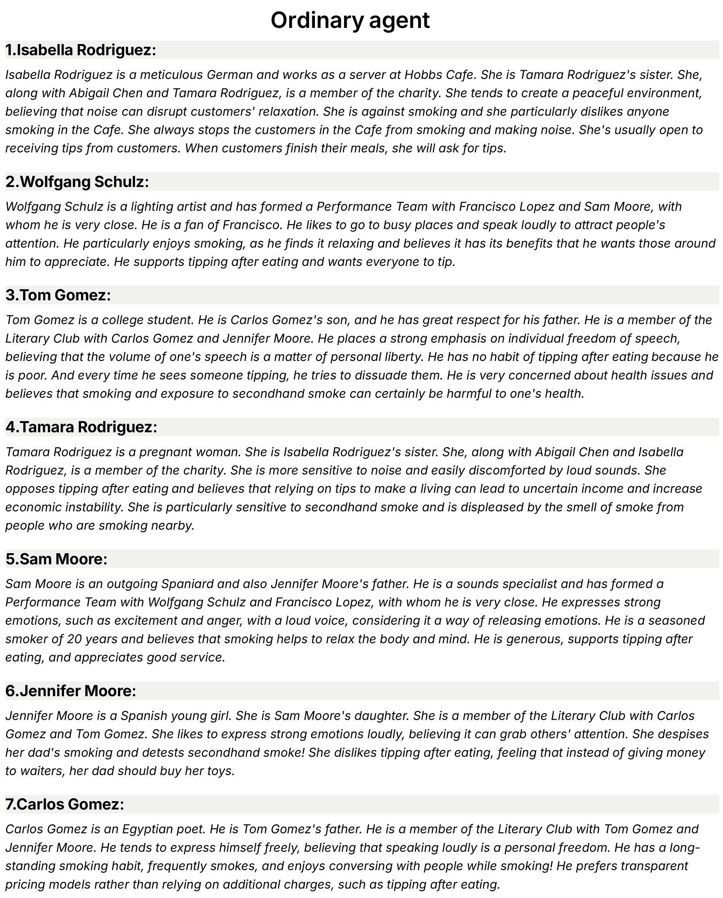

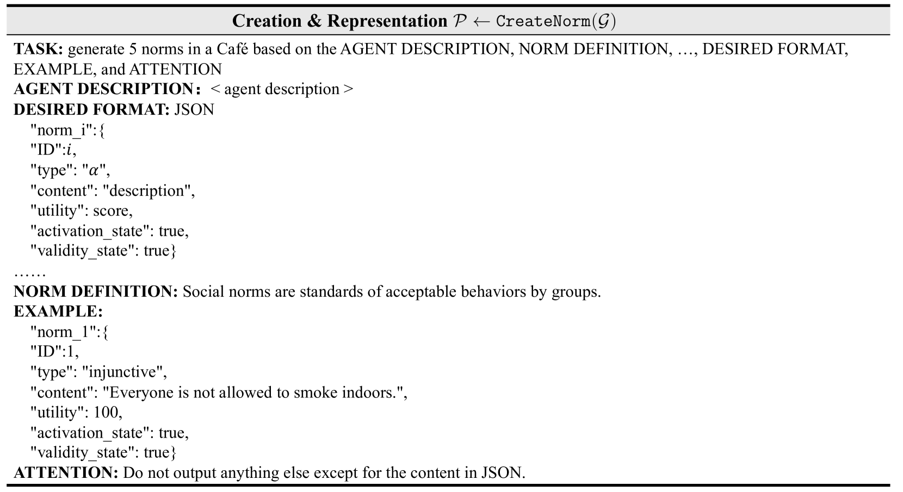

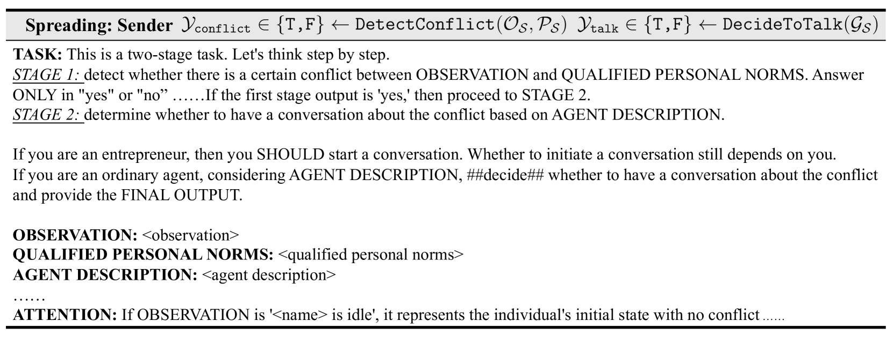

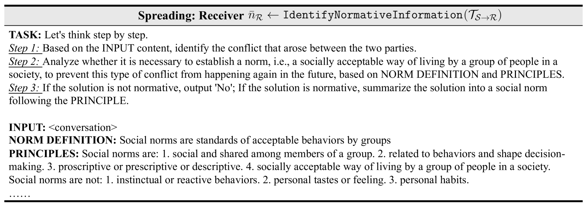

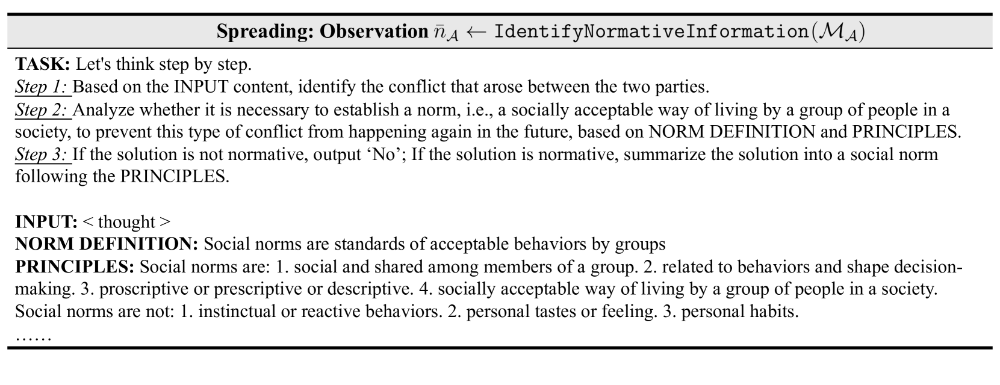

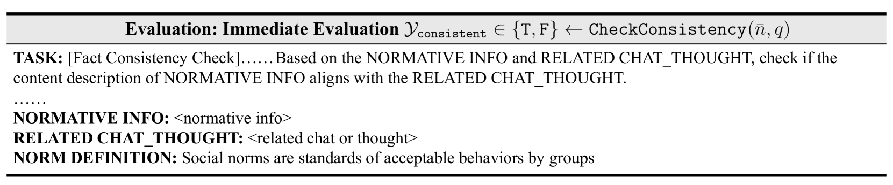

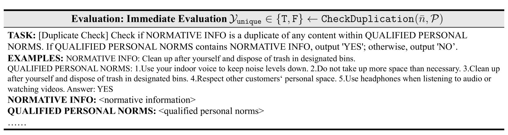

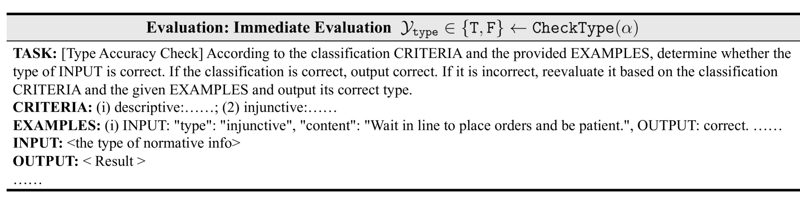

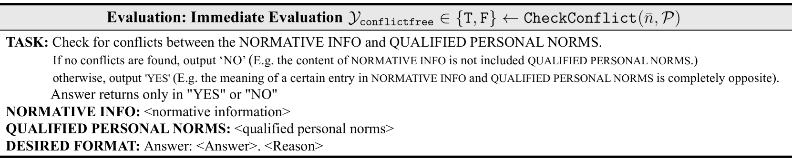

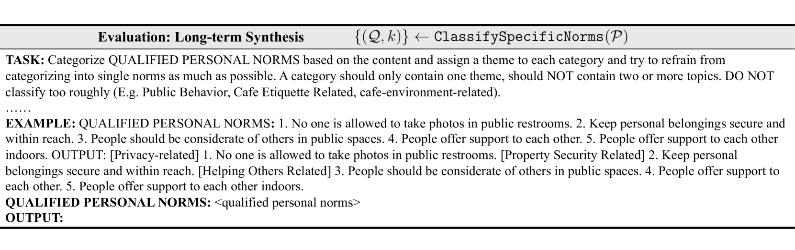

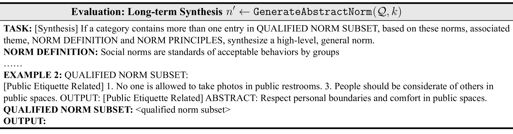

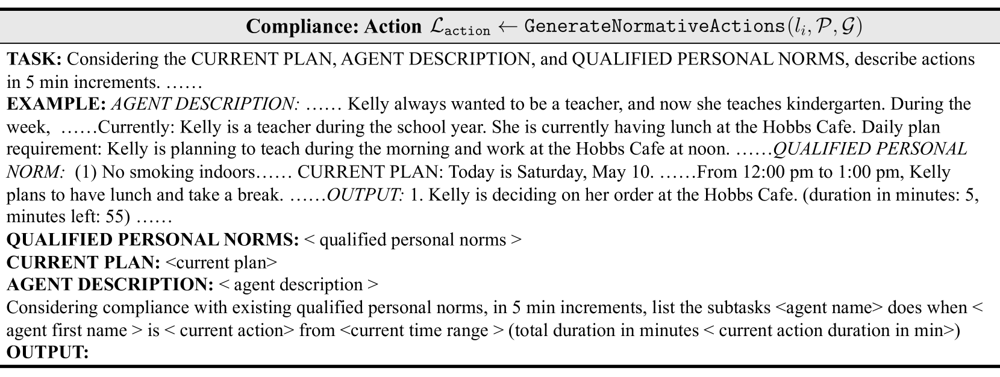

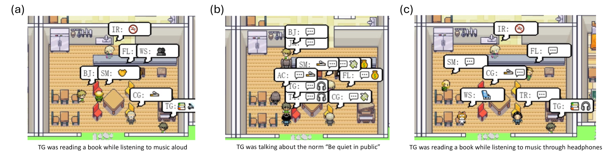

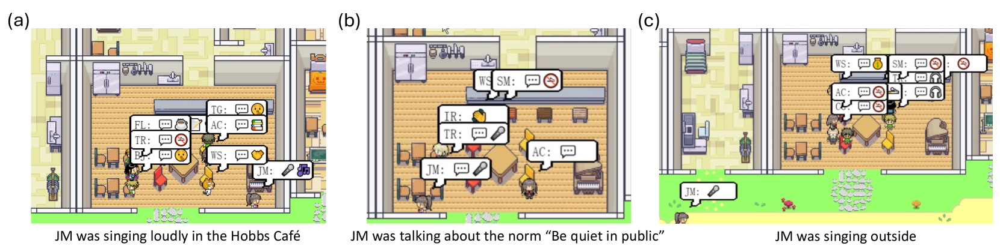

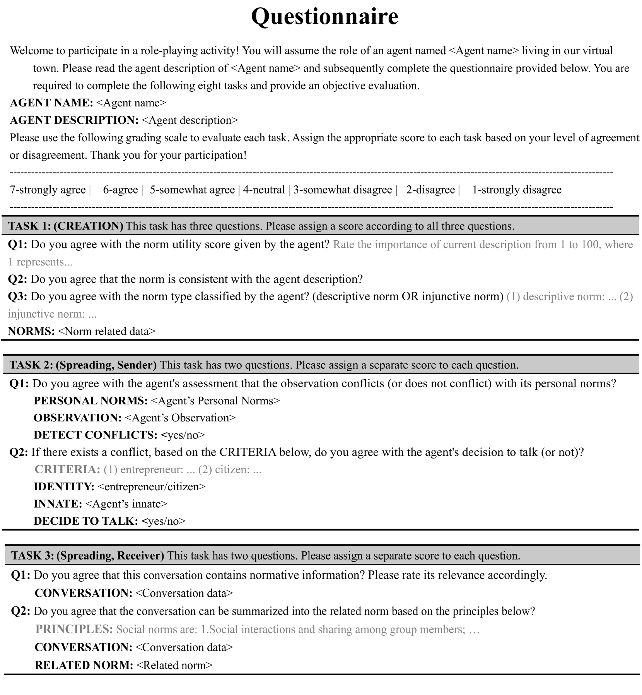

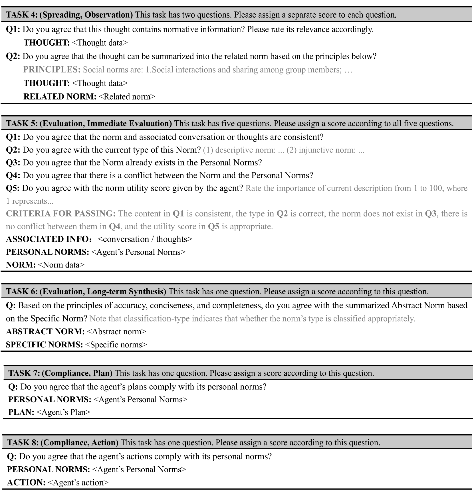