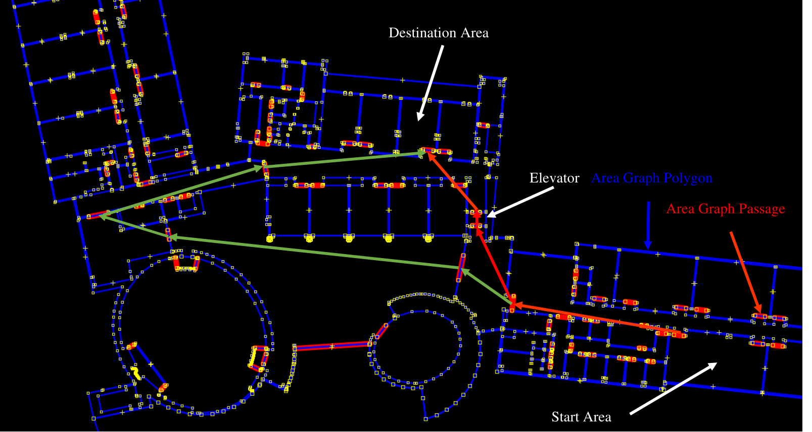
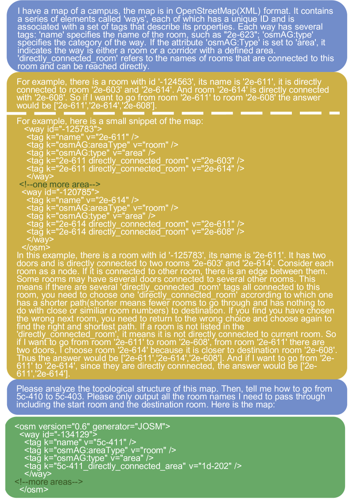
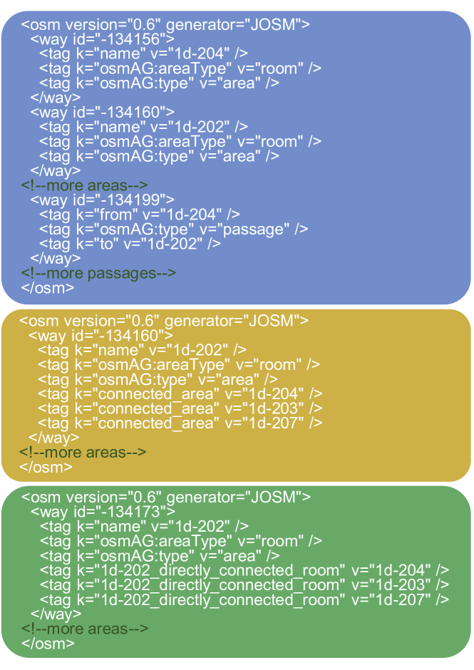
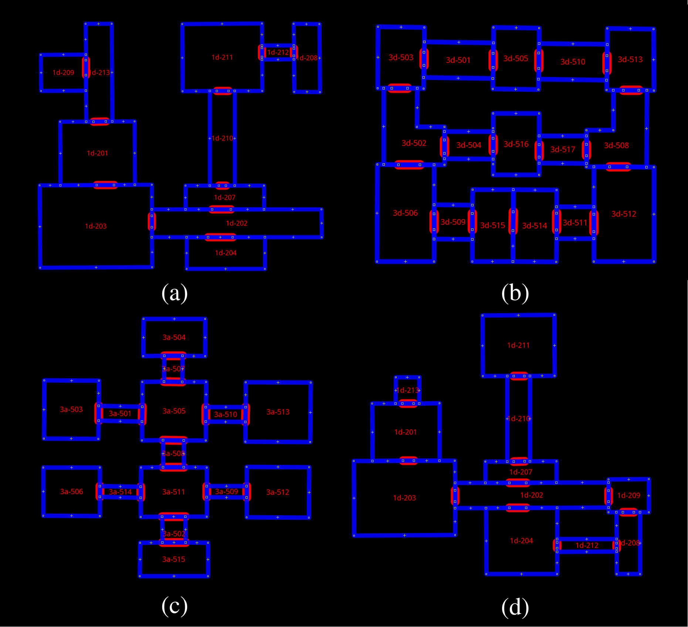
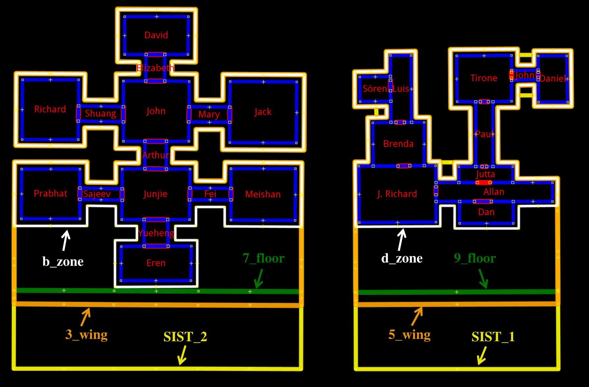
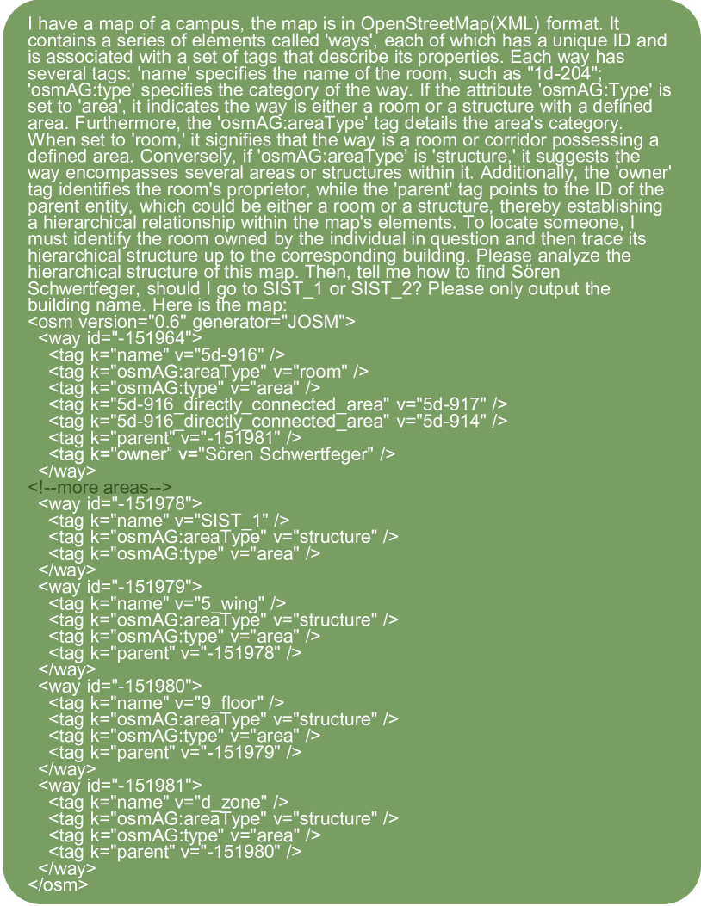
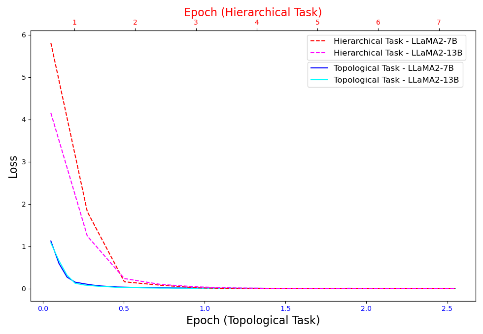

# 借助大型语言模型的力量，我们正在革新机器人技术领域，特别是在运用LLMs实现对osmAG地图的深度理解方面。

发布时间：2024年03月13日

`Agent` `机器人` `地图理解`

> Empowering Robotics with Large Language Models: osmAG Map Comprehension with LLMs

# 摘要

> 近年来，LLMs凭借对预设程序之外情境的强大通用知识支持，在机器人应用领域崭露头角。为了实现定位、导航等功能，移动机器人必须学会理解地图。本文聚焦于如何让LLMs掌握“区域图”这一种易于阅读且结构化的文本地图表达方式，以提升其在移动机器人领域的实用性。“区域图”采用层级化、拓扑语义设计，利用多边形描绘诸如房间、走廊、建筑等区域，并以XML文本格式存储，自然而然地契合LLMs的阅读习惯。值得注意的是，osmAG（OpenStreetMap格式下的区域图）可与常规的定位算法、路径规划算法无缝配合，使得LLMs、传统机器人算法及人类都能轻松理解这一地图表达形式。实验证明，只要地图表示恰当，LLMs完全能够理解地图并基于理解进行查询应答。经简单微调后的LLaMA2模型，在处理拓扑和层次理解相关任务时表现优于ChatGPT-3.5。更多详情，包括数据集、数据集生成代码以及微调后的LoRA适配器，均可在https://github.com/xiefujing/LLM-osmAG-Comprehension网站获取。

> Recently, Large Language Models (LLMs) have demonstrated great potential in robotic applications by providing essential general knowledge for situations that can not be pre-programmed beforehand. Generally speaking, mobile robots need to understand maps to execute tasks such as localization or navigation. In this letter, we address the problem of enabling LLMs to comprehend Area Graph, a text-based map representation, in order to enhance their applicability in the field of mobile robotics. Area Graph is a hierarchical, topometric semantic map representation utilizing polygons to demark areas such as rooms, corridors or buildings. In contrast to commonly used map representations, such as occupancy grid maps or point clouds, osmAG (Area Graph in OpensStreetMap format) is stored in a XML textual format naturally readable by LLMs. Furthermore, conventional robotic algorithms such as localization and path planning are compatible with osmAG, facilitating this map representation comprehensible by LLMs, traditional robotic algorithms and humans. Our experiments show that with a proper map representation, LLMs possess the capability to understand maps and answer queries based on that understanding. Following simple fine-tuning of LLaMA2 models, it surpassed ChatGPT-3.5 in tasks involving topology and hierarchy understanding. Our dataset, dataset generation code, fine-tuned LoRA adapters can be accessed at https://github.com/xiefujing/LLM-osmAG-Comprehension.

[Arxiv](https://arxiv.org/abs/2403.08228)