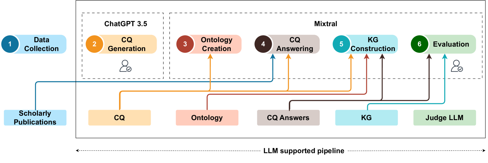
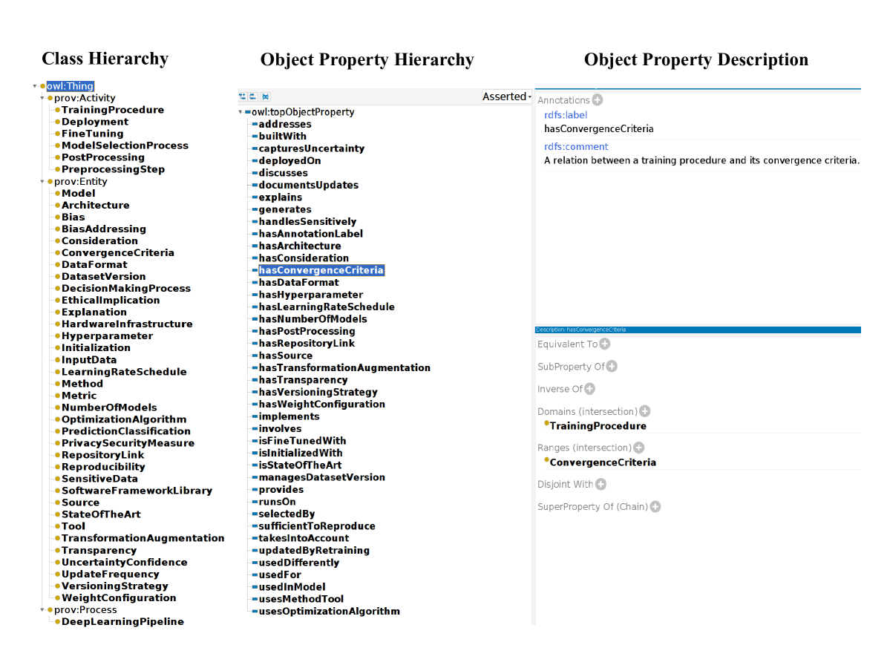

# 跃迁至机器智能：运用大型语言模型助力本体与知识图谱构建之旅

发布时间：2024年03月13日

`LLM应用` `知识图谱`

> From human experts to machines: An LLM supported approach to ontology and knowledge graph construction

# 摘要

> 传统上构建本体和知识图谱高度依赖人工专家，而近期流行的大型语言模型（LLMs）因能理解并生成类人自然语言，为这一过程的部分自动化带来了可能。本研究借助开源LLMs探索了半自动构建知识图谱的方法。我们以提出能力问题、根据这些问题构建本体、运用该本体构建知识图谱、并通过少量甚至无需人工介入的方式评估结果图为流程，通过利用学术文献资源成功构建了一幅关于深度学习方法的知识图谱。为评估由检索增强生成（RAG）技术生成的答案及LLMs自动提取的知识图谱概念，我们设计了一个评价LLM，依据真实情况对其生成内容打分。结果显示，虽然LLMs有望减少构建知识图谱的人工成本，但仍推荐采用人机协同模式对自动生成的知识图谱进行评估。

> The conventional process of building Ontologies and Knowledge Graphs (KGs) heavily relies on human domain experts to define entities and relationship types, establish hierarchies, maintain relevance to the domain, fill the ABox (or populate with instances), and ensure data quality (including amongst others accuracy and completeness). On the other hand, Large Language Models (LLMs) have recently gained popularity for their ability to understand and generate human-like natural language, offering promising ways to automate aspects of this process. This work explores the (semi-)automatic construction of KGs facilitated by open-source LLMs. Our pipeline involves formulating competency questions (CQs), developing an ontology (TBox) based on these CQs, constructing KGs using the developed ontology, and evaluating the resultant KG with minimal to no involvement of human experts. We showcase the feasibility of our semi-automated pipeline by creating a KG on deep learning methodologies by exploiting scholarly publications. To evaluate the answers generated via Retrieval-Augmented-Generation (RAG) as well as the KG concepts automatically extracted using LLMs, we design a judge LLM, which rates the generated content based on ground truth. Our findings suggest that employing LLMs could potentially reduce the human effort involved in the construction of KGs, although a human-in-the-loop approach is recommended to evaluate automatically generated KGs.

[Arxiv](https://arxiv.org/abs/2403.08345)