# [HRLAIF 是一种创新方法，它利用 AI 反馈，在开放域强化学习中显著提升了模型的有用性和减少潜在危害。该研究致力于优化人工智能在复杂环境下的决策行为，确保其更加有益且无害。]

发布时间：2024年03月13日

`Agent`

> HRLAIF: Improvements in Helpfulness and Harmlessness in Open-domain Reinforcement Learning From AI Feedback

> RLAIF借助AI反馈强化学习，在LLM训练的策略快速迭代阶段表现高效，成本低、标注周期短，优于依赖人类反馈的RLHF方法。实验中，我们将ChatGPT作为标注工具，在RLAIF训练中为开放领域提示提供反馈，发现虽然模型回应的人类偏好胜率有所提高，但评估员对其满意度却下滑了。深入分析揭示，满意度降低主要是由于部分回复实用性变差，尤其体现在准确度和真实性上，凸显出基础RLAIF在实际应用中的局限性。为此，本论文提出了融合型AI反馈强化学习技术——HRLAIF。这一技术增强了AI对模型回复的标注精确性，使模型在训练过程中的助益性更为稳健，并通过引入AI进行红队对抗检验，有效提升了模型的安全无害性。经由人工评估验证，HRLAIF不仅继承了RLAIF以较低成本提升人类对结果偏好的特性，而且成功改进了回复的满意度，相较于未采用强化学习前的策略模型，满意度提升了2.08%，有效解决了基本RLAIF应用后满意度降低4.58%的问题。

> Reinforcement Learning from AI Feedback (RLAIF) has the advantages of shorter annotation cycles and lower costs over Reinforcement Learning from Human Feedback (RLHF), making it highly efficient during the rapid strategy iteration periods of large language model (LLM) training. Using ChatGPT as a labeler to provide feedback on open-domain prompts in RLAIF training, we observe an increase in human evaluators' preference win ratio for model responses, but a decrease in evaluators' satisfaction rate. Analysis suggests that the decrease in satisfaction rate is mainly due to some responses becoming less helpful, particularly in terms of correctness and truthfulness, highlighting practical limitations of basic RLAIF. In this paper, we propose Hybrid Reinforcement Learning from AI Feedback (HRLAIF). This method enhances the accuracy of AI annotations for responses, making the model's helpfulness more robust in training process. Additionally, it employs AI for Red Teaming, further improving the model's harmlessness. Human evaluation results show that HRLAIF inherits the ability of RLAIF to enhance human preference for outcomes at a low cost while also improving the satisfaction rate of responses. Compared to the policy model before Reinforcement Learning (RL), it achieves an increase of 2.08\% in satisfaction rate, effectively addressing the issue of a decrease of 4.58\% in satisfaction rate after basic RLAIF.

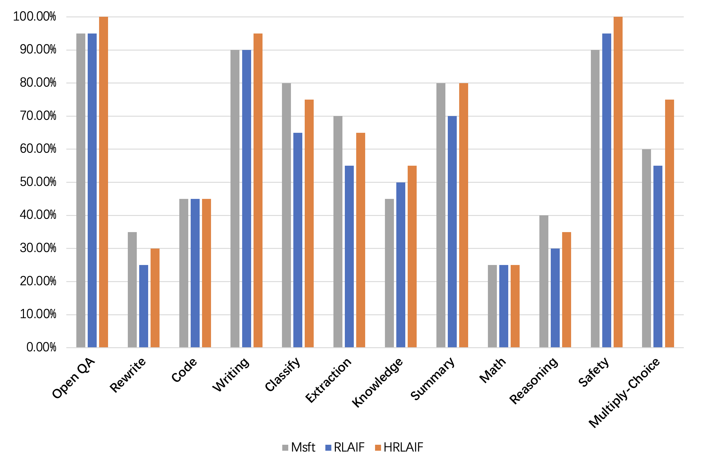

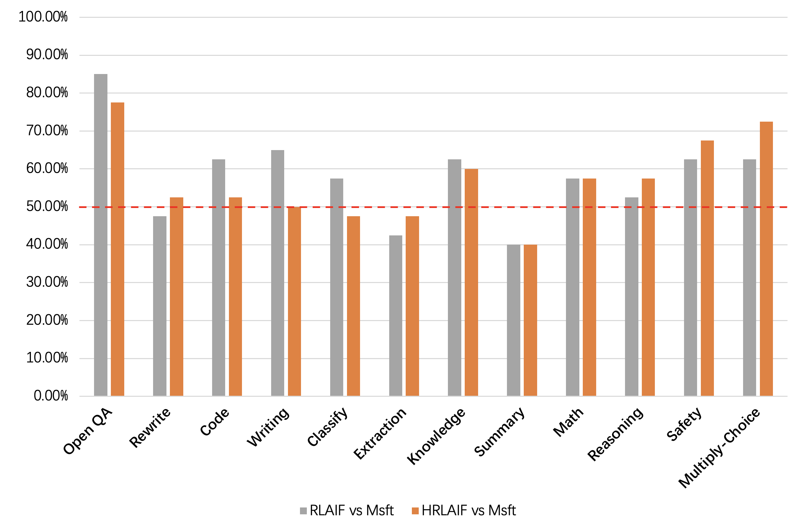

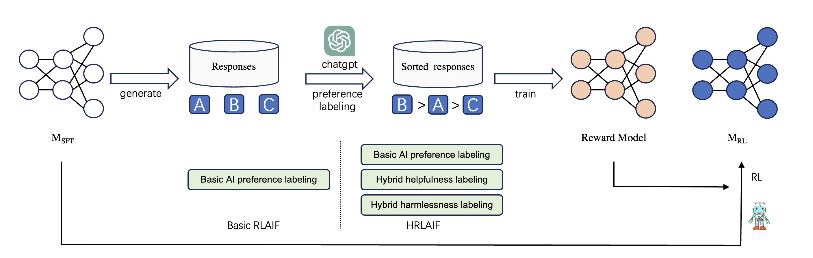

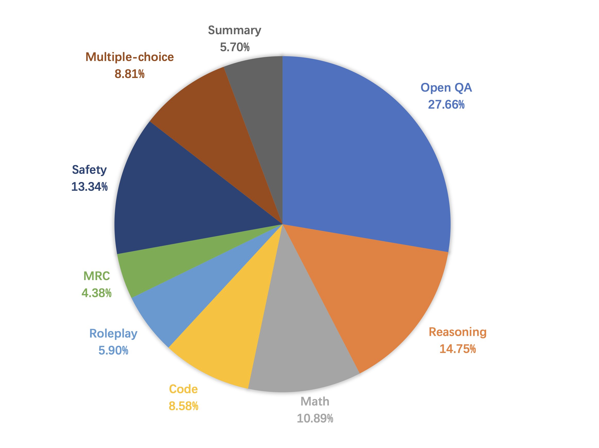

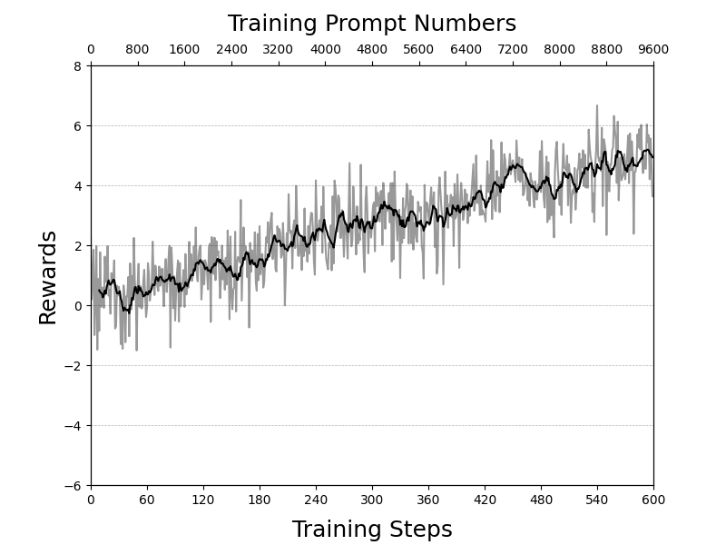

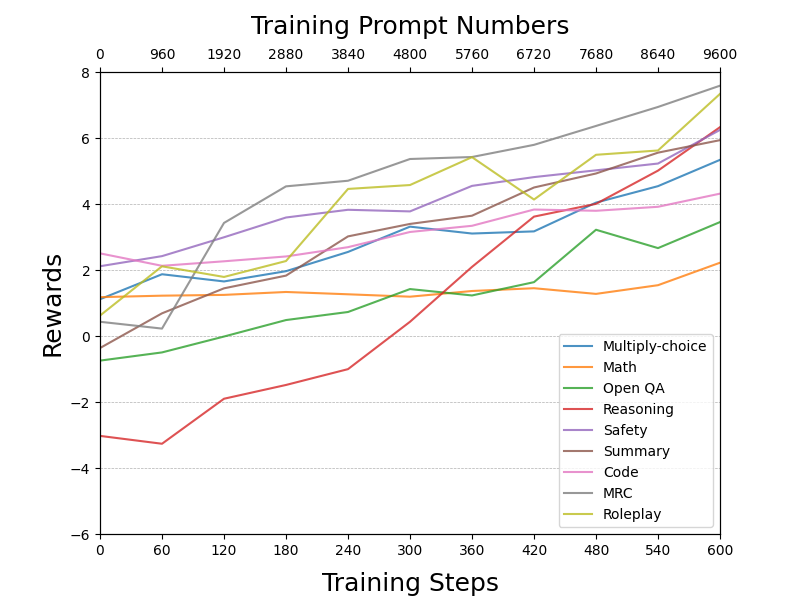

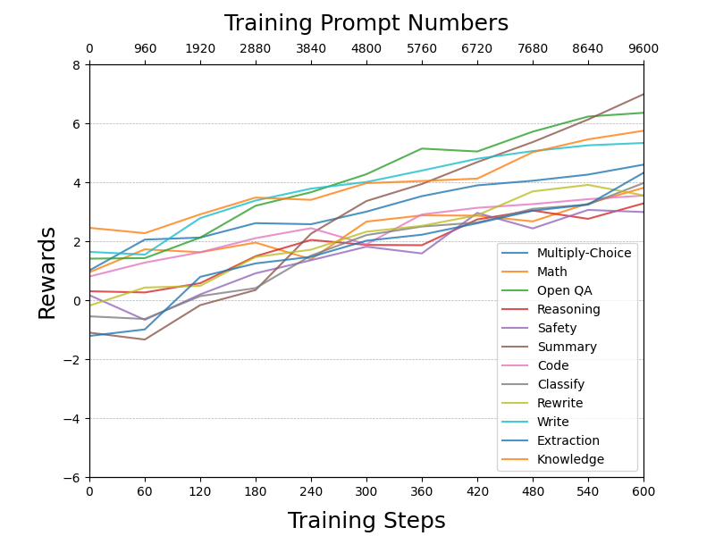

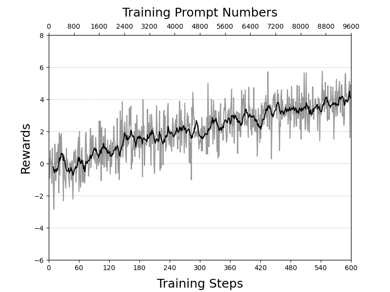

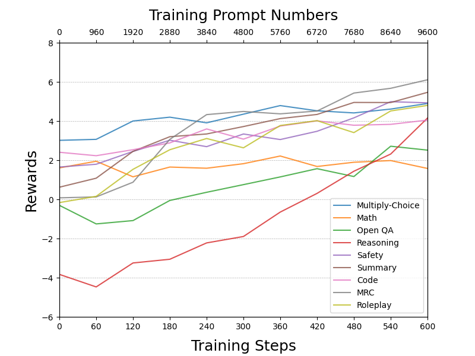

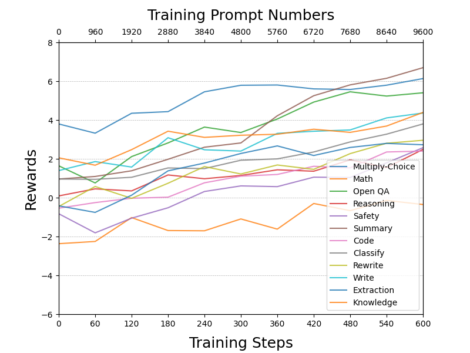

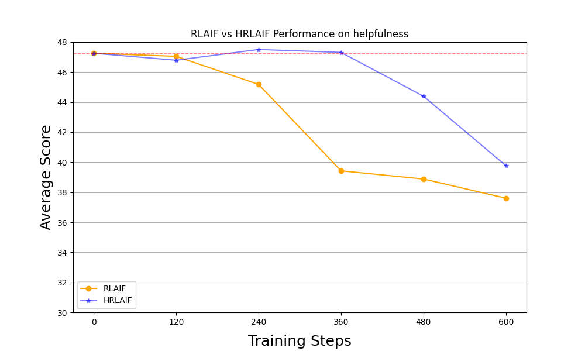

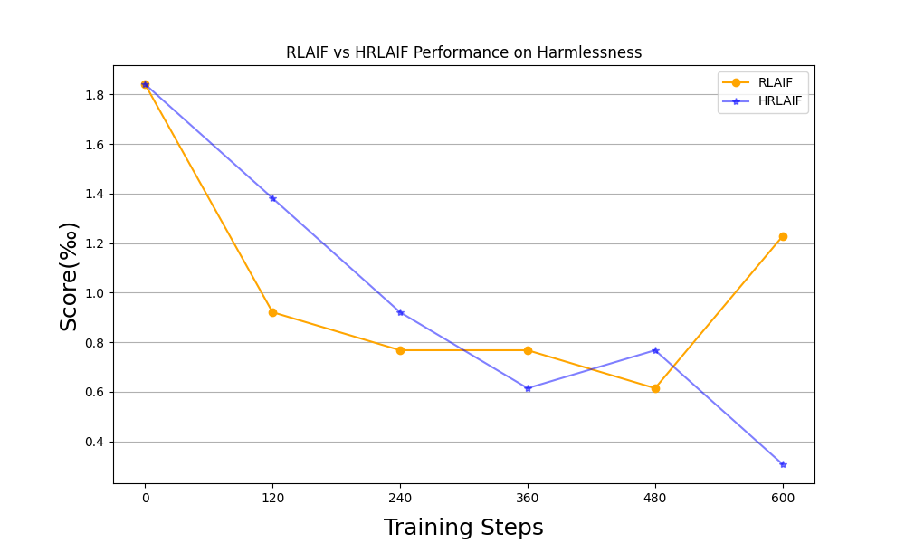

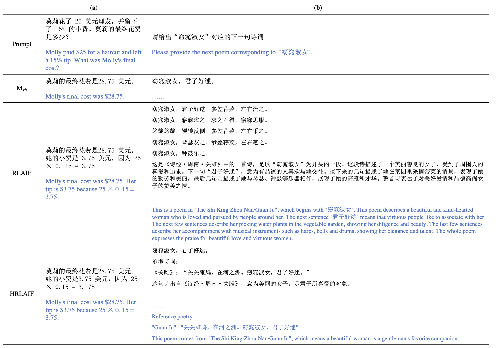

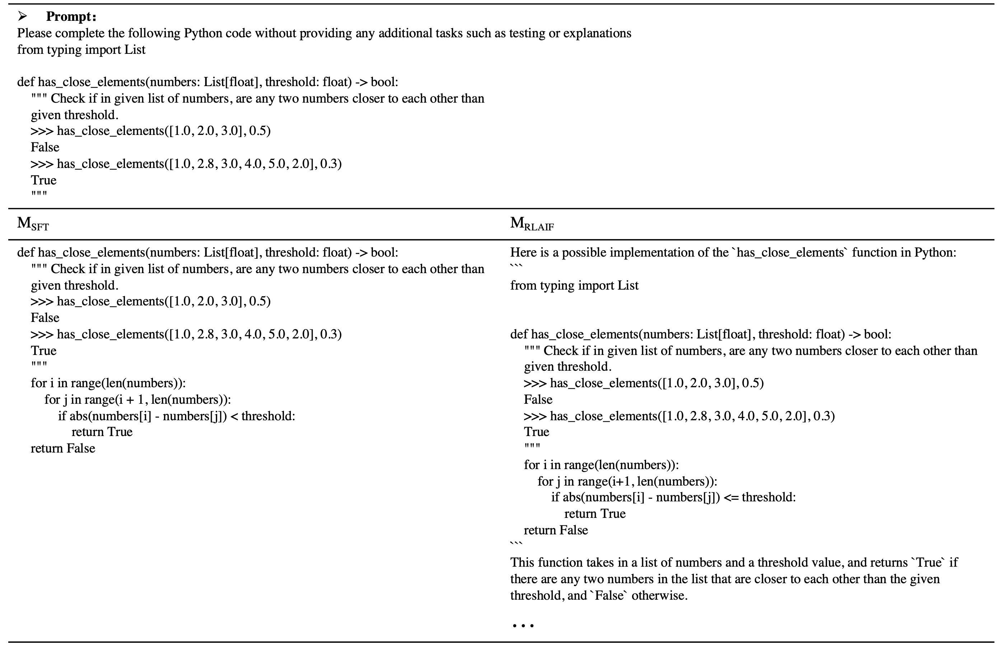

[Arxiv](https://arxiv.org/abs/2403.08309)