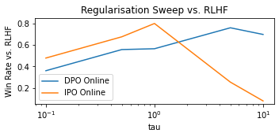
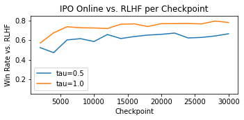
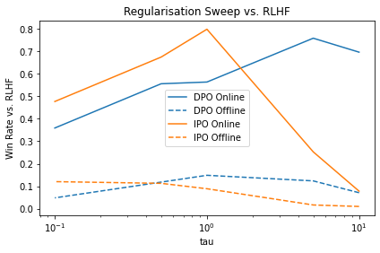
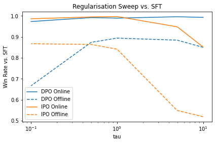
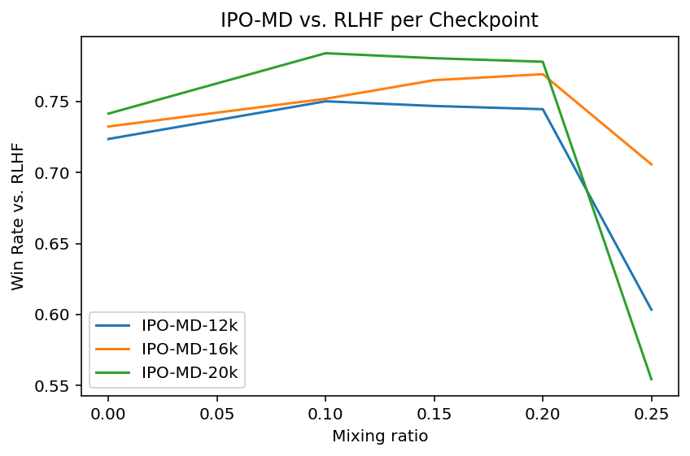
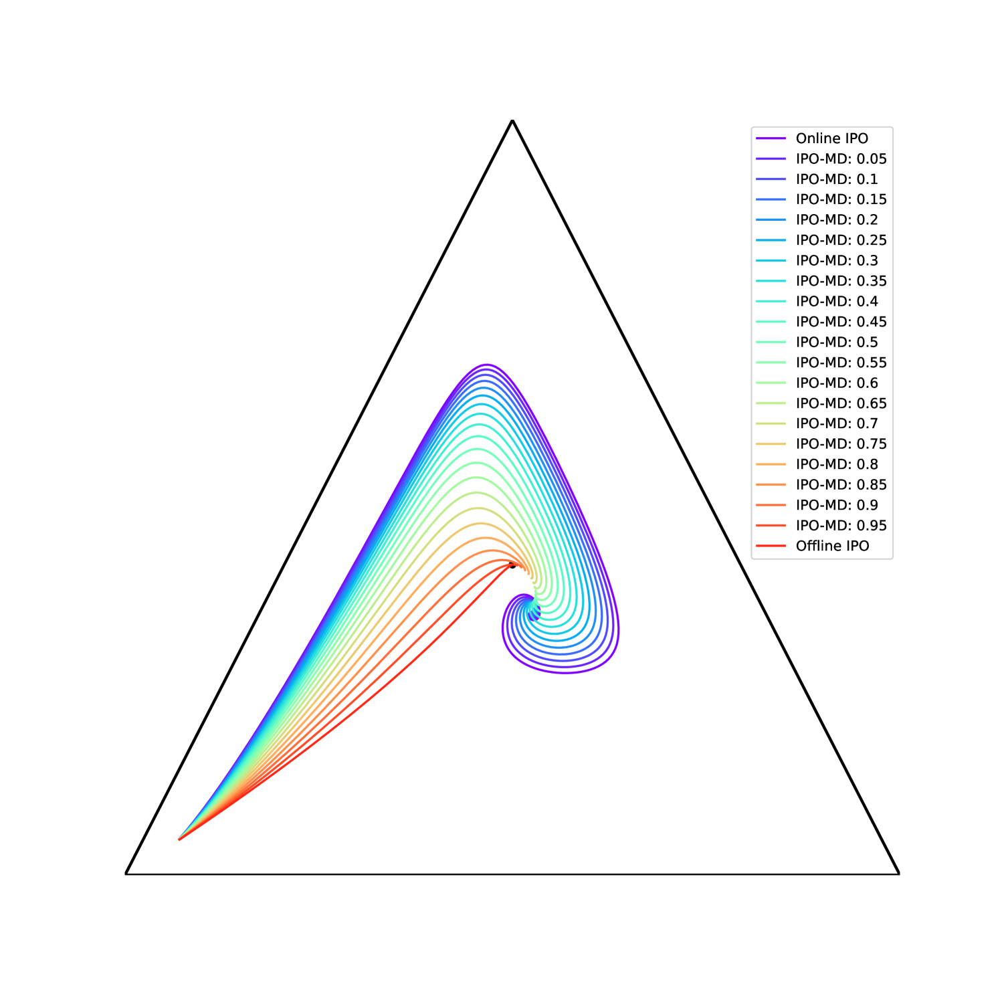

# [借助在线偏好优化技术，本研究探讨如何实现大型语言模型与人类需求的精准对齐。]

发布时间：2024年03月13日

`LLM理论` `人工智能安全`

> Human Alignment of Large Language Models through Online Preference Optimisation

> 为了打造实用、安全且愉悦的用户体验，关键在于确保语言模型输出符合人类偏好，为此，对人类偏好对齐的研究方兴未艾，涌现出了RLHF、DPO及SLiC等众多方法。本文做出两方面的贡献：首先揭示了近期提出的两种对齐技术IPO与Nash-MD在一定条件下具有等价性；其次，我们借鉴Nash-MD提出的正规化抽样思想，创新性地推出了IPO-MD算法，它是IPO的一个扩展版本。虽然表面上看，作为离线方法的IPO与运用偏好模型的在线方法Nash-MD似乎迥异，但在特定场景下，即两者均采用在线策略生成样本并经由训练过的偏好模型打标时，两者实则相通，此时优化IPO损失的过程相当于通过自博弈寻找偏好模型的纳什均衡点。以此为基础，我们设计出IPO-MD算法，其采用混合策略（融合在线策略和参照策略）生成数据，与广义Nash-MD算法相似。最终，我们将在摘要任务上对比在线-IPO、IPO-MD与已存在的DPO、SLiC等基于偏好的在线损失函数版本的表现。

> Ensuring alignment of language models' outputs with human preferences is critical to guarantee a useful, safe, and pleasant user experience. Thus, human alignment has been extensively studied recently and several methods such as Reinforcement Learning from Human Feedback (RLHF), Direct Policy Optimisation (DPO) and Sequence Likelihood Calibration (SLiC) have emerged. In this paper, our contribution is two-fold. First, we show the equivalence between two recent alignment methods, namely Identity Policy Optimisation (IPO) and Nash Mirror Descent (Nash-MD). Second, we introduce a generalisation of IPO, named IPO-MD, that leverages the regularised sampling approach proposed by Nash-MD.
  This equivalence may seem surprising at first sight, since IPO is an offline method whereas Nash-MD is an online method using a preference model. However, this equivalence can be proven when we consider the online version of IPO, that is when both generations are sampled by the online policy and annotated by a trained preference model. Optimising the IPO loss with such a stream of data becomes then equivalent to finding the Nash equilibrium of the preference model through self-play. Building on this equivalence, we introduce the IPO-MD algorithm that generates data with a mixture policy (between the online and reference policy) similarly as the general Nash-MD algorithm. We compare online-IPO and IPO-MD to different online versions of existing losses on preference data such as DPO and SLiC on a summarisation task.

[Arxiv](https://arxiv.org/abs/2403.08635)