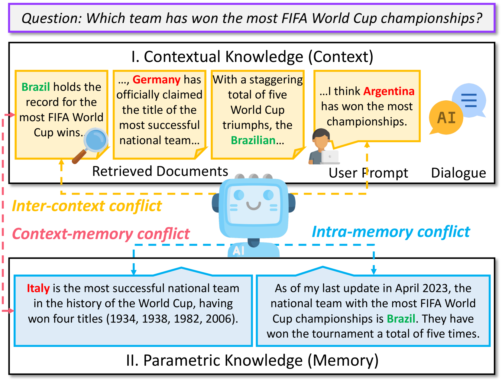
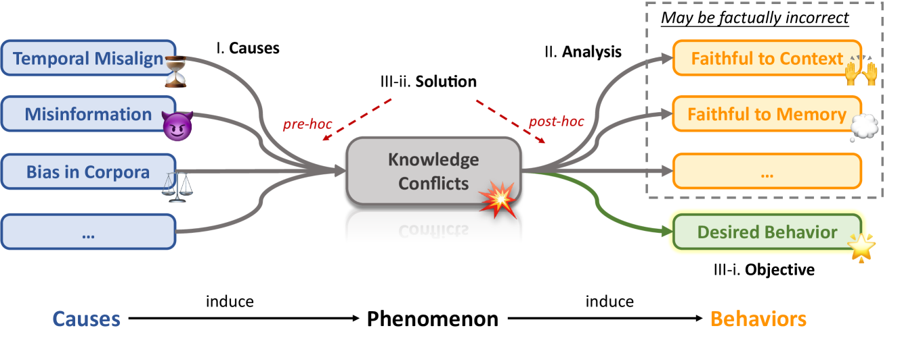

# [针对 LLMs 的知识冲突研究概述](https://arxiv.org/abs/2403.08319)

发布时间：2024年03月13日

`LLM理论` `` `大型语言模型`

> Knowledge Conflicts for LLMs: A Survey

> 针对大型语言模型（LLMs）整合上下文与参数知识过程中产生的复杂知识冲突难题，本研究进行了深度剖析，并着重探讨了三大类冲突：上下文与记忆间的冲突、不同上下文之间的冲突以及内部记忆冲突。这些冲突对LLMs的可靠性和实际表现有着显著影响，尤其是在充斥噪声和误导信息的真实应用场景中。通过分类整理这些冲突、挖掘冲突根源、观察LLMs在冲突条件下的行为模式，以及评估现有解决方案，本调查致力于照亮提升LLMs稳健性的路径，力图成为推动该领域持续发展的宝贵参考资料。

> This survey provides an in-depth analysis of knowledge conflicts for large language models (LLMs), highlighting the complex challenges they encounter when blending contextual and parametric knowledge. Our focus is on three categories of knowledge conflicts: context-memory, inter-context, and intra-memory conflict. These conflicts can significantly impact the trustworthiness and performance of LLMs, especially in real-world applications where noise and misinformation are common. By categorizing these conflicts, exploring the causes, examining the behaviors of LLMs under such conflicts, and reviewing available solutions, this survey aims to shed light on strategies for improving the robustness of LLMs, thereby serving as a valuable resource for advancing research in this evolving area.

[Arxiv](https://arxiv.org/abs/2403.08319)