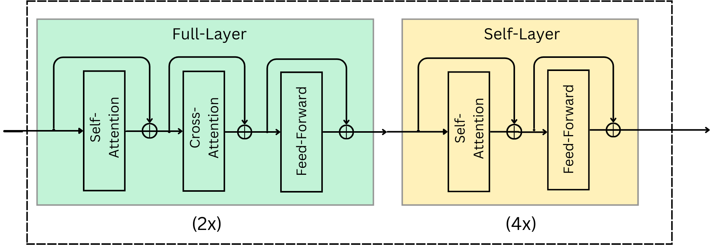
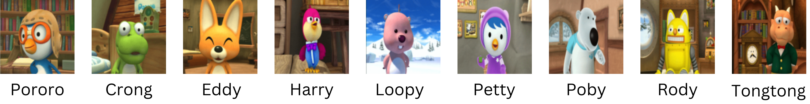
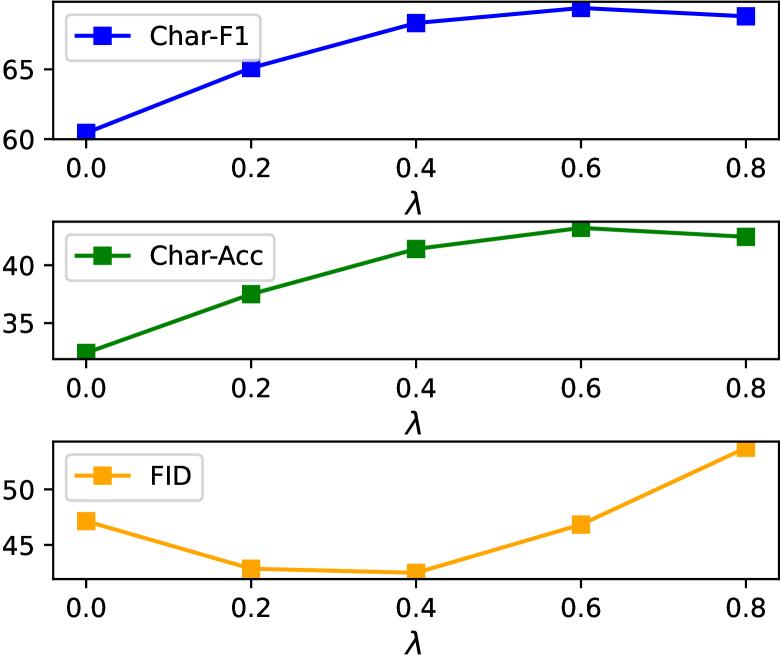
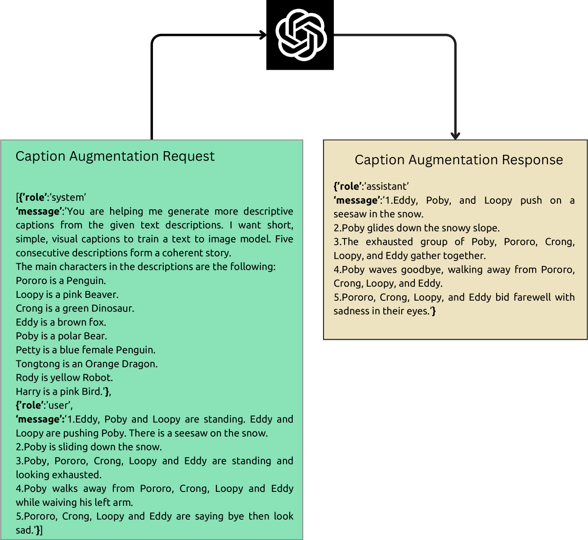
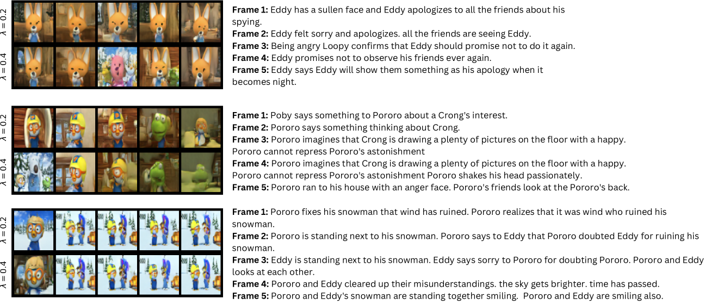
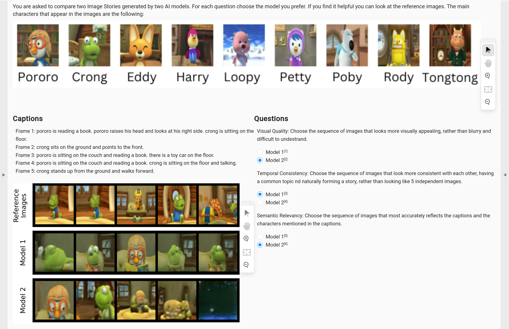

# [通过采用字符引导与标题增强技术，我们提出了一种掩码生成故事Transformer模型。该模型在生成连贯故事的同时，能够借助字符级别的指引以及标题信息的补充，以提升文本生成质量和叙事逻辑性。](https://arxiv.org/abs/2403.08502)

发布时间：2024年03月13日

`LLM应用`

`动画制作`

``

> Masked Generative Story Transformer with Character Guidance and Caption Augmentation

> 故事可视化（SV），作为一项既要保证视觉效果又要兼顾连续帧之间一致性的生成视觉难题，过往方法或是利用记忆机制贯穿自回归生成过程维持上下文连贯，或是独立建模角色及其背景以优化角色描绘。而我们另辟蹊径，独创性地采用了全并行Transformer架构，仅依赖过去和未来字幕的交叉注意力实现一致性。不仅如此，我们创新性地提出了“角色引导”技术，在对数概率空间中融合文本条件和角色条件日志概率，从而以一种隐含的方式聚焦角色生成环节。同时，借助大型语言模型（LLM）进行的字幕增强策略，有效提升了方法的稳健性。这些技术的巧妙融合使我们在权威的SV基准测试Pororo-SV中取得了多项指标上的最新突破，即便在有限资源条件下，也实现了超越前人成果的优越计算效率。并且，一项针对人类受试者的调查进一步验证了我们定量实验结果的有效性。

> Story Visualization (SV) is a challenging generative vision task, that requires both visual quality and consistency between different frames in generated image sequences. Previous approaches either employ some kind of memory mechanism to maintain context throughout an auto-regressive generation of the image sequence, or model the generation of the characters and their background separately, to improve the rendering of characters. On the contrary, we embrace a completely parallel transformer-based approach, exclusively relying on Cross-Attention with past and future captions to achieve consistency. Additionally, we propose a Character Guidance technique to focus on the generation of characters in an implicit manner, by forming a combination of text-conditional and character-conditional logits in the logit space. We also employ a caption-augmentation technique, carried out by a Large Language Model (LLM), to enhance the robustness of our approach. The combination of these methods culminates into state-of-the-art (SOTA) results over various metrics in the most prominent SV benchmark (Pororo-SV), attained with constraint resources while achieving superior computational complexity compared to previous arts. The validity of our quantitative results is supported by a human survey.

