# 通过深度融合各领域的高度专业化语言模型，实现对文本、代码与数学的同时精通

发布时间：2024年03月13日

`LLM应用` `多模态` `模型融合`

> Mastering Text, Code and Math Simultaneously via Fusing Highly Specialized Language Models

# 摘要

> 面对自然语言、编程代码和数学符号迥异的数据分布，大型语言模型（LLMs）面临着要在三者间同步取得卓越性能的艰巨挑战。单个LLM要在某一特定领域达到极高水准，往往需依赖于大量针对性的训练数据，而这一过程常常伴随着对其他领域性能的妥协。本文创新性地提出将已高度专业化训练的模型进行直接融合，打造出名为“UltraFuser”的融合框架，它整合了分别精通语言、编程及数学三大领域的三位“专家”。为融合这些专家的输出，我们引入了基于令牌粒度的门控机制，并配合均衡抽样策略设计了两阶段训练法以保证模型稳定。为了高效训练融合模型，我们还精心构建了一个包含文本、代码和数学内容在内的高质量监督指令微调数据集——UltraChat 2，含约30万条指令，涵盖了各个领域的广泛主题。实验显示，我们的模型能够在这三个至关重要的领域中实现并驾齐驱的精通掌握。

> Underlying data distributions of natural language, programming code, and mathematical symbols vary vastly, presenting a complex challenge for large language models (LLMs) that strive to achieve high performance across all three domains simultaneously. Achieving a very high level of proficiency for an LLM within a specific domain often requires extensive training with relevant corpora, which is typically accompanied by a sacrifice in performance in other domains. In this paper, we propose to fuse models that are already highly-specialized directly. The proposed fusing framework, UltraFuser, consists of three distinct specialists that are already sufficiently trained on language, coding, and mathematics. A token-level gating mechanism is introduced to blend the specialists' outputs. A two-stage training strategy accompanied by balanced sampling is designed to ensure stability. To effectively train the fused model, we further construct a high-quality supervised instruction tuning dataset, UltraChat 2, which includes text, code, and mathematical content. This dataset comprises approximately 300,000 instructions and covers a wide range of topics in each domain. Experiments show that our model could simultaneously achieve mastery of the three crucial domains.

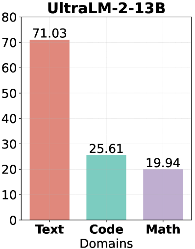

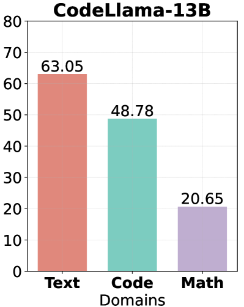

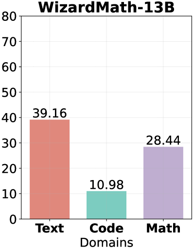

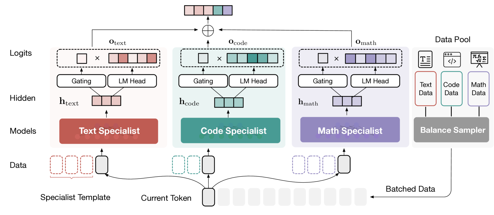

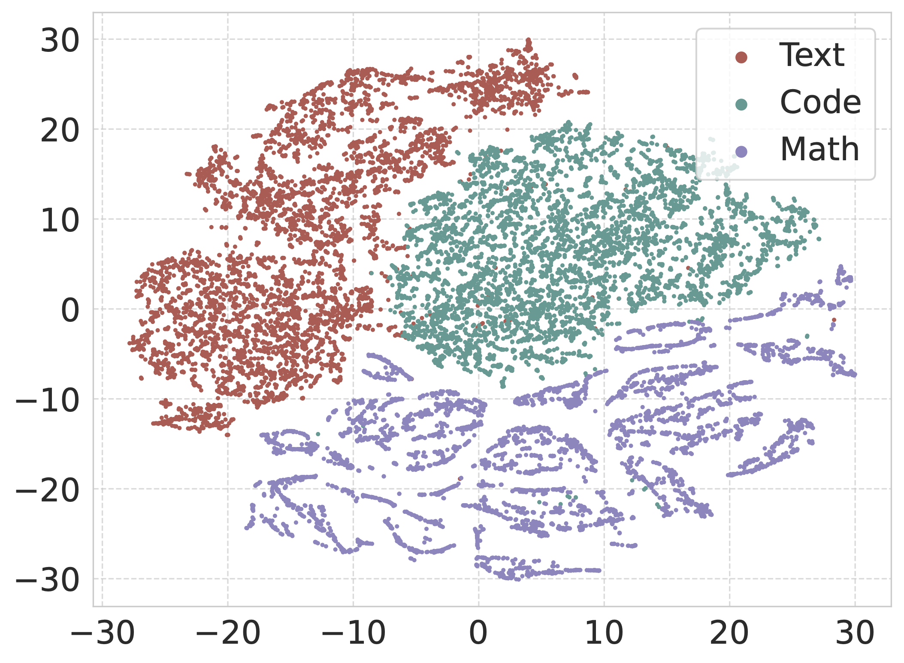

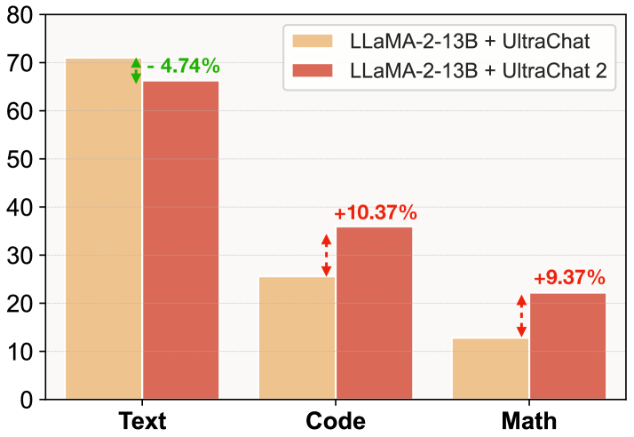

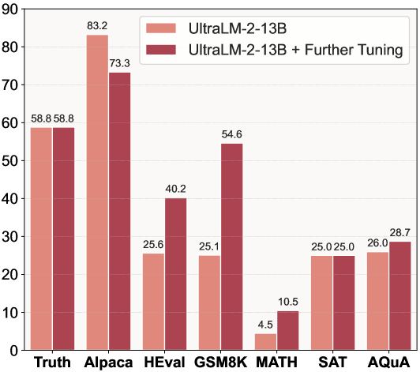

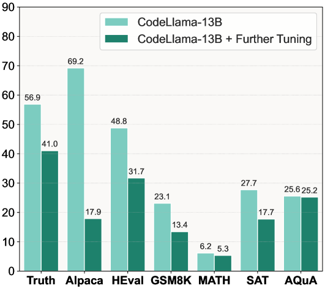

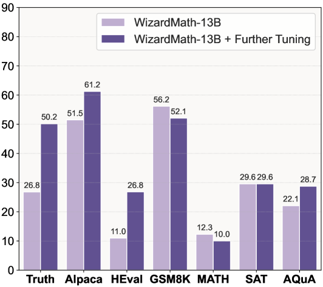

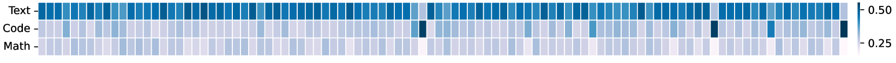

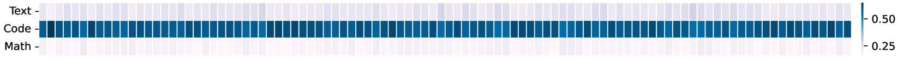

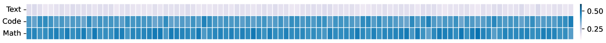

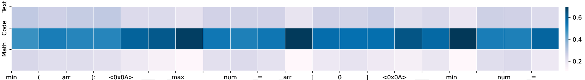

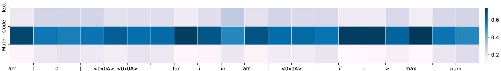

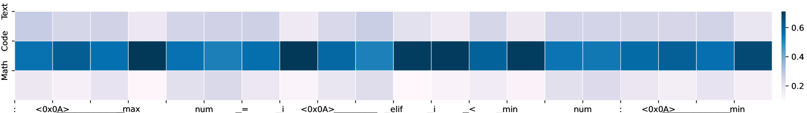

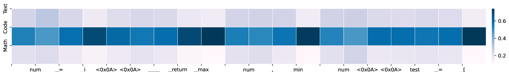

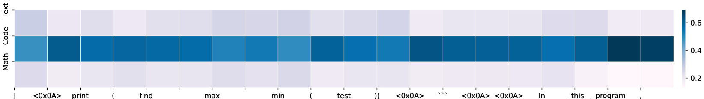

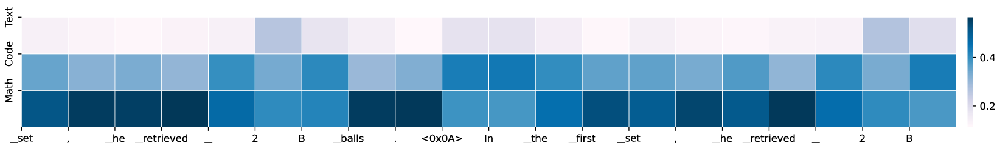

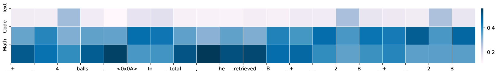

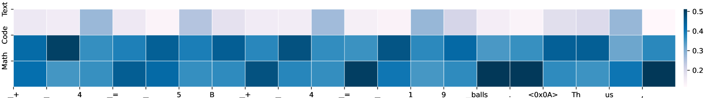

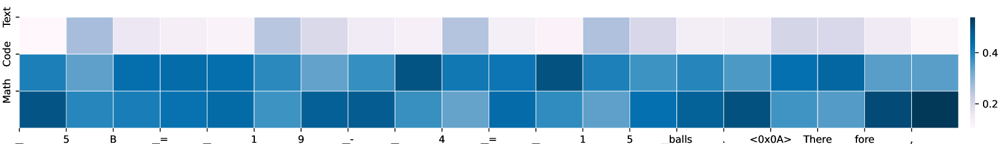

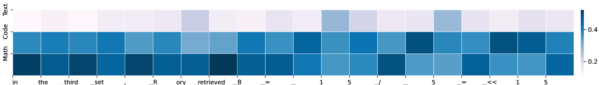

[Arxiv](https://arxiv.org/abs/2403.08281)