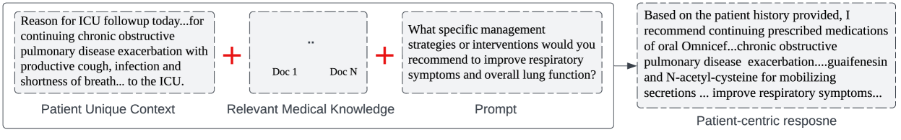
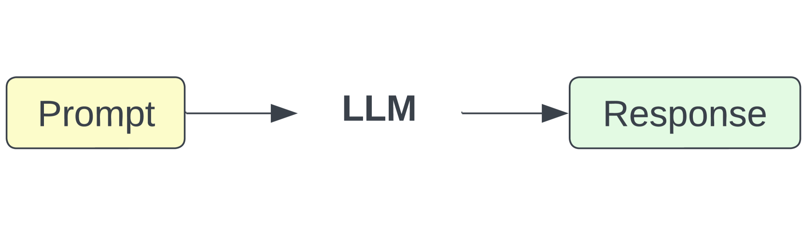
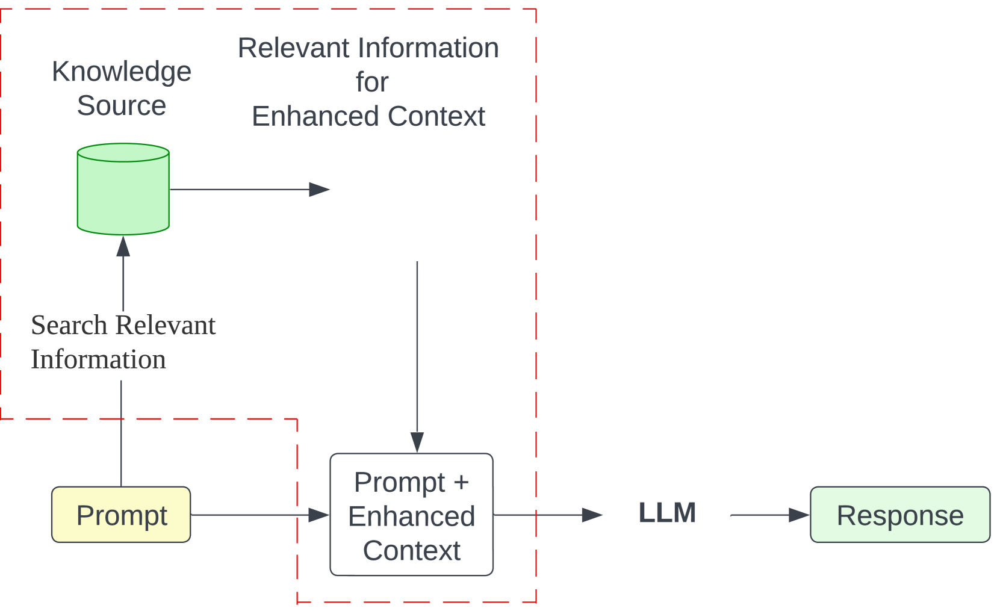
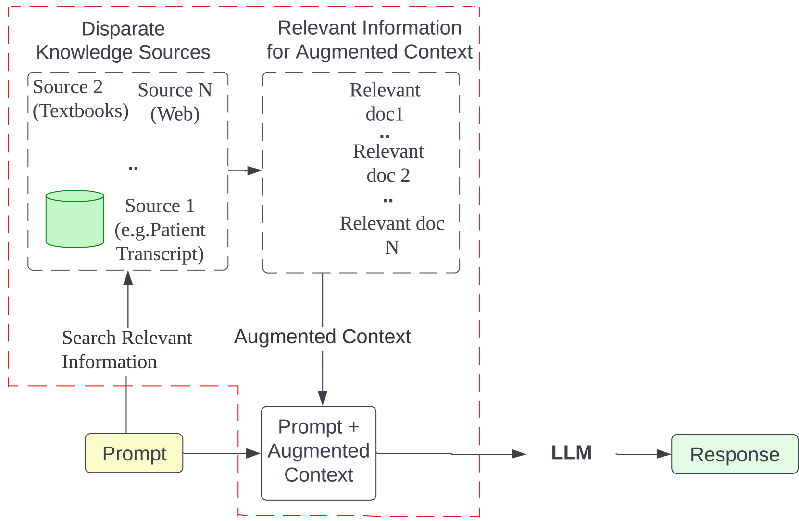
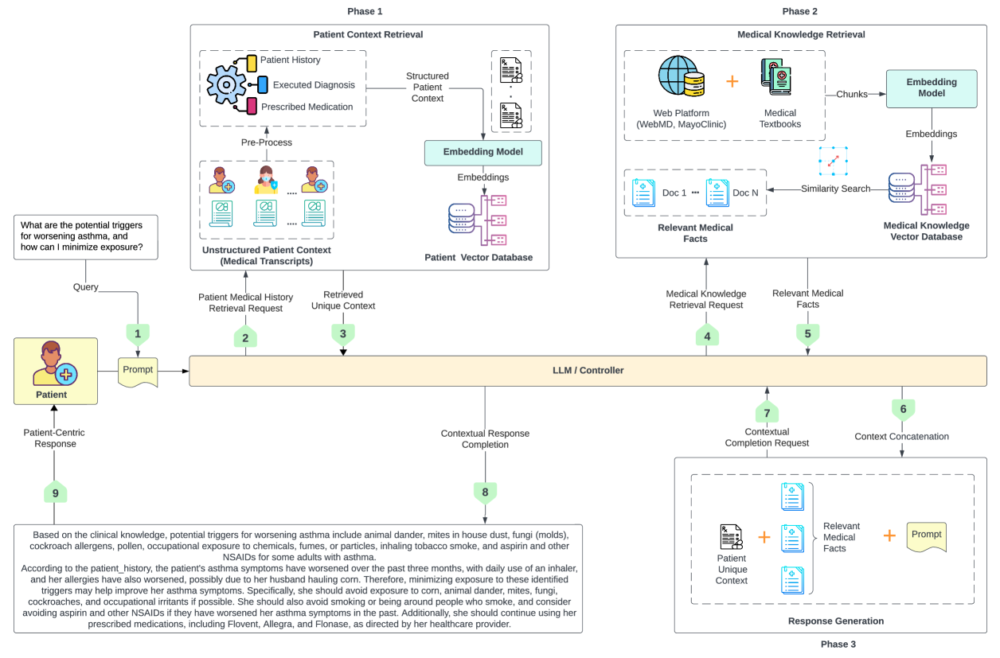
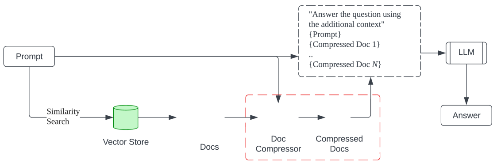
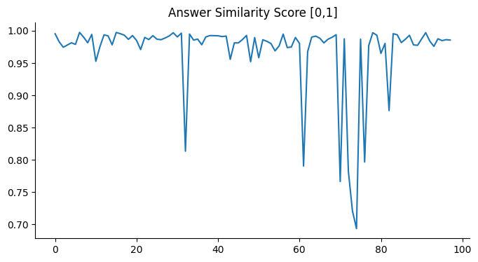
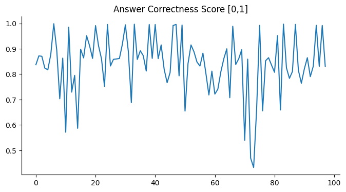
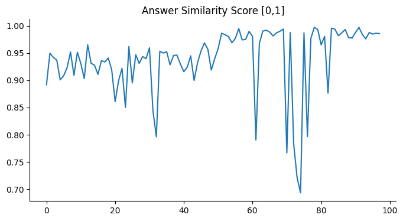
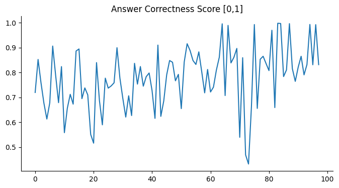

# MedInsight：针对大型语言模型，我们提出了一种创新的多源上下文增强框架，旨在借助该框架为生成个性化、以患者为中心的医疗回复提供有力支持。

发布时间：2024年03月13日

`LLM应用`

> MedInsight: A Multi-Source Context Augmentation Framework for Generating Patient-Centric Medical Responses using Large Language Models

# 摘要

> LLMs在生成类人回复上表现卓越，但在需要情境性和全面性回复的医疗场景中，由于缺乏特定领域知识而受限。为此，我们提出MedInsight——一种创新的检索增强框架，通过融合来自多方的背景信息来增强LLM的输入内容。MedInsight能从患者的病历或咨询记录中抽提重要信息，并基于患者的健康历史和状况整合权威医学教材及精心筛选的网络资源。MedInsight通过构造包含患者病历和相关医学知识的增强型语境，生成针对性强、详尽丰富的医疗回复，适用范围涵盖诊断、治疗建议以及患者教育等领域。在MTSamples数据集上的实验证明了MedInsight在生成符合情境的医学回复时的效果显著。定量评估结果显示，采用Ragas指标和TruLens衡量答案相似度和正确性时，模型表现出高效性。另外，经过由领域专家参与的人工评估验证，MedInsight在生成高度相关且准确的医疗回复方面获得了适度的一致认可。

> Large Language Models (LLMs) have shown impressive capabilities in generating human-like responses. However, their lack of domain-specific knowledge limits their applicability in healthcare settings, where contextual and comprehensive responses are vital. To address this challenge and enable the generation of patient-centric responses that are contextually relevant and comprehensive, we propose MedInsight:a novel retrieval augmented framework that augments LLM inputs (prompts) with relevant background information from multiple sources. MedInsight extracts pertinent details from the patient's medical record or consultation transcript. It then integrates information from authoritative medical textbooks and curated web resources based on the patient's health history and condition. By constructing an augmented context combining the patient's record with relevant medical knowledge, MedInsight generates enriched, patient-specific responses tailored for healthcare applications such as diagnosis, treatment recommendations, or patient education. Experiments on the MTSamples dataset validate MedInsight's effectiveness in generating contextually appropriate medical responses. Quantitative evaluation using the Ragas metric and TruLens for answer similarity and answer correctness demonstrates the model's efficacy. Furthermore, human evaluation studies involving Subject Matter Expert (SMEs) confirm MedInsight's utility, with moderate inter-rater agreement on the relevance and correctness of the generated responses.

[Arxiv](https://arxiv.org/abs/2403.08607)