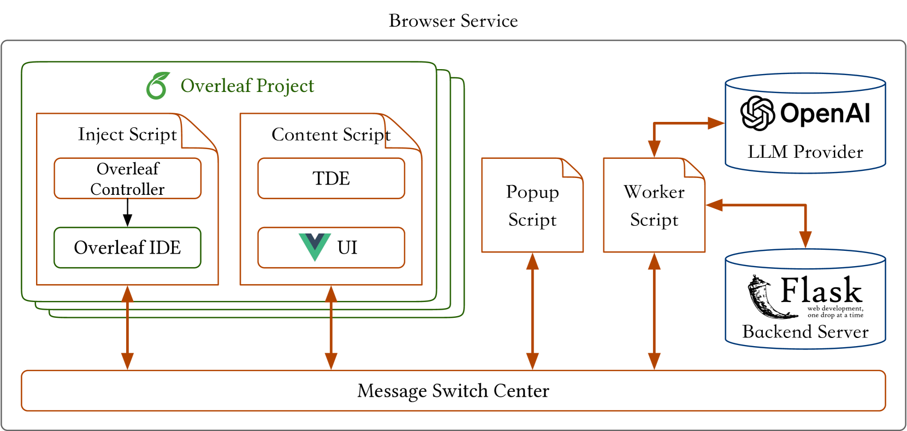
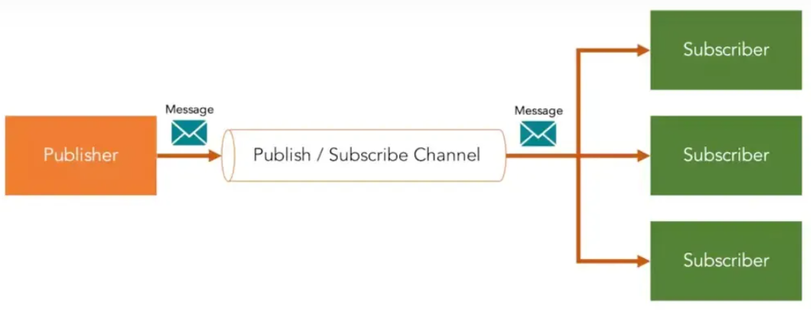

# OverleafCopilot：借助大型语言模型的力量，让 Overleaf 上的学术写作如虎添翼步骤详解：

发布时间：2024年03月13日

`LLM应用` `学术写作`

> OverleafCopilot: Empowering Academic Writing in Overleaf with Large Language Models

> 随着LLMs技术的迅猛发展，其在众多领域催生了丰富多样的应用。在此技术报告中，我们聚焦于将LLMs与热门学术写作工具Overleaf相结合，以提高学术写作的效能和水准。为此，我们需要克服三大难关：一是实现Overleaf与LLMs间的无缝互动；二是确保与LLM供应商稳定可靠的通信；三是保护用户隐私。针对这些问题，我们创新性地推出了OverleafCopilot——首款深度融合LLMs与Overleaf的浏览器插件，助力科研人员在撰写论文过程中便捷运用LLMs的强大功能。首先，我们设计了一个有效的架构桥梁，联通LLMs与Overleaf。接着，我们打造了PromptGenius网站，便于科研人员轻松获取和分享最新最优的提示资源。再者，我们构思了一套代理指令系统，助科研人员快速定制个性化的代理助手。目前，OverleafCopilot已上架Chrome扩展商店，服务于广大科研群体（链接：https://chromewebstore.google.com/detail/overleaf-copilot/eoadabdpninlhkkbhngoddfjianhlghb）。同时，PromptGenius的源代码已在GitHub开源（链接：https://github.com/wenhaomin/ChatGPT-PromptGenius）。我们坚信，这项工作有望颠覆学术写作的传统模式，让科研人员在更短时间内完成更高品质的研究论文创作。

> The rapid development of Large Language Models (LLMs) has facilitated a variety of applications from different domains. In this technical report, we explore the integration of LLMs and the popular academic writing tool, Overleaf, to enhance the efficiency and quality of academic writing. To achieve the above goal, there are three challenges: i) including seamless interaction between Overleaf and LLMs, ii) establishing reliable communication with the LLM provider, and iii) ensuring user privacy. To address these challenges, we present OverleafCopilot, the first-ever tool (i.e., a browser extension) that seamlessly integrates LLMs and Overleaf, enabling researchers to leverage the power of LLMs while writing papers. Specifically, we first propose an effective framework to bridge LLMs and Overleaf. Then, we developed PromptGenius, a website for researchers to easily find and share high-quality up-to-date prompts. Thirdly, we propose an agent command system to help researchers quickly build their customizable agents. OverleafCopilot (https://chromewebstore.google.com/detail/overleaf-copilot/eoadabdpninlhkkbhngoddfjianhlghb ) has been on the Chrome Extension Store, which now serves thousands of researchers. Additionally, the code of PromptGenius is released at https://github.com/wenhaomin/ChatGPT-PromptGenius. We believe our work has the potential to revolutionize academic writing practices, empowering researchers to produce higher-quality papers in less time.

[Arxiv](https://arxiv.org/abs/2403.09733)