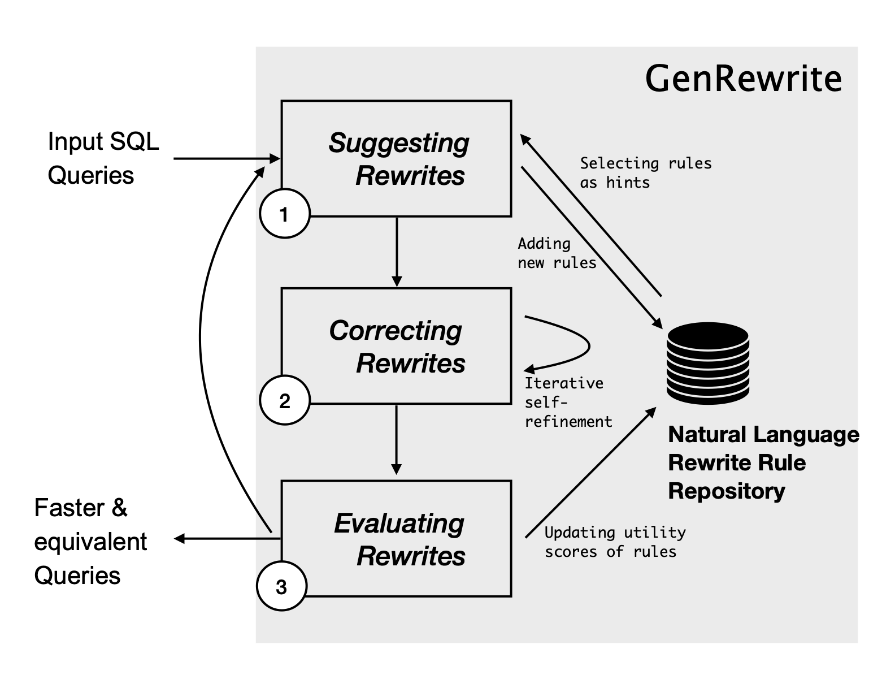
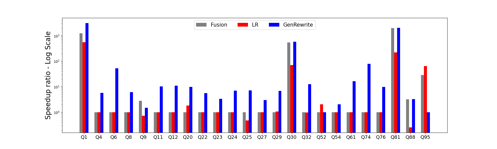

# 利用大型语言模型实现查询改写技术

发布时间：2024年03月13日

`LLM应用` `数据库`

> Query Rewriting via Large Language Models

> 面对低质量查询时，查询重写是向查询优化器传输前的关键技巧之一，但手动方式易出错且依赖专家经验，不具扩展性；传统的重写算法又仅能处理有限的查询场景，基于规则的方法难以适应新查询模式，基于合成的方法则无法处理复杂查询。所幸，如今具备广泛知识储备与高级推理技能的大型语言模型（LLMs）崭露头角，为解决这些长期悬而未决的问题带来曙光。本文介绍了首个全面应用LLMs进行查询重写的系统——GenRewrite。我们创新性地提出了“自然语言重写规则”（NLR2s），不仅以此引导LLM，还作为一种跨查询的知识迁移机制，让系统在不断实践中更智能、高效。此外，我们独创了一种以反例驱动的迭代技术，精准校正重写查询的语法和语义错误，有效减少了LLM成本及人工验证负担。实验证明，GenRewrite能让TPC公开基准中最复杂的99个查询中的22个查询速度提升超过2倍，其加速效果较现有最优的传统查询重写技术提高2.5至3.2倍，也比未经调整的LLM基线高出2.1倍。

> Query rewriting is one of the most effective techniques for coping with poorly written queries before passing them down to the query optimizer. Manual rewriting is not scalable, as it is error-prone and requires deep expertise. Similarly, traditional query rewriting algorithms can only handle a small subset of queries: rule-based techniques do not generalize to new query patterns and synthesis-based techniques cannot handle complex queries. Fortunately, the rise of Large Language Models (LLMs), equipped with broad general knowledge and advanced reasoning capabilities, has created hopes for solving some of these previously open problems.
  In this paper, we present GenRewrite, the first holistic system that leverages LLMs for query rewriting. We introduce the notion of Natural Language Rewrite Rules (NLR2s), and use them as hints to the LLM but also a means for transferring knowledge from rewriting one query to another, and thus becoming smarter and more effective over time. We present a novel counterexample-guided technique that iteratively corrects the syntactic and semantic errors in the rewritten query, significantly reducing the LLM costs and the manual effort required for verification. GenRewrite speeds up 22 out of 99 TPC queries (the most complex public benchmark) by more than 2x, which is 2.5x--3.2x higher coverage than state-of-the-art traditional query rewriting and 2.1x higher than the out-of-the-box LLM baseline.

[Arxiv](https://arxiv.org/abs/2403.09060)