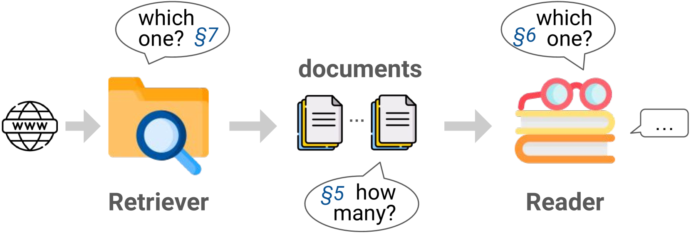
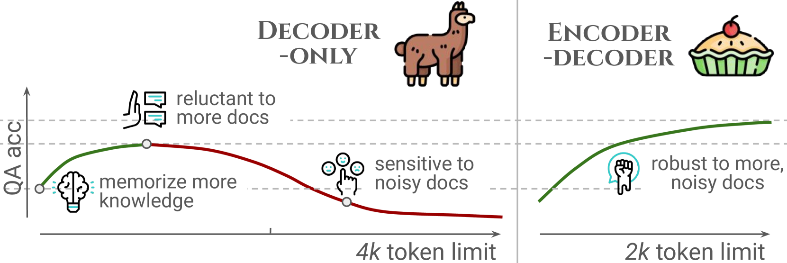
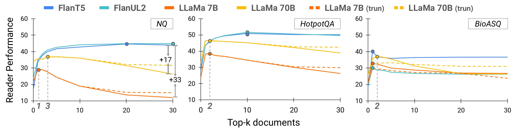
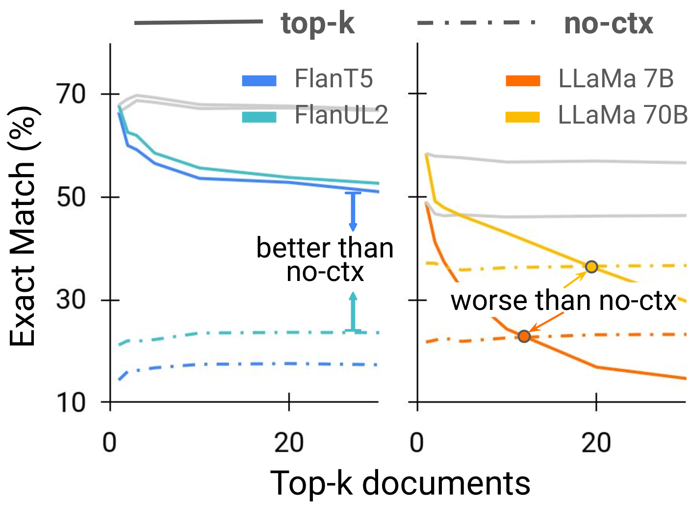
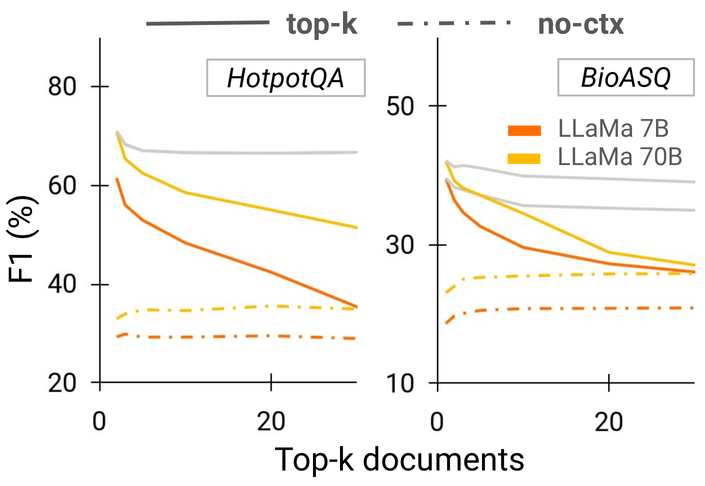
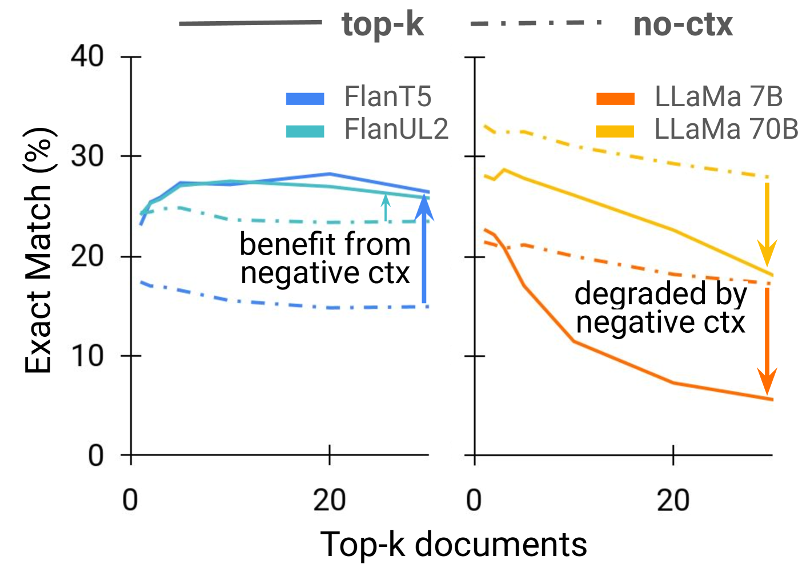
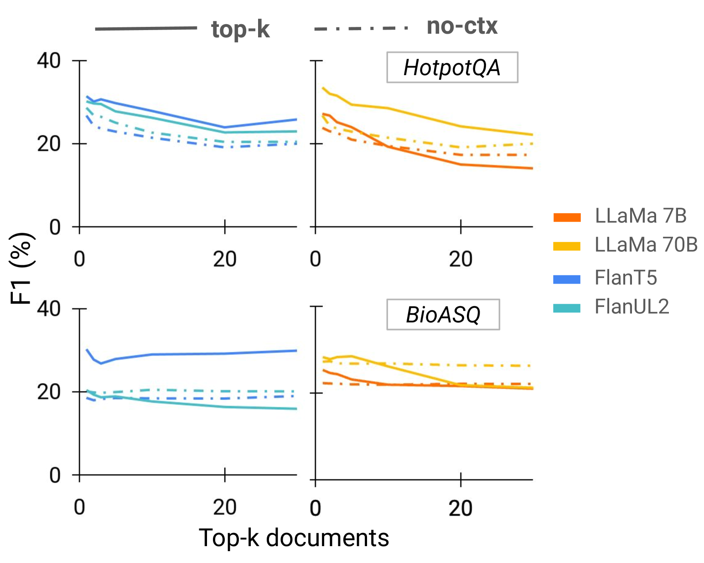
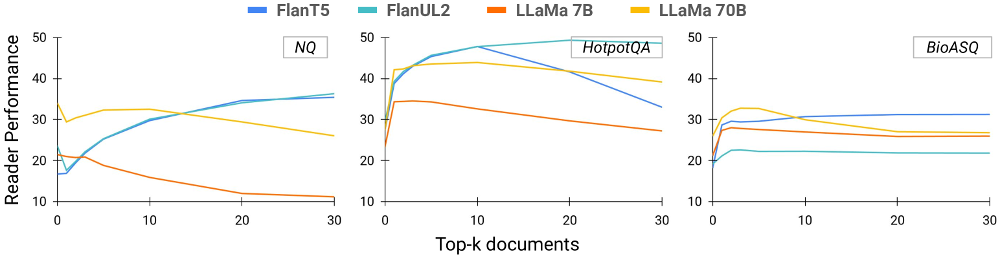

# RAGGED：致力于实现知情设计的检索增强生成系统研究，旨在深入理解并改进此类系统的构建方式。

发布时间：2024年03月13日

`RAG` `数据库问答` `语言模型`

> RAGGED: Towards Informed Design of Retrieval Augmented Generation Systems

> RAG技术通过为诸如DBQA这类任务补充背景信息，极大提升了LM的表现力，但其效能却与配置紧密相关，于是产生了一个核心问题——究竟怎样的RAG配置最为理想？为了解答这个问题，我们创新提出了RAGGED框架，用于深入分析并优化RAG系统。在一系列具有代表性的DBQA任务上，我们考察了两款经典稀疏和密集型检索器以及四款分别采用编码器-解码器和仅解码器架构且性能领先的LM。通过运用RAGGED，我们揭示了不同模型对于迥异RAG配置的适应差异：编码器-解码器模型随着文档增多性能会逐步提升；而仅解码器模型即便拥有较长的上下文窗口，通常也仅能有效利用不超过5份文档。此外，RAGGED还揭示了LM利用上下文的习惯规律：编码器-解码器模型更加倚重上下文信息，因而对检索质量更为敏感；而仅解码器模型则偏向于依赖训练过程中内化的知识。

> Retrieval-augmented generation (RAG) greatly benefits language models (LMs) by providing additional context for tasks such as document-based question answering (DBQA). Despite its potential, the power of RAG is highly dependent on its configuration, raising the question: What is the optimal RAG configuration? To answer this, we introduce the RAGGED framework to analyze and optimize RAG systems. On a set of representative DBQA tasks, we study two classic sparse and dense retrievers, and four top-performing LMs in encoder-decoder and decoder-only architectures. Through RAGGED, we uncover that different models suit substantially varied RAG setups. While encoder-decoder models monotonically improve with more documents, we find decoder-only models can only effectively use < 5 documents, despite often having a longer context window. RAGGED offers further insights into LMs' context utilization habits, where we find that encoder-decoder models rely more on contexts and are thus more sensitive to retrieval quality, while decoder-only models tend to rely on knowledge memorized during training.

[Arxiv](https://arxiv.org/abs/2403.09040)