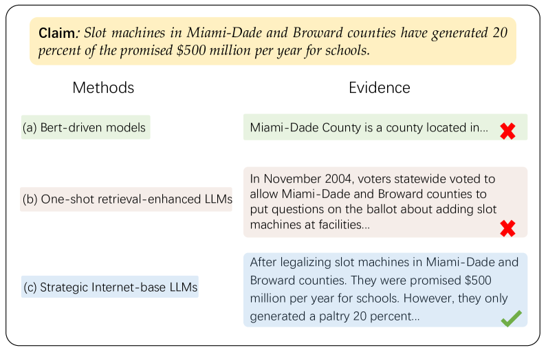
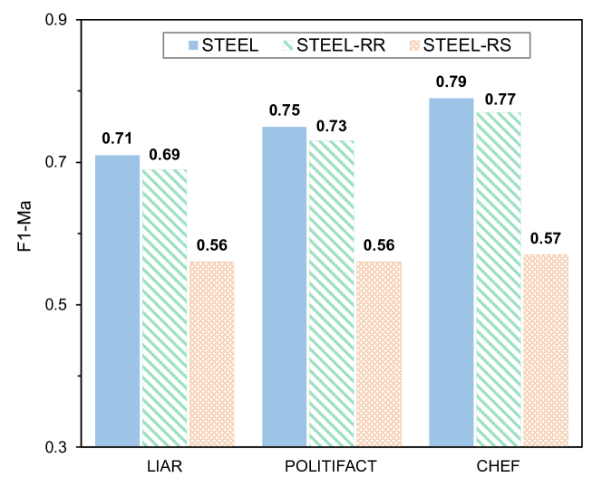
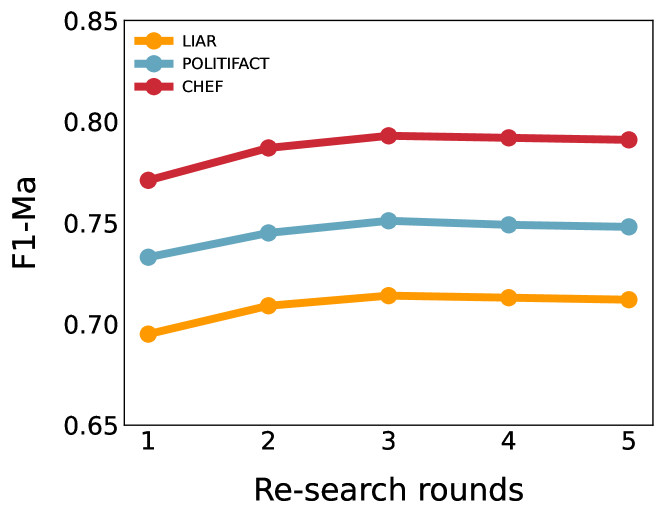
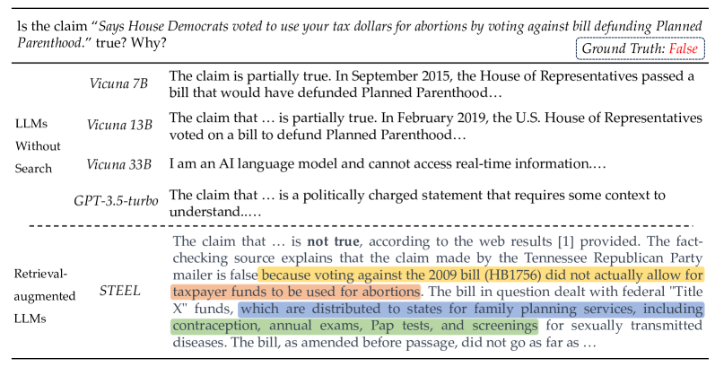
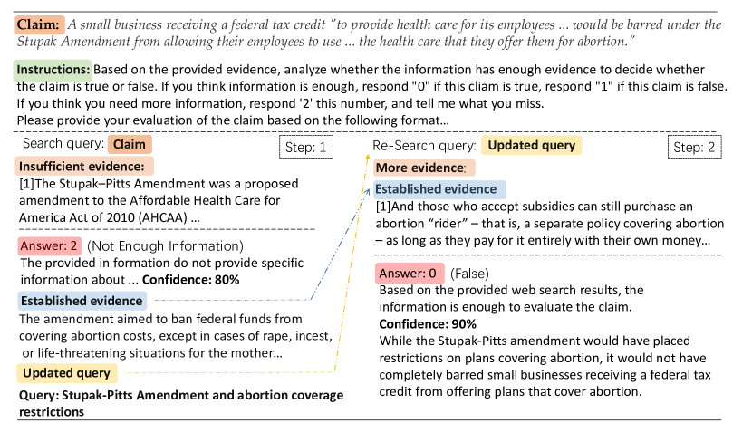

# 《重新搜索真相：通过多次检索增强的大规模语言模型在假新闻识别中展现强大实力》注：由于原句标题简短且具有一定的修辞特点，从准确性和生动性角度出发，在第一步直译的基础上，第二步仅做了微调以符合中文标题通常的行文习惯，保持了原有的紧凑与有力的表达风格。

发布时间：2024年03月13日

`LLM应用` `虚假信息检测`

> Re-Search for The Truth: Multi-round Retrieval-augmented Large Language Models are Strong Fake News Detectors

> 假新闻的广泛传播已对政治、经济乃至整个社会造成深远冲击。现有的假新闻检测手段虽已在应对这个问题上发挥了作用，但其有效性很大程度上取决于证据的质量与相关度，以及裁决预测机制的效果。传统的依赖静态资源库（如维基百科）的方法受限于数据更新滞后和不完整性，特别是在处理新兴或罕见言论时显得力不从心。如今，以强大的推理与生成能力闻名的大规模语言模型（LLMs）开辟了假新闻检测的新纪元。不过，同传统方法一样，基于LLM的解决方案也深受老旧及边缘知识不足的问题困扰，同时，增强检索功能的LLMs在低质量证据检索和上下文长度限制方面同样面临难题。因此，我们创新性地提出了一个首开先河的、融合检索增强技术的LLMs框架，它可以智能地从网络资源中自动抓取关键证据用于验证声明真伪。借助多轮检索策略，此框架确保能够获得充足且相关性强的证据，进而显著提升检测效果。在三个实际应用场景的数据集上进行全面实验，证实了该框架相对于已有方法的优势。尤为值得一提的是，我们的模型不仅能提供精准的判断结论，还能生成易于理解的人类可读解释，从而增强了结果的可解释性。

> The proliferation of fake news has had far-reaching implications on politics, the economy, and society at large. While Fake news detection methods have been employed to mitigate this issue, they primarily depend on two essential elements: the quality and relevance of the evidence, and the effectiveness of the verdict prediction mechanism. Traditional methods, which often source information from static repositories like Wikipedia, are limited by outdated or incomplete data, particularly for emerging or rare claims. Large Language Models (LLMs), known for their remarkable reasoning and generative capabilities, introduce a new frontier for fake news detection. However, like traditional methods, LLM-based solutions also grapple with the limitations of stale and long-tail knowledge. Additionally, retrieval-enhanced LLMs frequently struggle with issues such as low-quality evidence retrieval and context length constraints. To address these challenges, we introduce a novel, retrieval-augmented LLMs framework--the first of its kind to automatically and strategically extract key evidence from web sources for claim verification. Employing a multi-round retrieval strategy, our framework ensures the acquisition of sufficient, relevant evidence, thereby enhancing performance. Comprehensive experiments across three real-world datasets validate the framework's superiority over existing methods. Importantly, our model not only delivers accurate verdicts but also offers human-readable explanations to improve result interpretability.

[Arxiv](https://arxiv.org/abs/2403.09747)