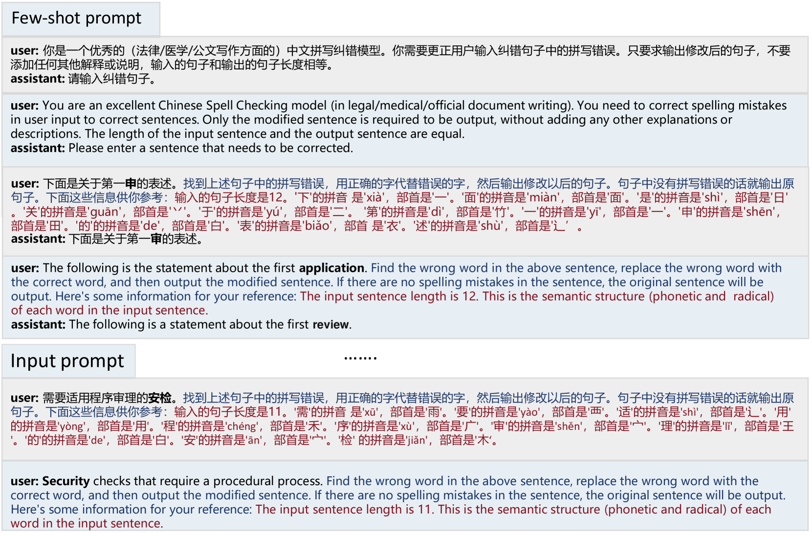
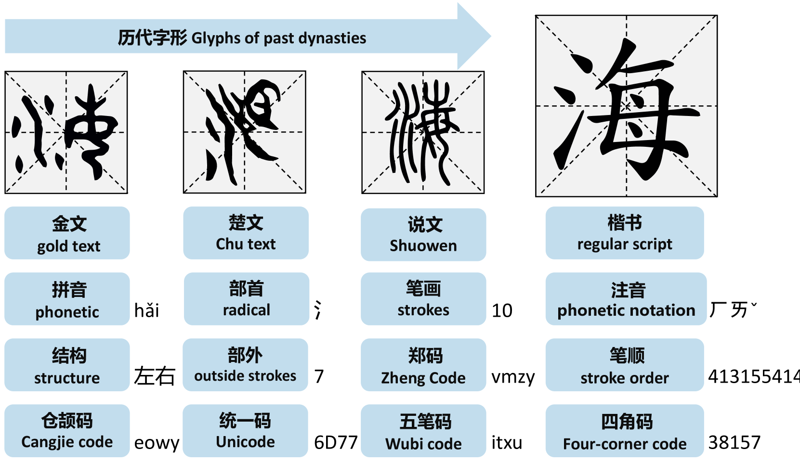
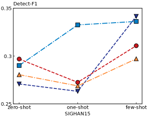
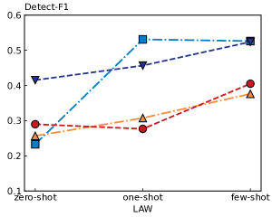
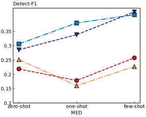
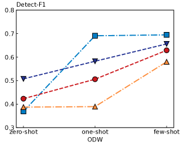
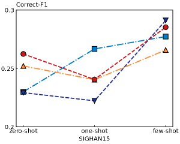
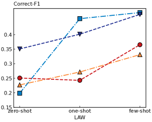
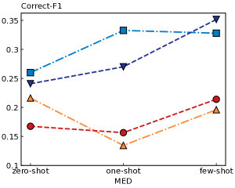
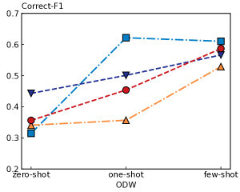

# 通过融入丰富语义知识以提升大型语言模型能力，我们致力于实现针对少量样本的高效中文拼写纠错。

发布时间：2024年03月13日

`LLM应用` `语音识别` `光学字符识别`

> Rich Semantic Knowledge Enhanced Large Language Models for Few-shot Chinese Spell Checking

# 摘要

> CSC 技术在 STT 和 OCR 领域扮演重要角色，当前基于 BERT 的主流方法表现出色，但在少量样本场景下受限于基础模型规模而显得力不从心。为此，本文探索利用一种名为 RS-LLM 的情境学习技术，让大型语言模型 (LLMs) 担当基础模型，并深入研究在该框架中融入不同类型的中文丰富语义信息的效果。实验表明，只需引入少量特定的中文语义结构，LLMs 即可在小样本 CSC 任务上超越 BERT 系列模型。我们在多个数据集上进行了一系列实验，实验证据有力证明了我们所构建框架的优势。

> Chinese Spell Checking (CSC) is a widely used technology, which plays a vital role in speech to text (STT) and optical character recognition (OCR). Most of the existing CSC approaches relying on BERT architecture achieve excellent performance. However, limited by the scale of the foundation model, BERT-based method does not work well in few-shot scenarios, showing certain limitations in practical applications. In this paper, we explore using an in-context learning method named RS-LLM (Rich Semantic based LLMs) to introduce large language models (LLMs) as the foundation model. Besides, we study the impact of introducing various Chinese rich semantic information in our framework. We found that by introducing a small number of specific Chinese rich semantic structures, LLMs achieve better performance than the BERT-based model on few-shot CSC task. Furthermore, we conduct experiments on multiple datasets, and the experimental results verified the superiority of our proposed framework.

[Arxiv](https://arxiv.org/abs/2403.08492)