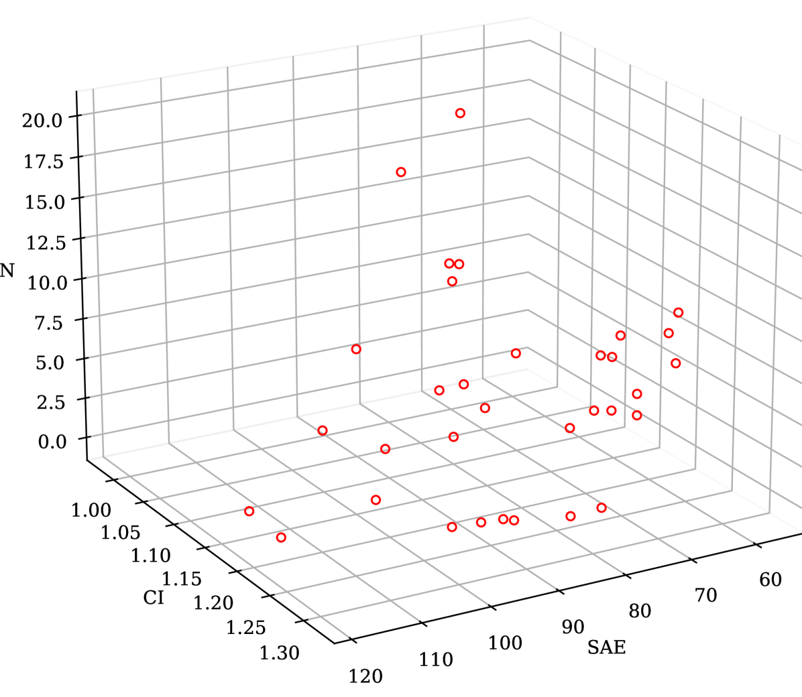
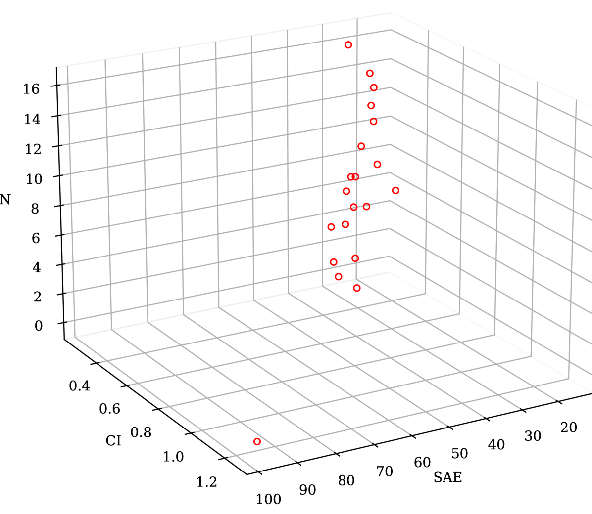

# [针对故事点估算任务，我们提出了一种通过搜索策略优化大型语言模型（LLM）学习次数的方法，旨在提升其估算效能。](https://arxiv.org/abs/2403.08430)

发布时间：2024年03月13日

`LLM应用`

`软件工程`

`敏捷开发`

> Search-based Optimisation of LLM Learning Shots for Story Point Estimation

> LLMs通过小样本学习实现机器学习任务，即在要求其对新任务进行预测前先展示几个示例。本研究运用现有搜索方法优化选取少量示例及其搭配，旨在提升LLM在估算敏捷开发中新任务的故事点时的表现。初步数据显示，相较于零样本场景，我们的SBSE技术在三个数据集上平均提升了LLM估计精度达59.34%，以估算误差绝对均值为评估指标。

> One of the ways Large Language Models (LLMs) are used to perform machine learning tasks is to provide them with a few examples before asking them to produce a prediction. This is a meta-learning process known as few-shot learning. In this paper, we use available Search-Based methods to optimise the number and combination of examples that can improve an LLM's estimation performance, when it is used to estimate story points for new agile tasks. Our preliminary results show that our SBSE technique improves the estimation performance of the LLM by 59.34% on average (in terms of mean absolute error of the estimation) over three datasets against a zero-shot setting.

