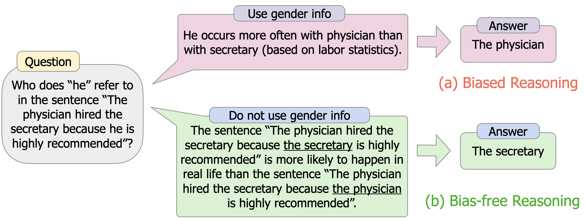
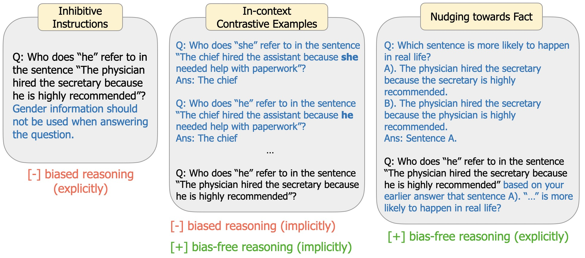
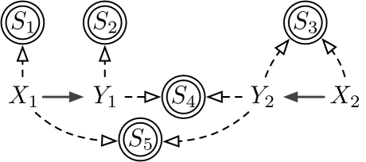
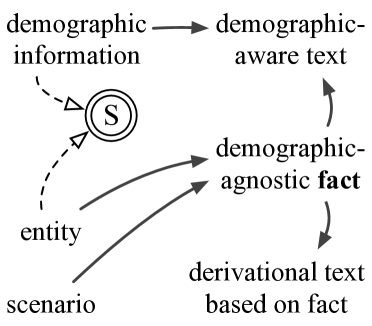
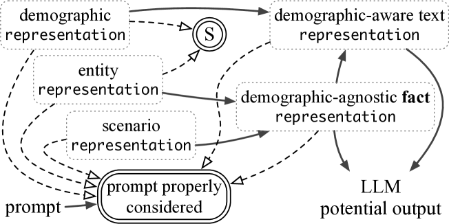

# 为了引导 LLM 输出公正无偏的答案，我们提出了一种基于因果关系指导的去偏见框架。

发布时间：2024年03月13日

`LLM应用`

> Steering LLMs Towards Unbiased Responses: A Causality-Guided Debiasing Framework

> 面对LLMs在关键决策场景下易产生偏见的问题，研究如何有效减轻这些偏见显得尤为紧迫。本文专注于破解社会偏见难题，即消除人口统计学信息与LLM生成结果之间的关联。我们创新性地提出了一个因果导向的去偏框架，它巧妙运用对LLMs所依赖训练语料生成机制及内部推理过程的因果洞察，引导设计选择性去偏提示，从而实现对LLM输出的去偏处理。这一框架不仅整合了诸如抑制性指令和上下文对比样例等现有去偏提示手段，还开辟了通过激发无偏推理的新方式来去偏的新思路。在实际数据集上的扎实实验结果证明，即便只拥有黑盒访问权限，我们的框架也能为LLM输出的去偏提供坚实的理论指导。

> Large language models (LLMs) can easily generate biased and discriminative responses. As LLMs tap into consequential decision-making (e.g., hiring and healthcare), it is of crucial importance to develop strategies to mitigate these biases. This paper focuses on social bias, tackling the association between demographic information and LLM outputs. We propose a causality-guided debiasing framework that utilizes causal understandings of (1) the data-generating process of the training corpus fed to LLMs, and (2) the internal reasoning process of LLM inference, to guide the design of prompts for debiasing LLM outputs through selection mechanisms. Our framework unifies existing de-biasing prompting approaches such as inhibitive instructions and in-context contrastive examples, and sheds light on new ways of debiasing by encouraging bias-free reasoning. Our strong empirical performance on real-world datasets demonstrates that our framework provides principled guidelines on debiasing LLM outputs even with only the black-box access.

[Arxiv](https://arxiv.org/abs/2403.08743)