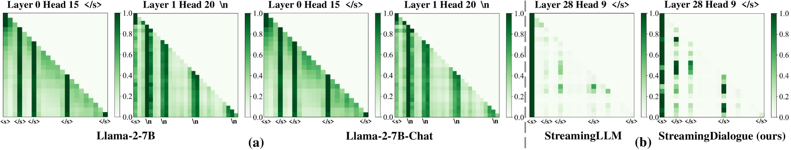
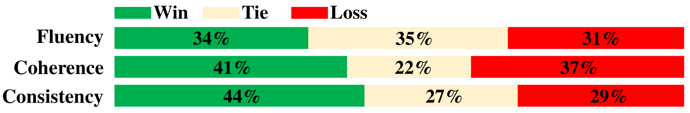
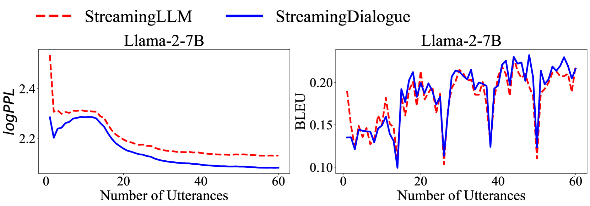
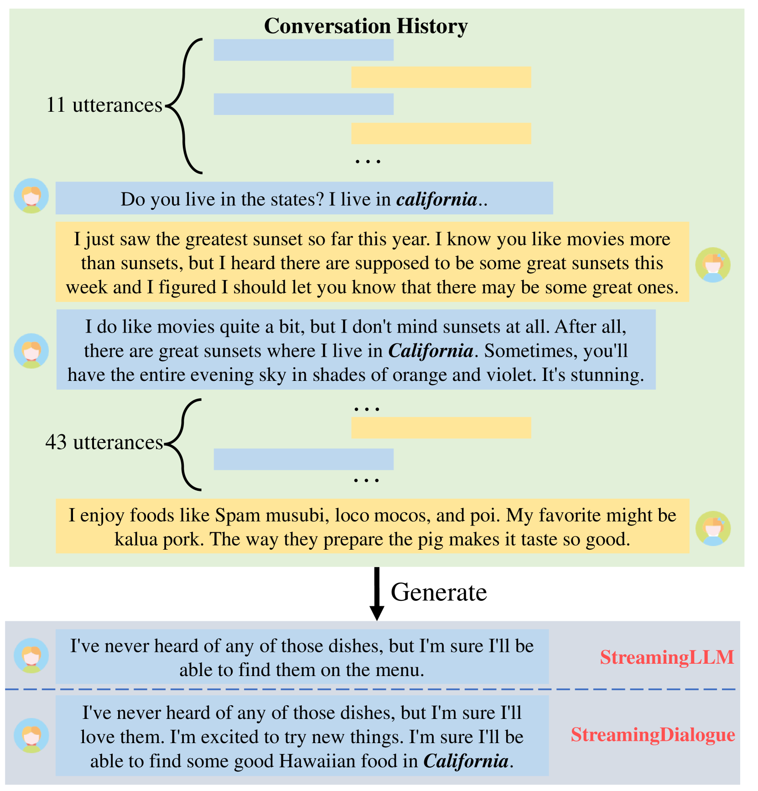
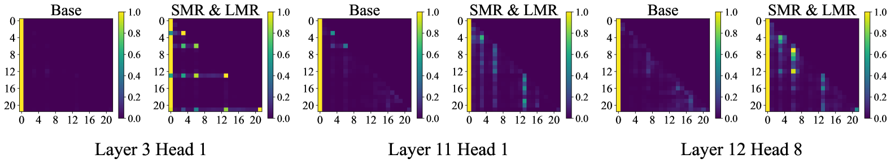
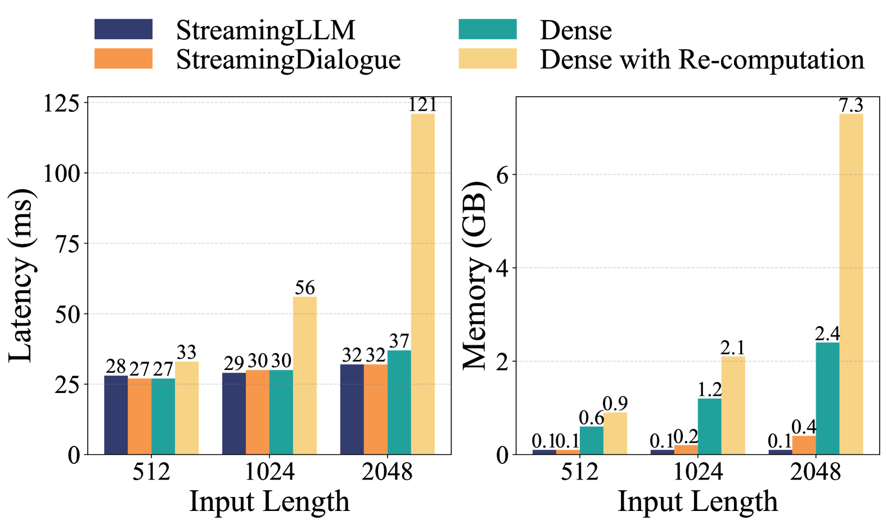
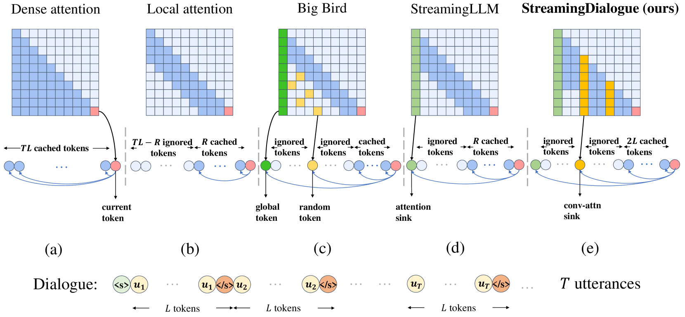
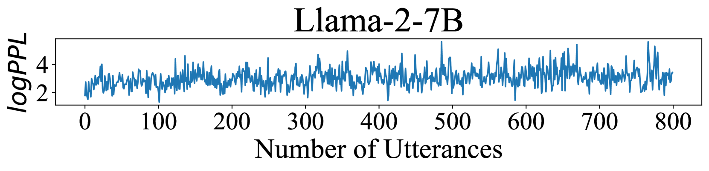
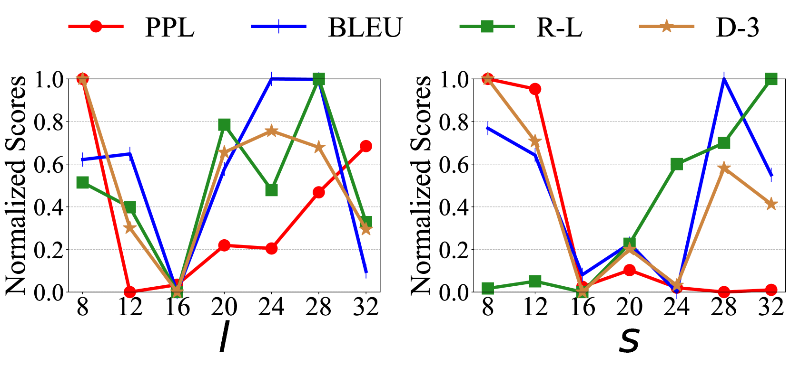

# StreamingDialogue 方法借助于最小损失的长上下文高效压缩技术，实现了对话模型对长时间、连续对话的深入学习。

发布时间：2024年03月13日

`LLM应用` `对话系统`

> StreamingDialogue: Prolonged Dialogue Learning via Long Context Compression with Minimal Losses

> 面对拥有长背景的对话处理难题，标准LLMs因效率及一致性问题而显得力不从心。研究发现，对话内容具有明显结构特征，其中“话语结束”符号EoU蕴含着整合信息的可能性。我们形象地称其为“会话注意力汇流点”。为此，我们创新性地提出了StreamingDialogue方案，它能将冗长的对话历史高效压缩至汇流点，几乎无损地降低计算复杂度，复杂度与汇流点数量（即话语数）成平方反比关系。如今部分LLMs已展示出处理数十万级别上下文窗口的能力，通过将多条话语浓缩为EoU， StreamingDialogue有望进一步突破这个阈值，有效延长对话学习的深度。为确保压缩后的信息重构损失降到最低，我们精心设计了短期记忆重建（SMR）和长期记忆唤醒（LMR）两种学习策略。实验证明，此方法在对话任务上超越强劲基准，速度提升高达4倍，同时内存占用量仅为原有密集注意力重新计算方法的1/18。

> Standard Large Language Models (LLMs) struggle with handling dialogues with long contexts due to efficiency and consistency issues. According to our observation, dialogue contexts are highly structured, and the special token of \textit{End-of-Utterance} (EoU) in dialogues has the potential to aggregate information. We refer to the EoU tokens as ``conversational attention sinks'' (conv-attn sinks). Accordingly, we introduce StreamingDialogue, which compresses long dialogue history into conv-attn sinks with minimal losses, and thus reduces computational complexity quadratically with the number of sinks (i.e., the number of utterances). Current LLMs already demonstrate the ability to handle long context window, e.g., a window size of 200k or more. To this end, by compressing utterances into EoUs, our method has the potential to handle more than 200k of utterances, resulting in a prolonged dialogue learning. In order to minimize information losses from reconstruction after compression, we design two learning strategies of short-memory reconstruction (SMR) and long-memory reactivation (LMR). Our method outperforms strong baselines in dialogue tasks and achieves a 4 $\times$ speedup while reducing memory usage by 18 $\times$ compared to dense attention recomputation.

[Arxiv](https://arxiv.org/abs/2403.08312)