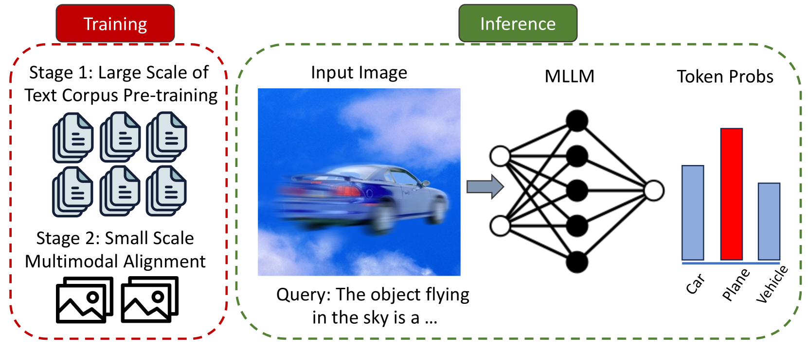
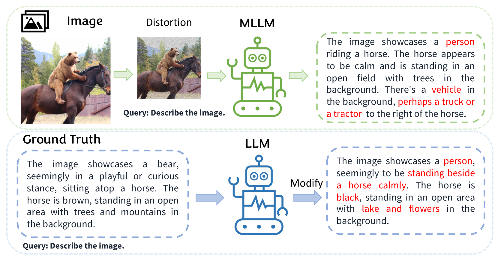
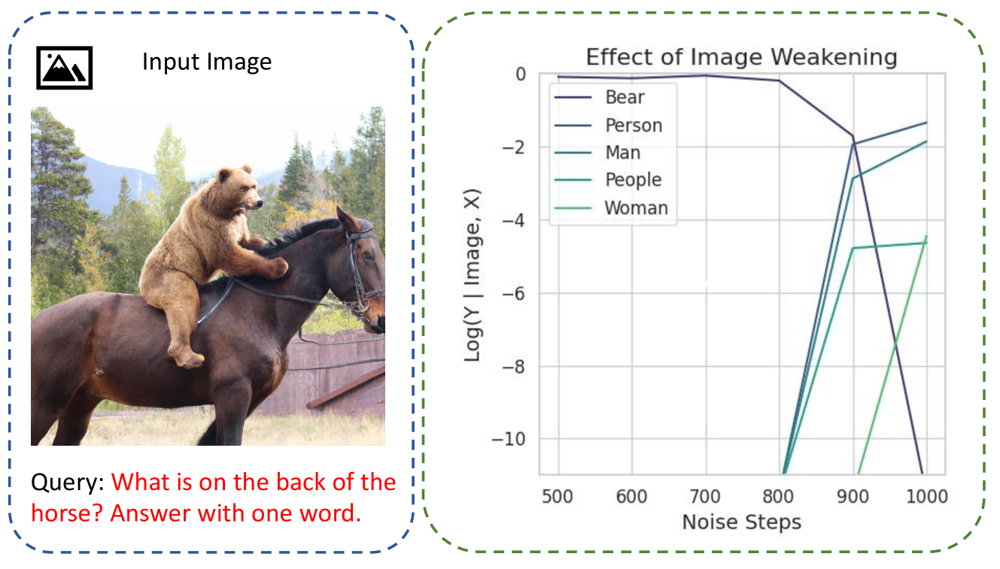
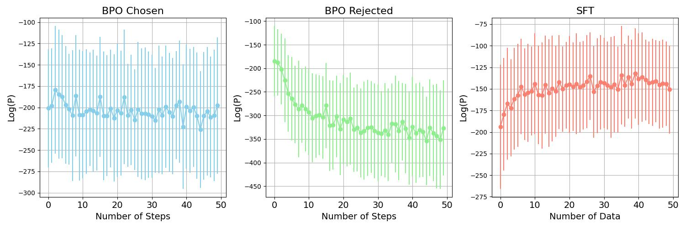
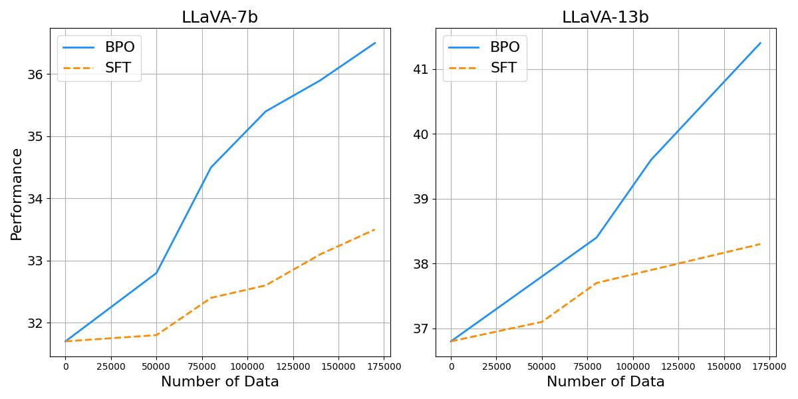

# [运用引导式偏好优化策略，提升多模态大型语言模型的表现力和效能。](https://arxiv.org/abs/2403.08730)

发布时间：2024年03月13日

`LLM应用` `对话系统` `多模态`

> Strengthening Multimodal Large Language Model with Bootstrapped Preference Optimization

> MLLM 能够根据视觉输入出色地生成回复，不过常常会受到预训练语料库的影响而偏向于生成与其相似的回复，进而削弱了对视觉信息的关注。我们把这种现象看作是模型对预训练统计特征的一种“偏好”，它妨碍了模型对视觉输入的有效捕捉。为此，我们创新性地提出 Bootstrapped Preference Optimization (BPO) 策略，借助从模型内部引导生成的负面示例数据集进行偏好学习。具体而言，我们设计了两个关键步骤：首先，通过给 MLLM 输入失真图像，诱导其产生具有明显预训练偏差的回复；其次，运用基于文本的 LLM 有意识地向原始回复中注入常见但错误的元素。接着，我们将这些不尽人意的回复与实际数据集中的标准回复配对，形成偏好学习的数据集，并用此数据集进行后续学习。这种方法成功地减轻了预训练 LLM 的固有偏好，使模型在处理视觉输入时能够实现更好的定位效果。大量实验验证了该方法在多个评估指标上的显著改进，有力地推动了多模态对话系统的前沿发展。

> Multimodal Large Language Models (MLLMs) excel in generating responses based on visual inputs. However, they often suffer from a bias towards generating responses similar to their pretraining corpus, overshadowing the importance of visual information. We treat this bias as a "preference" for pretraining statistics, which hinders the model's grounding in visual input. To mitigate this issue, we propose Bootstrapped Preference Optimization (BPO), which conducts preference learning with datasets containing negative responses bootstrapped from the model itself. Specifically, we propose the following two strategies: 1) using distorted image inputs to the MLLM for eliciting responses that contain signified pretraining bias; 2) leveraging text-based LLM to explicitly inject erroneous but common elements into the original response. Those undesirable responses are paired with original annotated responses from the datasets to construct the preference dataset, which is subsequently utilized to perform preference learning. Our approach effectively suppresses pretrained LLM bias, enabling enhanced grounding in visual inputs. Extensive experimentation demonstrates significant performance improvements across multiple benchmarks, advancing the state-of-the-art in multimodal conversational systems.

[Arxiv](https://arxiv.org/abs/2403.08730)