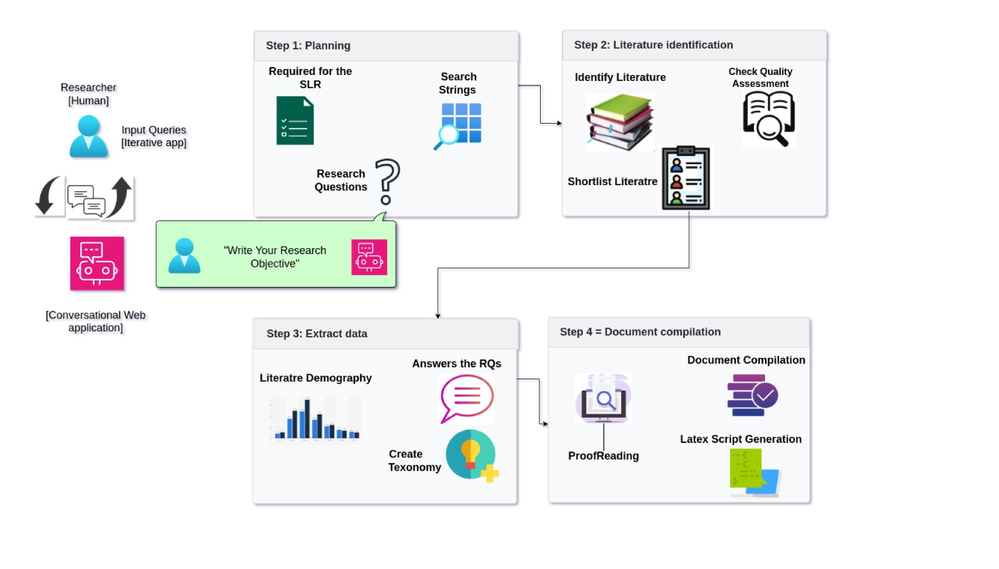
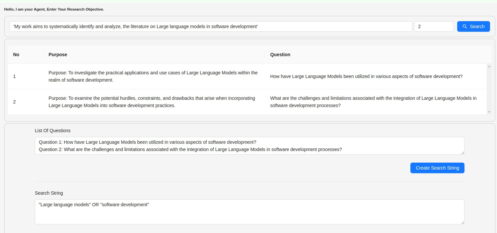
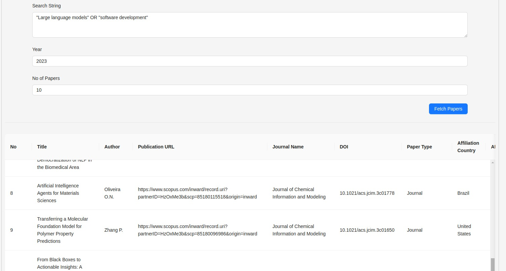
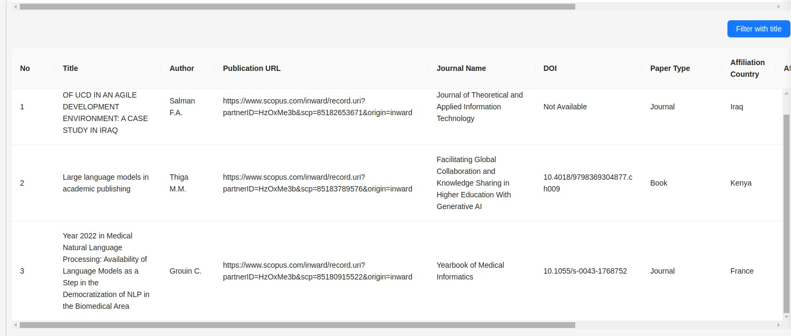
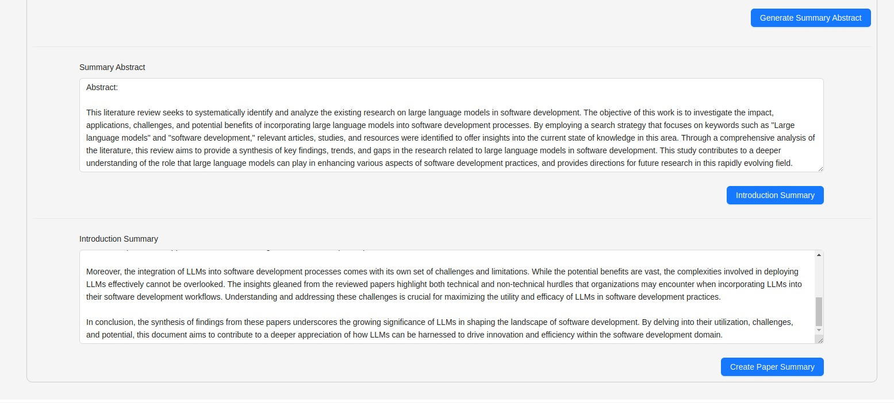

# [本研究提出了一种采用多个AI代理进行系统性文献综述的创新系统，并对其进行了深入的概念阐述和严谨的实证评估。](https://arxiv.org/abs/2403.08399)

发布时间：2024年03月13日

`Agent`

`软件工程`

`文献综述`

> System for systematic literature review using multiple AI agents: Concept and an empirical evaluation

> SLR已成为证据驱动研究的基石，助力研究者依据特定问题筛选、归类并整合现有研究成果。尽管在近几年，研究者已在部分环节实现SLR过程的自动化以节省时间和精力，但仍未出现能全程自动化的AI代理模型。为解决这一问题，我们创新设计了一款多AI代理模型，它能全面自动完成SLR全过程。借助LLMs的强大功能，此模型极大地简化了审阅流程，提升了精准度和效率。用户只需在一个友好界面上输入研究主题，模型将自动生成对应搜索串，检索相关学术文献。之后模型会进行包含和排除的双重筛选，重点关注与特定研究领域紧密相关的文章标题。接着，模型将智能概括这些论文摘要，只保留与研究领域直接相关的部分。最后，模型将围绕预设研究问题深入剖析精选出的论文。我们邀请了十位资深软件工程研究人员对该模型进行试用与分析，他们对此模型反响热烈并提出了宝贵的改进建议。该项目源代码已发布在GitHub库https://github.com/GPT-Laboratory/SLR-automation上。

> Systematic Literature Reviews (SLRs) have become the foundation of evidence-based studies, enabling researchers to identify, classify, and combine existing studies based on specific research questions. Conducting an SLR is largely a manual process. Over the previous years, researchers have made significant progress in automating certain phases of the SLR process, aiming to reduce the effort and time needed to carry out high-quality SLRs. However, there is still a lack of AI agent-based models that automate the entire SLR process. To this end, we introduce a novel multi-AI agent model designed to fully automate the process of conducting an SLR. By utilizing the capabilities of Large Language Models (LLMs), our proposed model streamlines the review process, enhancing efficiency and accuracy. The model operates through a user-friendly interface where researchers input their topic, and in response, the model generates a search string used to retrieve relevant academic papers. Subsequently, an inclusive and exclusive filtering process is applied, focusing on titles relevant to the specific research area. The model then autonomously summarizes the abstracts of these papers, retaining only those directly related to the field of study. In the final phase, the model conducts a thorough analysis of the selected papers concerning predefined research questions. We also evaluated the proposed model by sharing it with ten competent software engineering researchers for testing and analysis. The researchers expressed strong satisfaction with the proposed model and provided feedback for further improvement. The code for this project can be found on the GitHub repository at https://github.com/GPT-Laboratory/SLR-automation.

