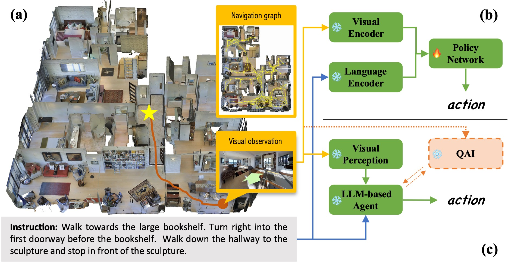
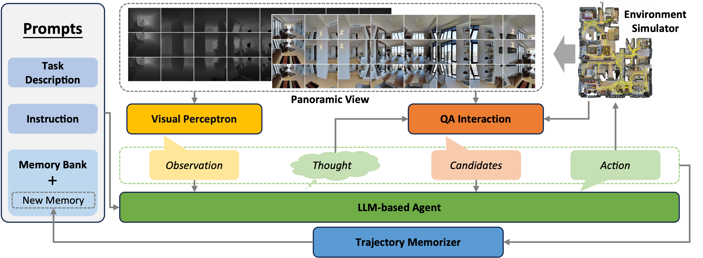
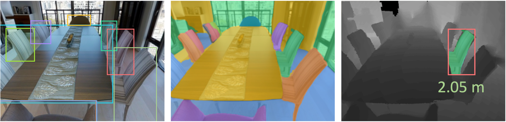
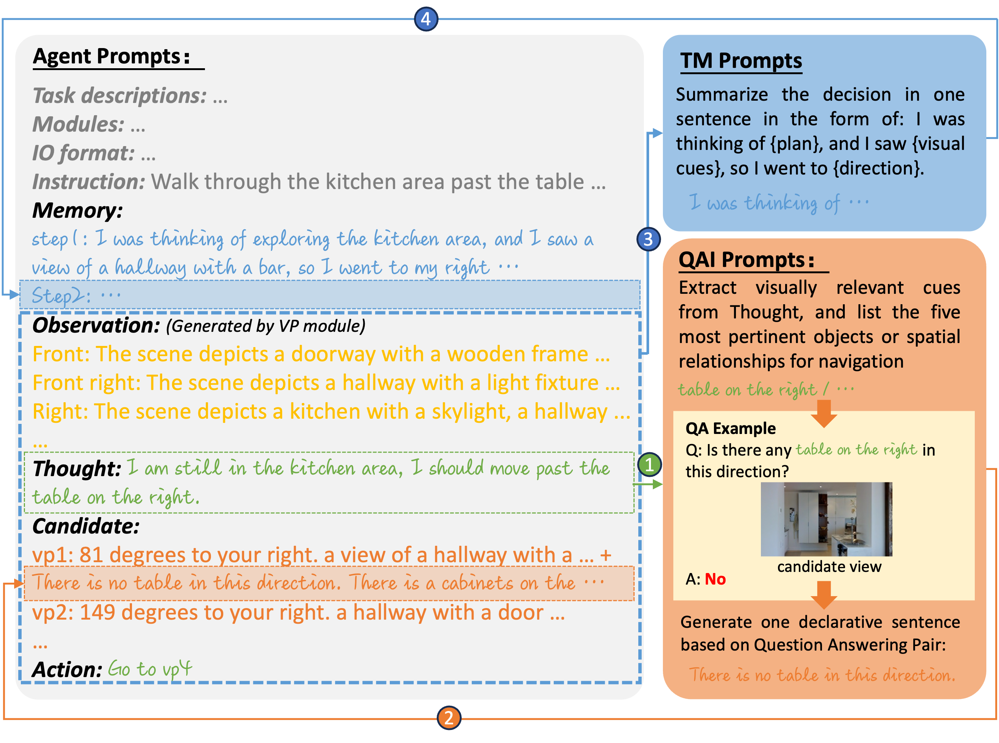
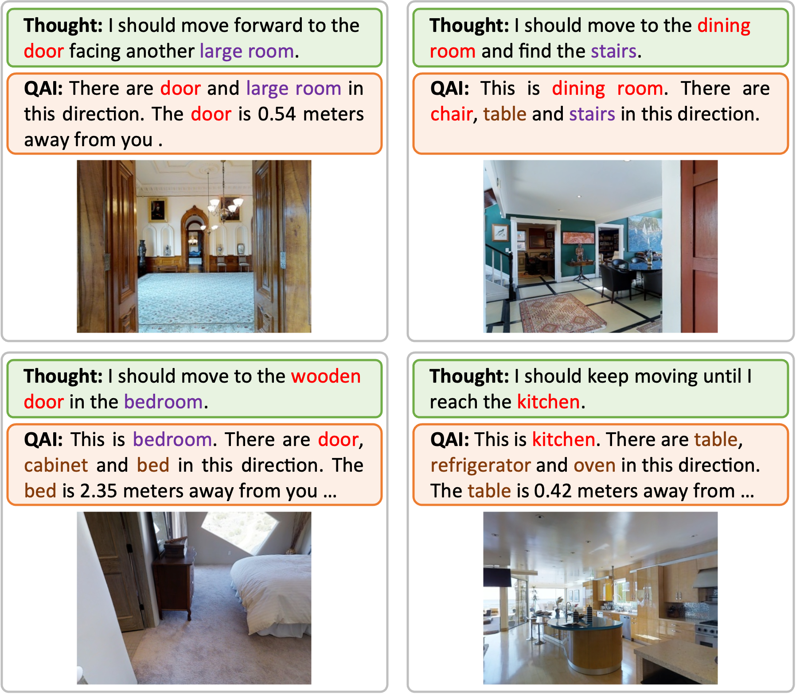

# [TINA 是一个专为零样本视觉语言导航设计的框架，涵盖了思考（Think）、交互（Interaction）和行动（Action）三个关键维度。](https://arxiv.org/abs/2403.08833)

发布时间：2024年03月13日

`Agent`

``

``

> TINA: Think, Interaction, and Action Framework for Zero-Shot Vision Language Navigation

> 零射导航是VLN任务的关键难题，要求模型能灵活应对陌生指令并自如探索未知环境。然而，现有的依赖于强化学习训练及注释数据的监督学习模型在泛化能力上表现受限。这时，拥有深厚知识储备和卓越推理能力的大型语言模型（LLMs）为解决零射导航问题带来新的可能。本文介绍了一个基于LLMs的VLN智能体，探究了零射导航的相关策略。针对LLMs在环境感知上的短板，我们创新性地设计了Thinking, Interacting, and Action（TINA）框架。该框架使得智能体能够精细审视感知信息，并通过嵌入式问答模块主动查询环境中的关键信息，确保指令与具体感知数据紧密匹配。借助TINA框架，智能体的感知能力得以大幅提升，同时，清晰的思维和查询流程也让导航过程变得更为可解释、透明。我们在Room-to-Room数据集上验证了我们方法的有效性，实验结果表明，此方法显著提升了基于LLMs的智能体在导航任务上的表现，甚至在零射导航场景中优于部分基于监督学习的传统方法，充分展示了其在解决此类问题上的优越性。

> Zero-shot navigation is a critical challenge in Vision-Language Navigation (VLN) tasks, where the ability to adapt to unfamiliar instructions and to act in unknown environments is essential. Existing supervised learning-based models, trained using annotated data through reinforcement learning, exhibit limitations in generalization capabilities. Large Language Models (LLMs), with their extensive knowledge and emergent reasoning abilities, present a potential pathway for achieving zero-shot navigation. This paper presents a VLN agent based on LLMs, exploring approaches to the zero-shot navigation problem. To compensate for the shortcomings of LLMs in environmental perception, we propose the Thinking, Interacting, and Action (TINA) framework. TINA enables the agent to scrutinize perceptual information and autonomously query key clues within the environment through an introduced question-answering module, thereby aligning instructions with specific perceptual data. The navigation agent's perceptual abilities are enhanced through the TINA framework, while the explicit thought and query processes also improve the navigational procedure's explainability and transparency. We evaluate the performance of our method on the Room-to-Room dataset. The experiment results indicate that our approach improves the navigation performance of LLM-based agents. Our approach also outperformed some supervised learning-based methods, highlighting its efficacy in zero-shot navigation.

