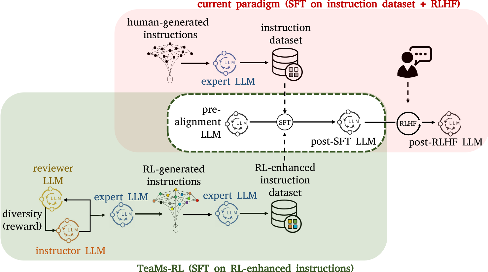
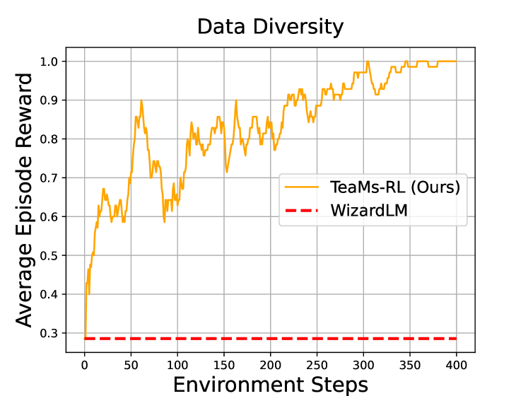
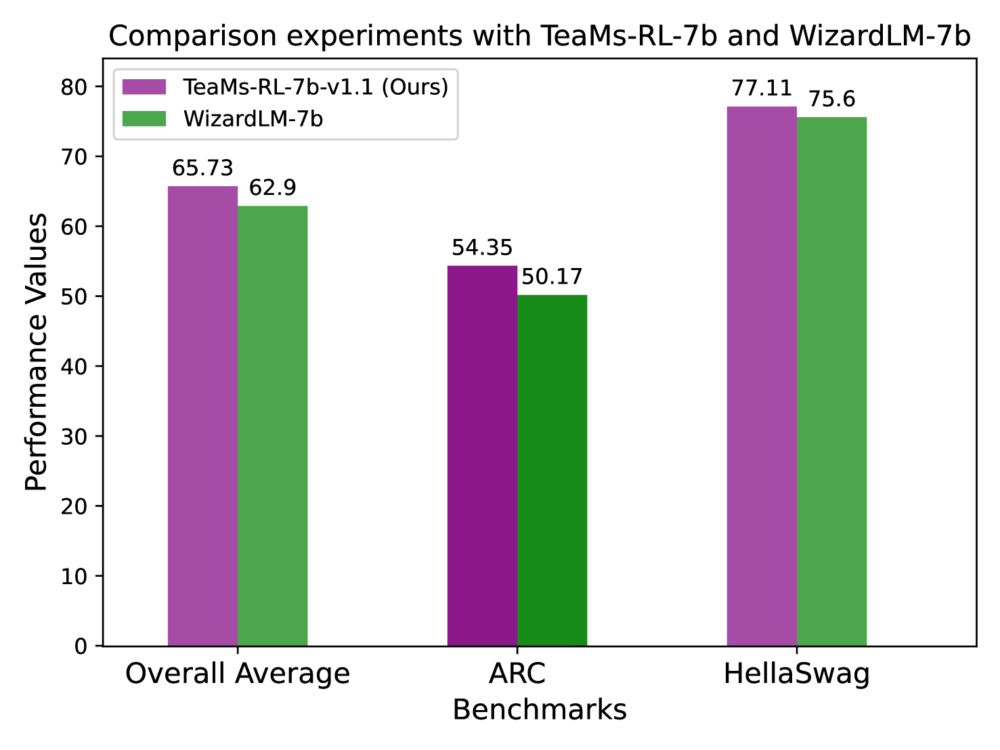
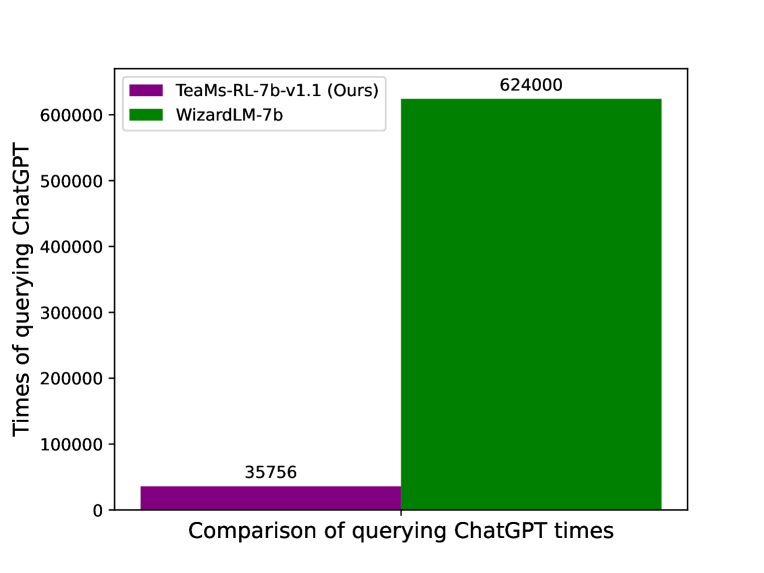
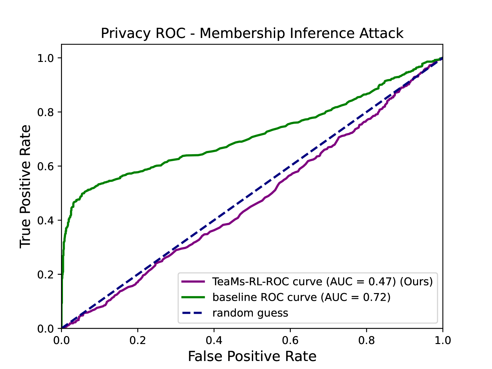

# TeaMs-RL项目利用强化学习，让大型语言模型（LLMs）学会自我优化和改进指令。这项研究旨在通过RL机制使LLMs能够更有效地进行自我教学，不断提升其理解与生成高质量指令的能力。

发布时间：2024年03月13日

`Agent`

> TeaMs-RL: Teaching LLMs to Teach Themselves Better Instructions via Reinforcement Learning

> 在面对LLMs开发中的难题时，如强化学习中的人工标注依赖和自教学模式带来的高昂外部查询成本，我们另辟蹊径，采用强化学习（RL），并加以巧妙改良。不同于常规的RLHF通过后期指令数据训练优化LLMs，我们运用RL直接创建一个足以一步到位完成微调的基础指令数据集。我们的创新方法TeaMs-RL借助一系列文本操作和规则，着力提升训练数据集的多样性，使得在不严重依赖外部高端模型的情况下也能生成高质量数据，进而实现只需一次微调步骤，省去了后续RLHF阶段的繁琐过程。研究揭示了我们的方法关键优点：大幅度减少人工介入和模型查询需求（只占WizardLM总查询量的$5.73\%$），并且相比强劲基准，LLMs在构建和解读复杂指令上展现出更强实力，同时有效提高了模型隐私保护水平。

> The development of Large Language Models (LLMs) often confronts challenges stemming from the heavy reliance on human annotators in the reinforcement learning with human feedback (RLHF) framework, or the frequent and costly external queries tied to the self-instruct paradigm. In this work, we pivot to Reinforcement Learning (RL) -- but with a twist. Diverging from the typical RLHF, which refines LLMs following instruction data training, we use RL to directly generate the foundational instruction dataset that alone suffices for fine-tuning. Our method, TeaMs-RL, uses a suite of textual operations and rules, prioritizing the diversification of training datasets. It facilitates the generation of high-quality data without excessive reliance on external advanced models, paving the way for a single fine-tuning step and negating the need for subsequent RLHF stages. Our findings highlight key advantages of our approach: reduced need for human involvement and fewer model queries (only $5.73\%$ of WizardLM's total), along with enhanced capabilities of LLMs in crafting and comprehending complex instructions compared to strong baselines, and substantially improved model privacy protection.

[Arxiv](https://arxiv.org/abs/2403.08694)