# [在“分叉路径的花园”中，我们深入探究大型语言模型内部的动态参数分布，揭示其内在变化规律与特性。](https://arxiv.org/abs/2403.08739)

发布时间：2024年03月13日

`LLM理论`

``

``

> The Garden of Forking Paths: Observing Dynamic Parameters Distribution in Large Language Models

> 尽管Transformer架构在NLP领域的卓越表现令人瞩目，但其背后深层次原理的研究尚存较大空白，尤其是在揭示训练时参数分布动态变化机制这一问题上。本文提出新见解，认为关注模型参数统计分布随时间演化的规律，尤其是分析其中的分岔现象，将有助于深入理解模型质量，有望降低训练花费和评测成本，并从实证角度揭示权重稀疏化为何能提升模型效果。

> A substantial gap persists in understanding the reasons behind the exceptional performance of the Transformer architecture in NLP. A particularly unexplored area involves the mechanistic description of how the distribution of parameters evolves over time during training. In this work we suggest that looking at the time evolution of the statistic distribution of model parameters, and specifically at bifurcation effects, can help understanding the model quality, potentially reducing training costs and evaluation efforts and empirically showing the reasons behind the effectiveness of weights sparsification.

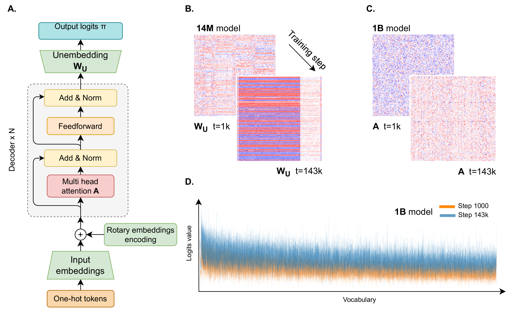

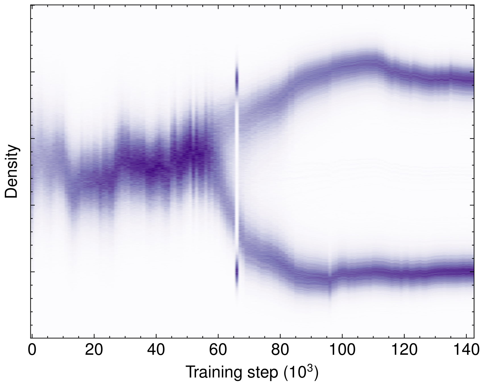

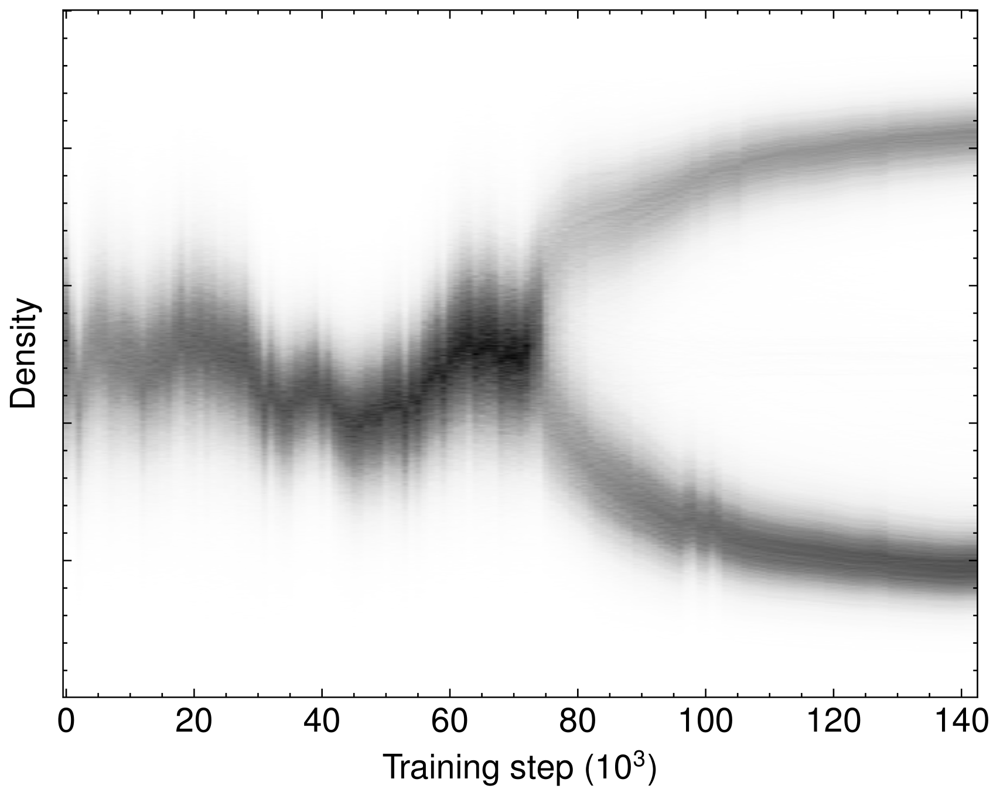

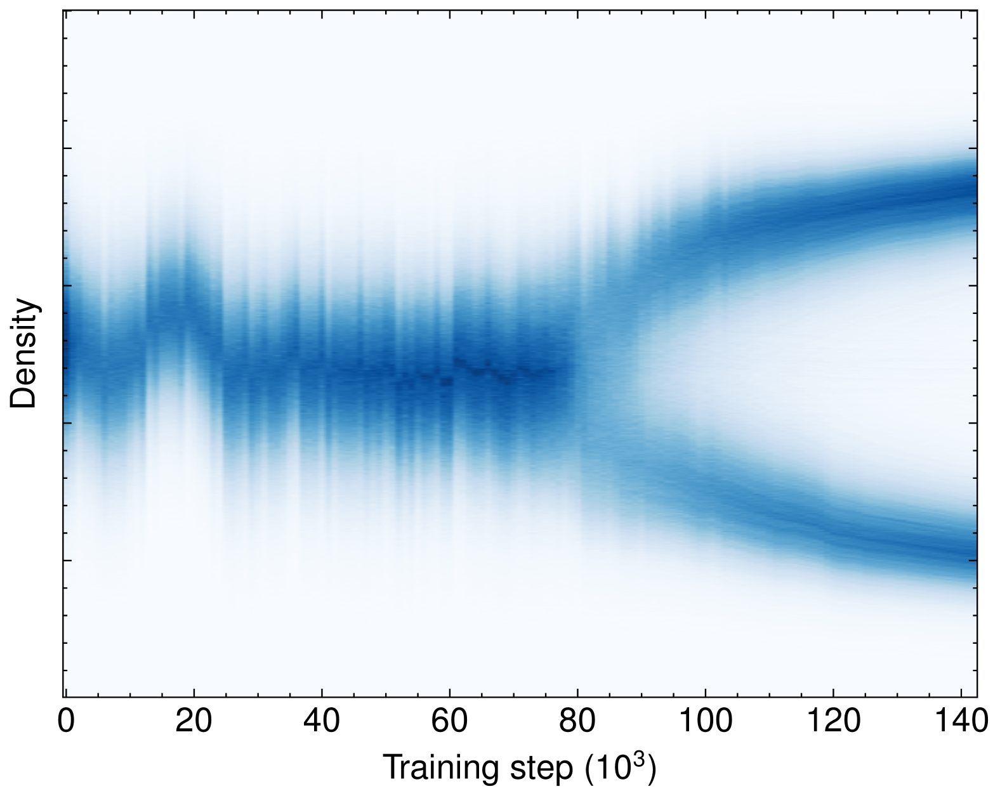

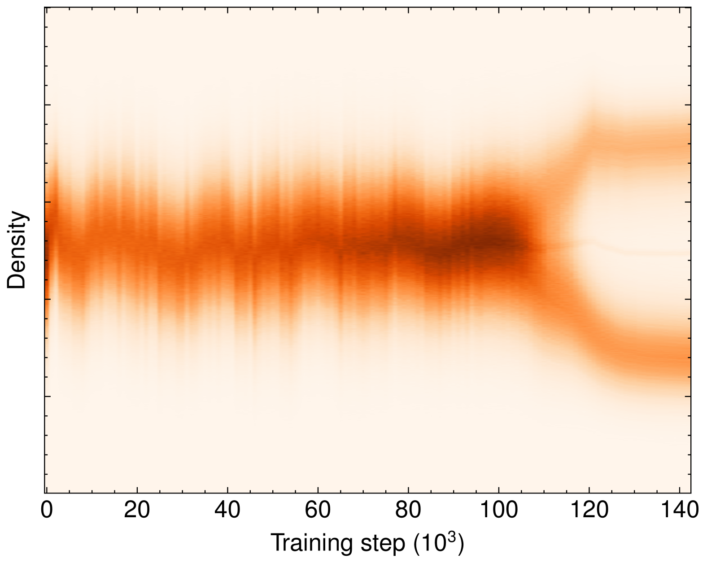

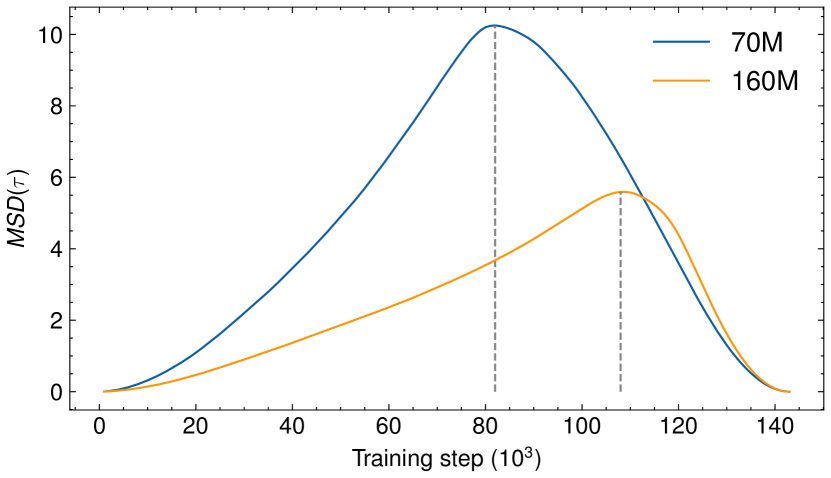

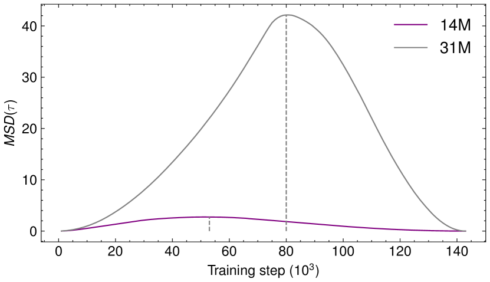

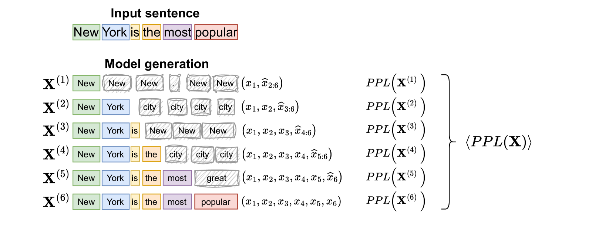

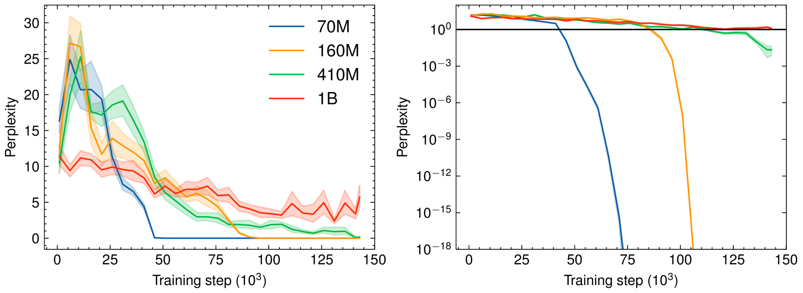

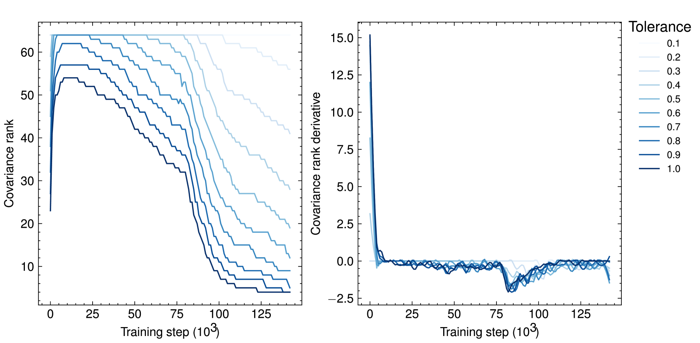

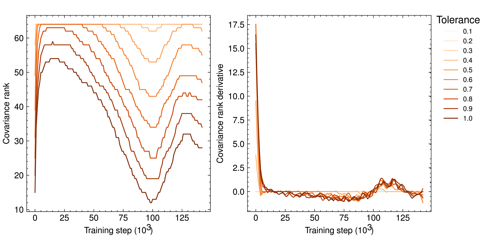