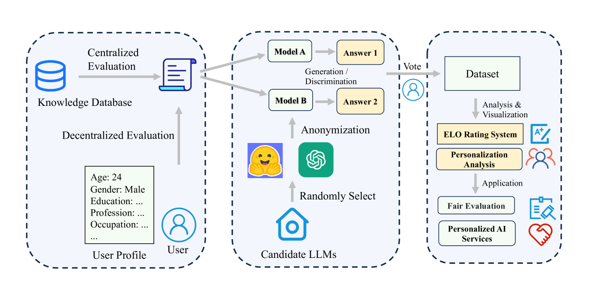
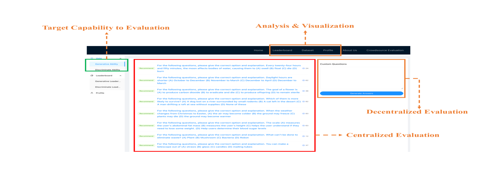
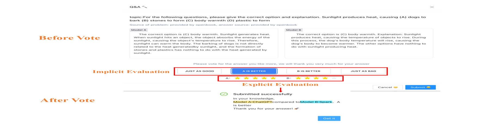
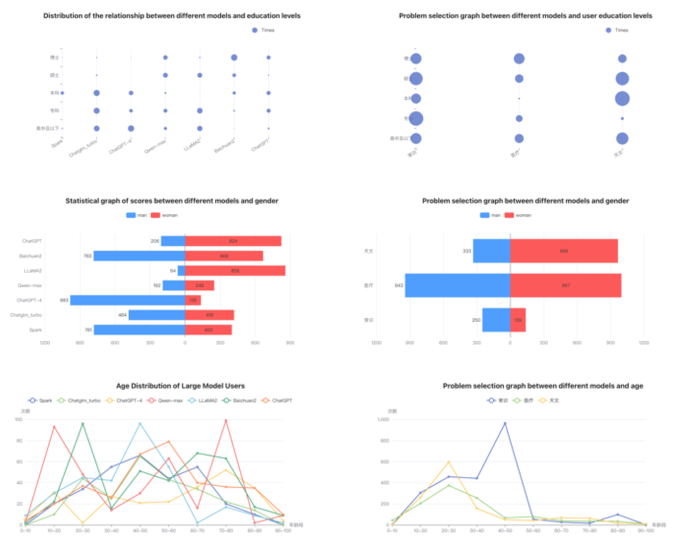

# [本研究利用匿名众包平台，旨在探索针对大型语言模型的个性化评估方法。](https://arxiv.org/abs/2403.08305)

发布时间：2024年03月13日

`Agent` `模型评估`

> Towards Personalized Evaluation of Large Language Models with An Anonymous Crowd-Sourcing Platform

> 评估大型语言模型是提升模型性能的核心环节，然而以往诸多评估方法虽然卓有成效，却侧重于客观问题的评测，普遍忽略了对大型语言模型频繁面临的主观问题评价。此外，这些方法多依赖中心化数据集，问题来源局限于评估平台内部，并且当前平台在实施评估时，通常未能顾及个性化因素，即未能充分考量评估者与被评估模型的独特性。为此，我们创新性地设计了一款名为 BingJian 的匿名众包评估平台，专门面向大型语言模型，采用竞争性打分模式，让用户依据模型实际表现对其进行排序。该平台不仅能够执行集中式评估以检验模型的基础能力，还开创了一个开放的评估通道，允许用户提交个性化问题，从而从更宽泛的角度测试模型的各种潜能。不仅如此，BingJian 还引入了个性化的评估情景，借助丰富的人机交互形式，确保在兼顾各用户特定需求和场景下全面评估大型语言模型。现在您可以通过访问 https://github.com/Mingyue-Cheng/Bingjian 来体验 BingJian 平台的实际展示。

> Large language model evaluation plays a pivotal role in the enhancement of its capacity. Previously, numerous methods for evaluating large language models have been proposed in this area. Despite their effectiveness, these existing works mainly focus on assessing objective questions, overlooking the capability to evaluate subjective questions which is extremely common for large language models. Additionally, these methods predominantly utilize centralized datasets for evaluation, with question banks concentrated within the evaluation platforms themselves. Moreover, the evaluation processes employed by these platforms often overlook personalized factors, neglecting to consider the individual characteristics of both the evaluators and the models being evaluated. To address these limitations, we propose a novel anonymous crowd-sourcing evaluation platform, BingJian, for large language models that employs a competitive scoring mechanism where users participate in ranking models based on their performance. This platform stands out not only for its support of centralized evaluations to assess the general capabilities of models but also for offering an open evaluation gateway. Through this gateway, users have the opportunity to submit their questions, testing the models on a personalized and potentially broader range of capabilities. Furthermore, our platform introduces personalized evaluation scenarios, leveraging various forms of human-computer interaction to assess large language models in a manner that accounts for individual user preferences and contexts. The demonstration of BingJian can be accessed at https://github.com/Mingyue-Cheng/Bingjian.

[Arxiv](https://arxiv.org/abs/2403.08305)