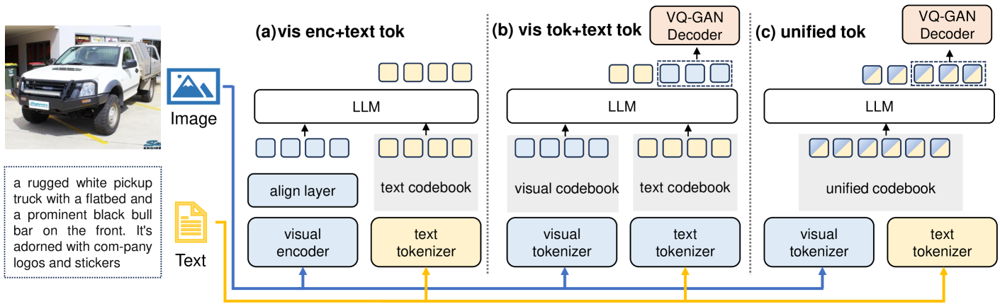
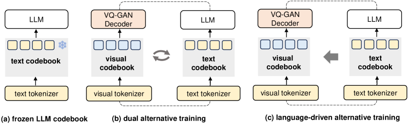
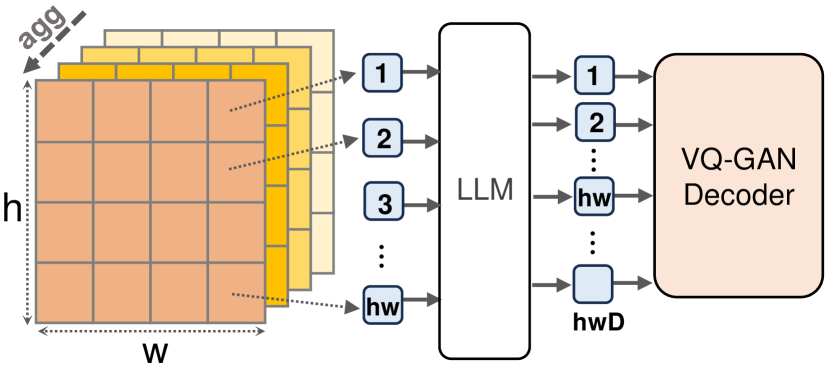
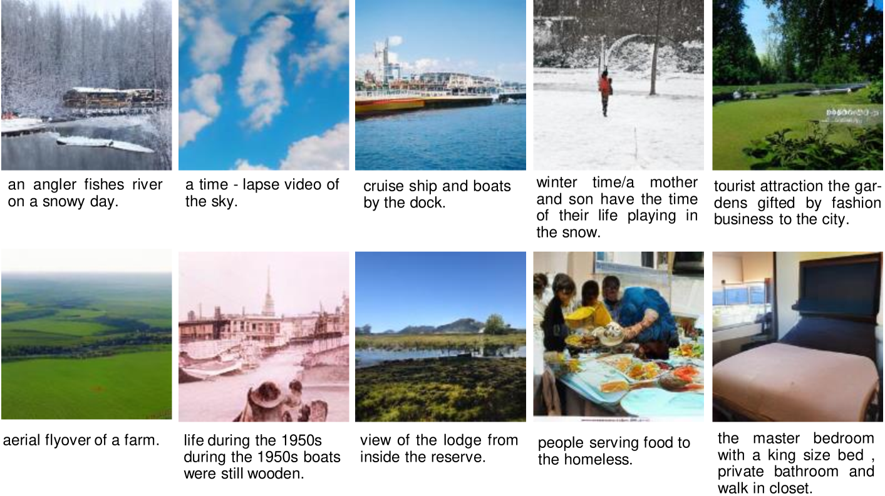

# UniCode项目致力于为多模态大型语言模型打造一个统一的码本，旨在整合和优化不同模态数据在模型中的表示与处理。

发布时间：2024年03月13日

`LLM应用` `多模态` `语言模型`

> UniCode: Learning a Unified Codebook for Multimodal Large Language Models

> 在这篇文章中，我们推出了名为 \textbf{UniCode} 的创新方案，专为解决多模态大型语言模型(MLLMs)中的一个重要问题而设计，它通过学习一个通用码本来高效处理视觉、文本和其他类型信号的编码。当前的 MLLMs 由于仅依赖文本码本，在多模态环境下生成图像和文本的能力受到限制，UniCode 正是对这一问题的有力回应。我们引入了一种基于语言引导的迭代训练模式，并配合一种称为“图像解压”的独特上下文预训练任务，让模型能够理解和生成高质量图像。这个统一码本让模型不仅能够在视觉指导的任务上有所突破，还能应用于非语言生成任务。此外，UniCode 灵活兼容各种堆叠量化技术，从而实现视觉信号更紧凑的令牌化表达。尽管在训练阶段使用的参数和数据大大减少，UniCode 在视觉重建和生成方面展现出了显著潜力，并在多个 VQA 标准评测中表现出与顶尖 MLLMs 不相上下的优秀性能。

> In this paper, we propose \textbf{UniCode}, a novel approach within the domain of multimodal large language models (MLLMs) that learns a unified codebook to efficiently tokenize visual, text, and potentially other types of signals. This innovation addresses a critical limitation in existing MLLMs: their reliance on a text-only codebook, which restricts MLLM's ability to generate images and texts in a multimodal context. Towards this end, we propose a language-driven iterative training paradigm, coupled with an in-context pre-training task we term ``image decompression'', enabling our model to interpret compressed visual data and generate high-quality images.The unified codebook empowers our model to extend visual instruction tuning to non-linguistic generation tasks. Moreover, UniCode is adaptable to diverse stacked quantization approaches in order to compress visual signals into a more compact token representation. Despite using significantly fewer parameters and less data during training, Unicode demonstrates promising capabilities in visual reconstruction and generation. It also achieves performances comparable to leading MLLMs across a spectrum of VQA benchmarks.

[Arxiv](https://arxiv.org/abs/2403.09072)