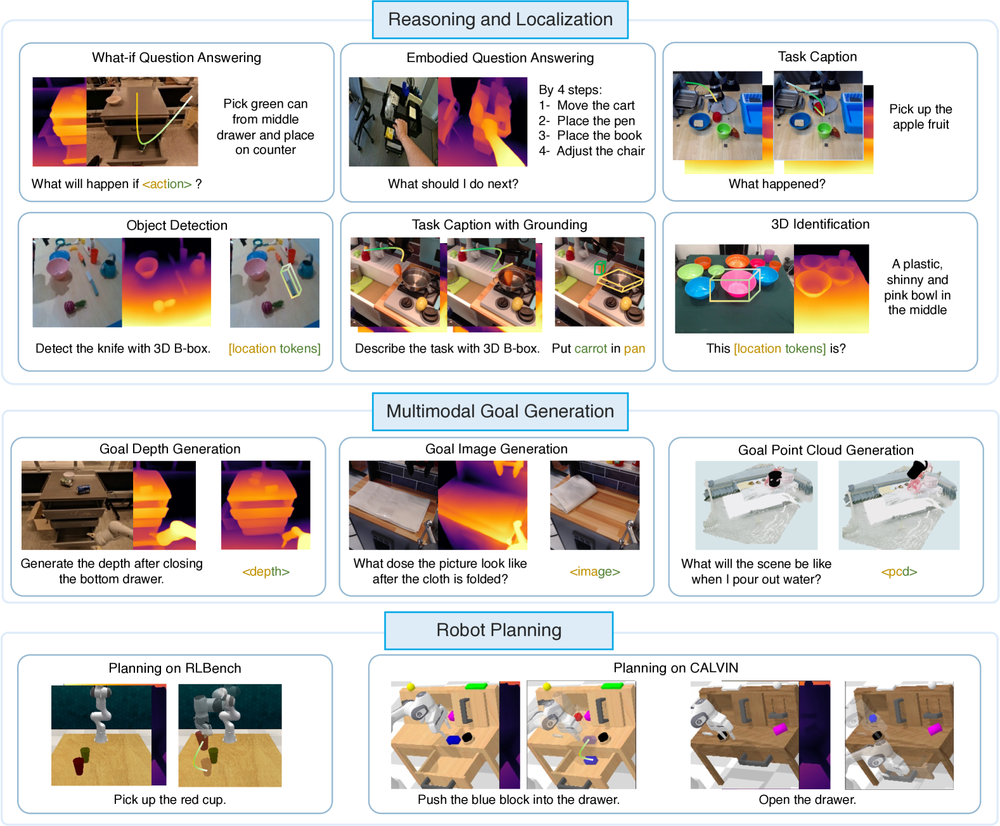
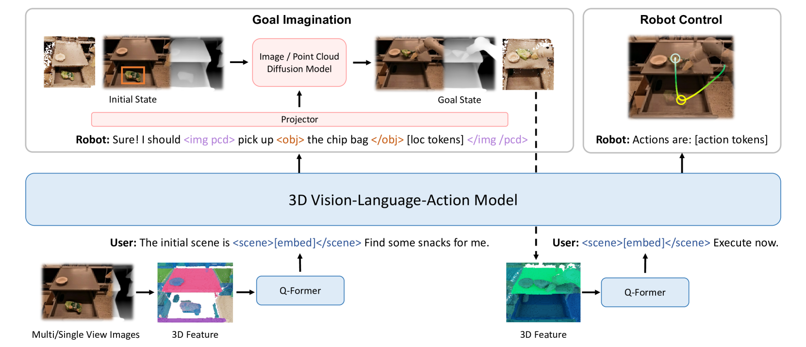
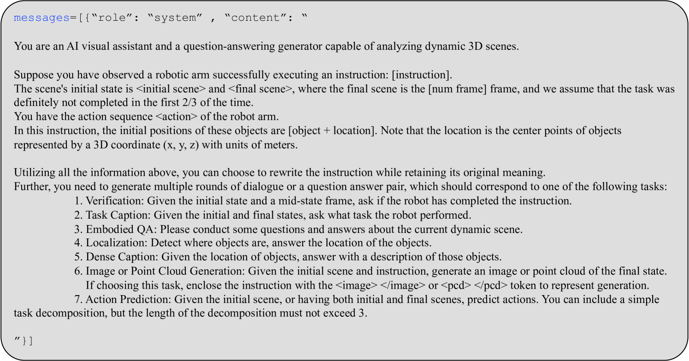
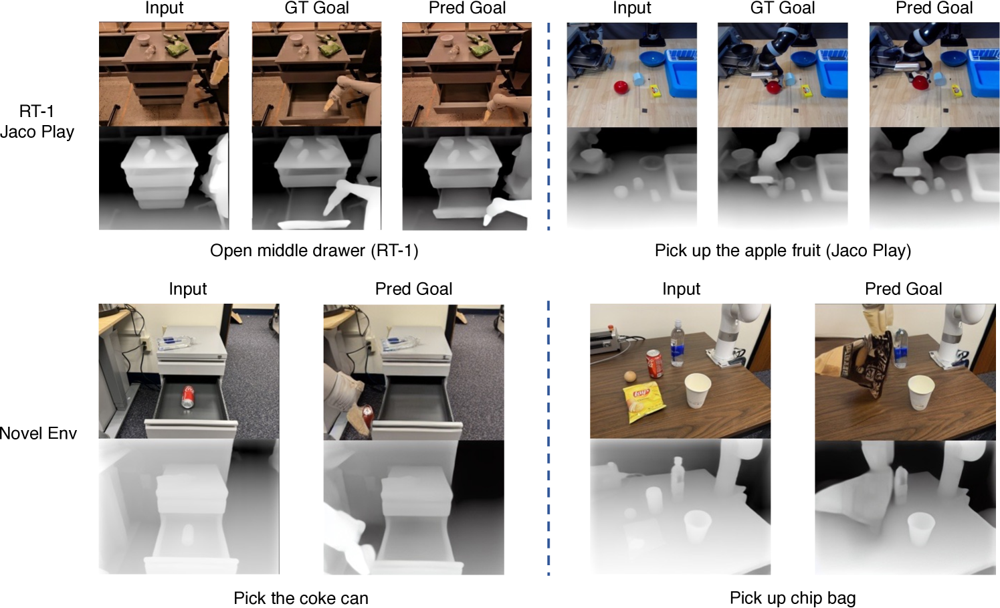

# [3D-VLA，一款创新的三维视觉-语言-动作生成世界模型，它将三维视觉信息、自然语言理解和执行动作的能力整合于一体。](https://arxiv.org/abs/2403.09631)

发布时间：2024年03月14日

`Agent`

`机器人`

`3D环境理解`

> 3D-VLA: A 3D Vision-Language-Action Generative World Model

> 最近的VLA模型主要依赖2D输入，未能充分融入3D物理世界。它们直觉地从感知映射到动作，忽略了复杂的环境动态及动作间的关系。而人类则具备描绘未来场景并据此规划行动的世界模型。因此，我们创新性地提出3D-VLA模型，它结合了一种新的具身基础模型族系，通过生成式世界模型将3D感知、推理和动作紧密相连。3D-VLA构建于3D LLM之上，并利用交互令牌与具身环境互动。为赋予模型生成能力，我们训练了一系列具身扩散模型，并将其整合至LLM中以预测目标图像和点云。我们精心构建了一个大规模3D具身指令数据集，从现有的机器人数据集中挖掘丰富的3D信息用以训练3D-VLA。实验证明，在保留的数据集上，3D-VLA在具身环境中显著增强了推理、多模态生成和规划能力，展现出广阔的实际应用前景。

> Recent vision-language-action (VLA) models rely on 2D inputs, lacking integration with the broader realm of the 3D physical world. Furthermore, they perform action prediction by learning a direct mapping from perception to action, neglecting the vast dynamics of the world and the relations between actions and dynamics. In contrast, human beings are endowed with world models that depict imagination about future scenarios to plan actions accordingly. To this end, we propose 3D-VLA by introducing a new family of embodied foundation models that seamlessly link 3D perception, reasoning, and action through a generative world model. Specifically, 3D-VLA is built on top of a 3D-based large language model (LLM), and a set of interaction tokens is introduced to engage with the embodied environment. Furthermore, to inject generation abilities into the model, we train a series of embodied diffusion models and align them into the LLM for predicting the goal images and point clouds. To train our 3D-VLA, we curate a large-scale 3D embodied instruction dataset by extracting vast 3D-related information from existing robotics datasets. Our experiments on held-in datasets demonstrate that 3D-VLA significantly improves the reasoning, multimodal generation, and planning capabilities in embodied environments, showcasing its potential in real-world applications.

