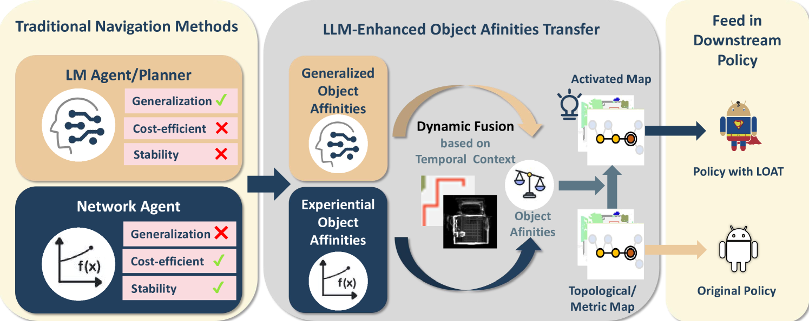
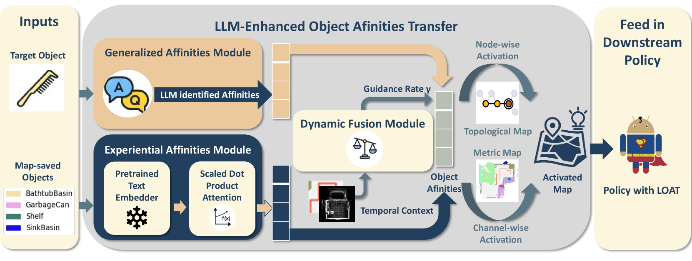
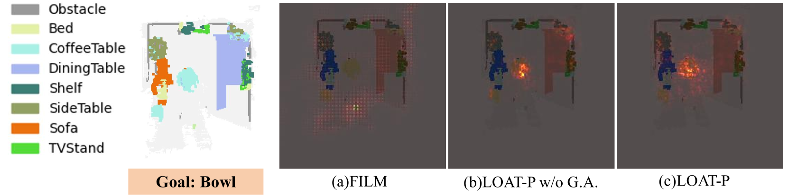
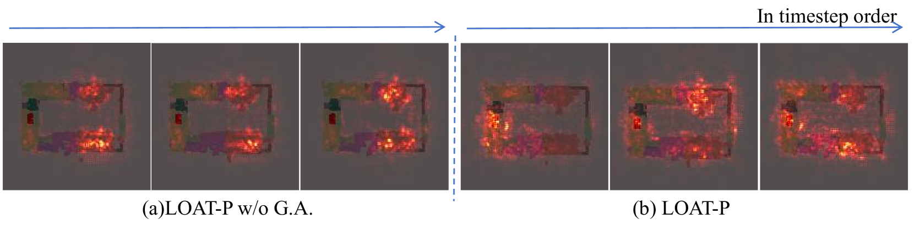
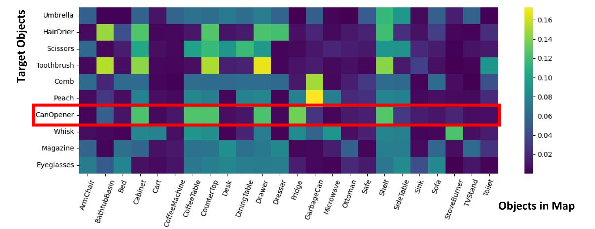
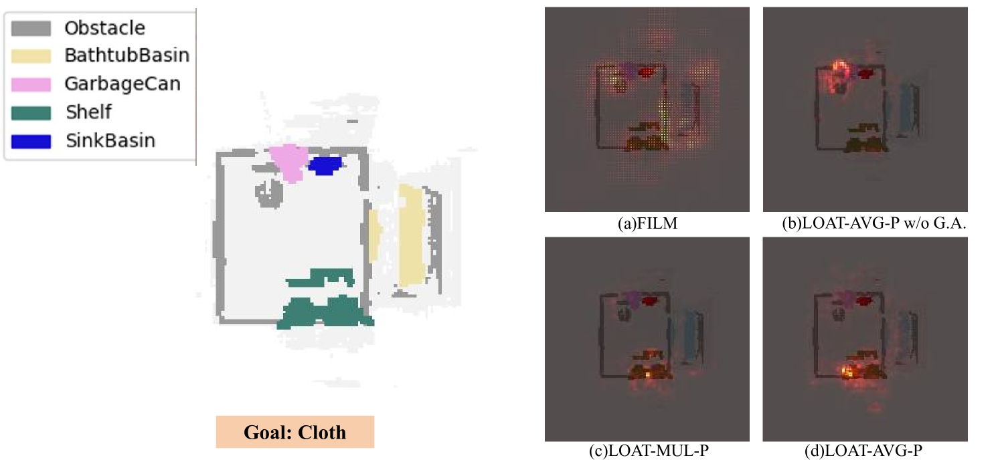

# [本研究借助LLM强化的对象亲和力转移技术，推进物体目标导航的发展。](https://arxiv.org/abs/2403.09971)

发布时间：2024年03月14日

`Agent` `机器人` `导航系统`

> Advancing Object Goal Navigation Through LLM-enhanced Object Affinities Transfer

> 在目标导航任务中，智能体运用视觉与空间信息寻找指定类别的目标物体。早期纯网络方法受限于历史数据估算物体关联性，面对新环境及未知目标时难以灵活应对；而将大型语言模型（LLMs）应用于导航规划或智能体虽有庞大的知识储备，却存在成本效益低、缺乏针对性历史经验的问题。为此，我们创新设计了LOAT框架，巧妙结合LLMs提取的对象语义与基于网络的方案，利用实践经验推算对象亲和性，从而显著提升在陌生场景下的适应性。LOAT采用了双模块机制：一为广域知识模块，汲取LLMs海量知识；二为经验亲和性模块，应用习得的对象语义联系，并配以随时间动态融合信息的融合模块。这一过程生成的分数先作用于语义地图，再输入至下游策略，使导航系统获得具备情境感知的输入增强。我们在AI2-THOR和Habitat模拟器上的实验证明，LOAT能够有效整合LLM智慧，显著提高目标导航的成功率和效率。

> In object goal navigation, agents navigate towards objects identified by category labels using visual and spatial information. Previously, solely network-based methods typically rely on historical data for object affinities estimation, lacking adaptability to new environments and unseen targets. Simultaneously, employing Large Language Models (LLMs) for navigation as either planners or agents, though offering a broad knowledge base, is cost-inefficient and lacks targeted historical experience. Addressing these challenges, we present the LLM-enhanced Object Affinities Transfer (LOAT) framework, integrating LLM-derived object semantics with network-based approaches to leverage experiential object affinities, thus improving adaptability in unfamiliar settings. LOAT employs a dual-module strategy: a generalized affinities module for accessing LLMs' vast knowledge and an experiential affinities module for applying learned object semantic relationships, complemented by a dynamic fusion module harmonizing these information sources based on temporal context. The resulting scores activate semantic maps before feeding into downstream policies, enhancing navigation systems with context-aware inputs. Our evaluations in AI2-THOR and Habitat simulators demonstrate improvements in both navigation success rates and efficiency, validating the LOAT's efficacy in integrating LLM insights for improved object goal navigation.

[Arxiv](https://arxiv.org/abs/2403.09971)