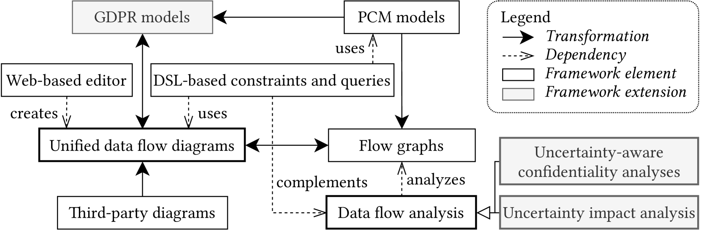
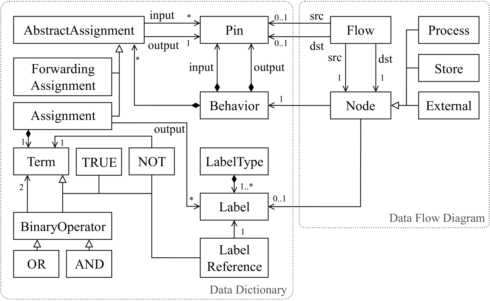
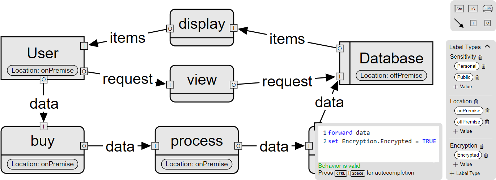
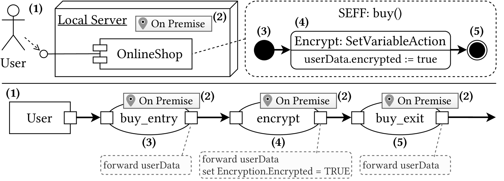
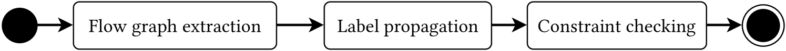
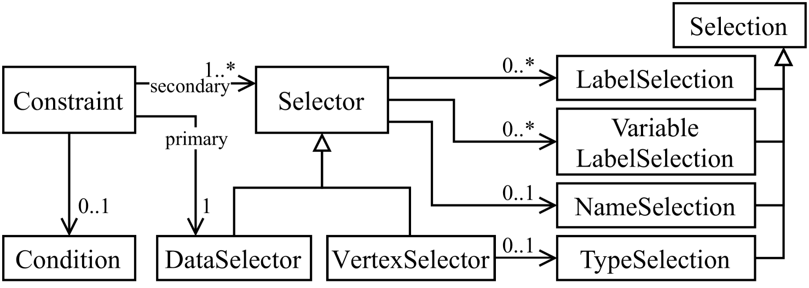

# [为探究信息安全中的数据流动规律，我们提出了一种灵活可扩展的架构导向数据流分析框架。](https://arxiv.org/abs/2403.09402)

发布时间：2024年03月14日

`Agent`

`软件工程`

`安全性分析`

> An Extensible Framework for Architecture-Based Data Flow Analysis for Information Security

> 日益紧密的软件系统互联使得在设计初期就必须重视安全性，而诸如保密性等安全属性往往依赖于数据流图（DFDs）进行分析。但面对大型软件系统的DFDs，人工分析耗时费力且易出差错，修改已部署软件的成本更是不菲。另外，封闭的分析环境限制了模型信息的复用，妨碍了对系统整体安全性的深度解读。本文介绍了一款开放且具备强大扩展能力的数据流分析框架。该框架的核心在于我们全新实现的一款经过严格验证的数据流分析方法，它不仅能对接DFDs，还能够从Palladio架构描述语言中抽取出数据流信息。通过多个模型和分析扩展实例，我们生动展现了该框架的可扩展性。经评估，相较于以往的实现，我们在处理相似场景时展现出更高的可扩展性能。

> The growing interconnection between software systems increases the need for security already at design time. Security-related properties like confidentiality are often analyzed based on data flow diagrams (DFDs). However, manually analyzing DFDs of large software systems is bothersome and error-prone, and adjusting an already deployed software is costly. Additionally, closed analysis ecosystems limit the reuse of modeled information and impede comprehensive statements about a system's security. In this paper, we present an open and extensible framework for data flow analysis. The central element of our framework is our new implementation of a well-validated data-flow-based analysis approach. The framework is compatible with DFDs and can also extract data flows from the Palladio architectural description language. We showcase the extensibility with multiple model and analysis extensions. Our evaluation indicates that we can analyze similar scenarios while achieving higher scalability compared to previous implementations.

