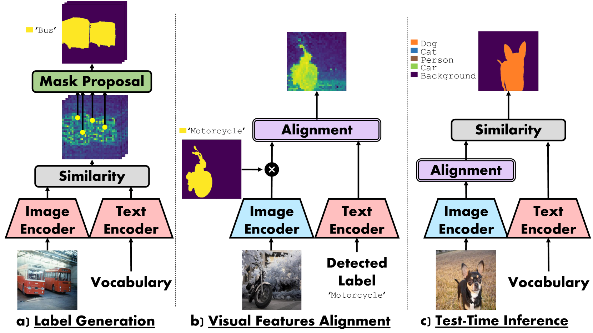
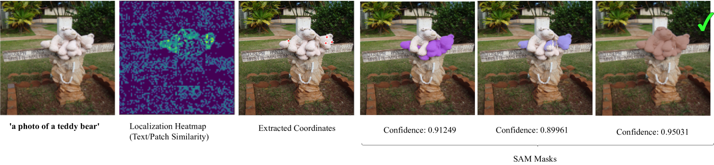
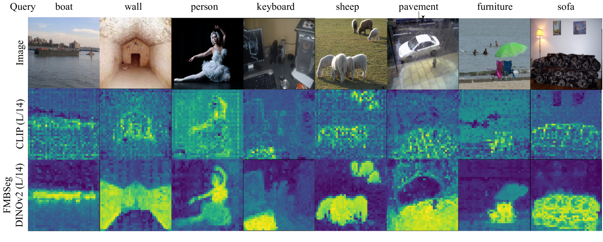
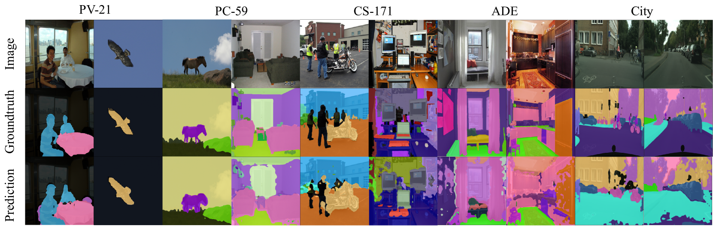
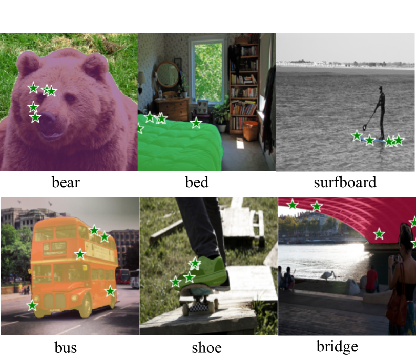
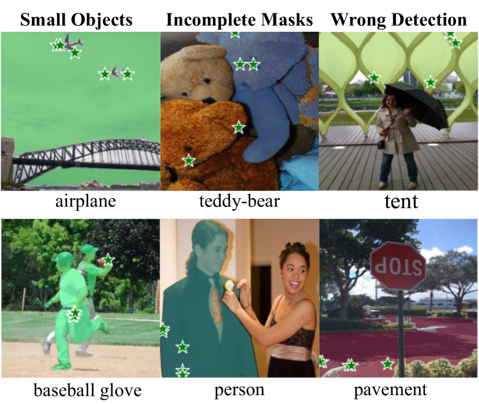

# [利用视觉基础模型实现无需标注的语义分割技术]

发布时间：2024年03月14日

`Agent` `计算机视觉`

> Annotation Free Semantic Segmentation with Vision Foundation Models

> 语义分割是一项极具挑战性的视觉任务，往往需海量精细标注的数据进行训练。最近，在基础模型和视觉-语言模型大放异彩的背景下，有研究尝试以零样本方式实现语义分割，但这通常仍需大规模训练或附加图像级标注。本文提出了一种创新方案：我们搭建了一个轻量级模块，叠加在自监督预训练的视觉编码器之上，通过与预训练文本编码器对齐patch特征来解决这一问题。关键在于，我们运用现有基础模型为任意语义分割数据集智能生成免费标注，并能够零成本地训练这个对齐模块。其中，CLIP负责检测物体，而SAM则用于生成高品质的物体掩模。这种方法能以最小训练代价，将基于语言的语义注入任何预训练的视觉编码器中。此模块结构精简，仅依托基础模型提供唯一监督，并展现出了惊人的小样本无标注训练数据下的泛化性能。

> Semantic Segmentation is one of the most challenging vision tasks, usually requiring large amounts of training data with expensive pixel-level annotations. With the success of foundation models and especially vision-language models, recent works attempt to achieve zero-shot semantic segmentation while requiring either large scale training or additional image/pixel-level annotations. In this work, we build a lightweight module on top of a self-supervised pretrained vision encoder to align patch features with a pre-trained text encoder. Importantly, we generate free annotations for any semantic segmentation dataset using existing foundation models and train our alignment module cost free. We use CLIP to detect objects and SAM to generate high quality object masks. Our approach can bring language-based semantics to any pre-trained vision encoder with minimal training. Our module is lightweight, uses foundation models as a sole source of supervision and shows impressive generalization capability from little training data with no annotation.

[Arxiv](https://arxiv.org/abs/2403.09307)