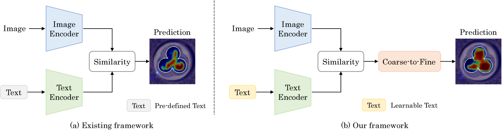
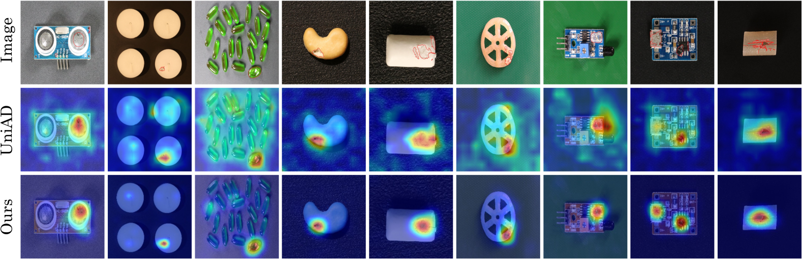
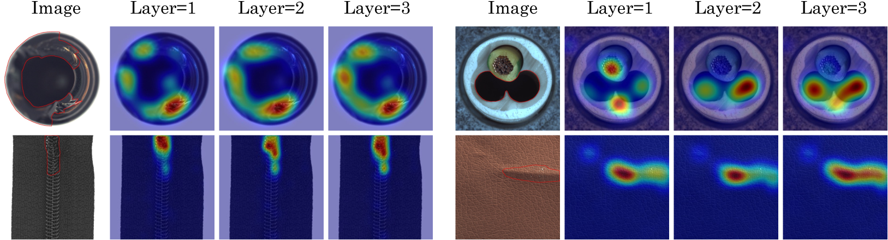

# 我们采用预训练的视觉语言模型并对其进行适应性调整，以实现对异常的有效检测。

发布时间：2024年03月14日

`Agent` `计算机视觉` `异常检测`

> Anomaly Detection by Adapting a pre-trained Vision Language Model

# 摘要

> 近期，大型视觉语言模型成功地适应了众多下游任务。本研究提出了一个名为CLIP-ADA的统一框架，通过改编预训练的CLIP模型进行异常检测。我们对此进行了两项关键创新：首先，为实现在多类别工业图像中的一体化异常检测，我们设计了一种可学习的提示，并利用自监督学习使其关联到异常模式；其次，为了深度挖掘CLIP的表达潜能，我们采用异常区域细化策略优化定位精度。在测试阶段，通过计算可学习提示与图像特征之间的相似度直接定位异常。广泛的实验验证了我们的框架性能卓越，比如在MVTec-AD和VisA数据集上的异常检测和定位任务上，我们分别取得了刷新纪录的97.5/55.6和89.3/33.1的分数。另外，即使在仅用极少量训练数据的情况下，该方法也能展现出令人满意的性能，这对于实际应用更具挑战性。

> Recently, large vision and language models have shown their success when adapting them to many downstream tasks. In this paper, we present a unified framework named CLIP-ADA for Anomaly Detection by Adapting a pre-trained CLIP model. To this end, we make two important improvements: 1) To acquire unified anomaly detection across industrial images of multiple categories, we introduce the learnable prompt and propose to associate it with abnormal patterns through self-supervised learning. 2) To fully exploit the representation power of CLIP, we introduce an anomaly region refinement strategy to refine the localization quality. During testing, the anomalies are localized by directly calculating the similarity between the representation of the learnable prompt and the image. Comprehensive experiments demonstrate the superiority of our framework, e.g., we achieve the state-of-the-art 97.5/55.6 and 89.3/33.1 on MVTec-AD and VisA for anomaly detection and localization. In addition, the proposed method also achieves encouraging performance with marginal training data, which is more challenging.

[Arxiv](https://arxiv.org/abs/2403.09493)