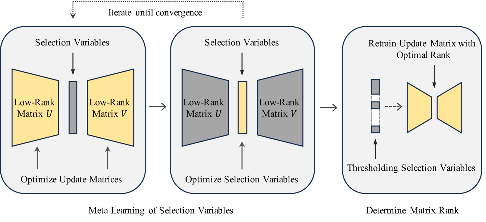
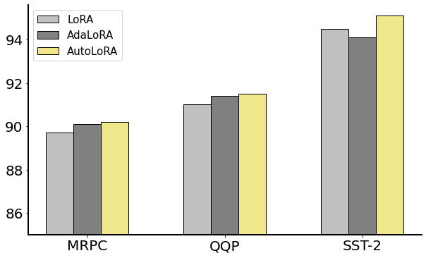
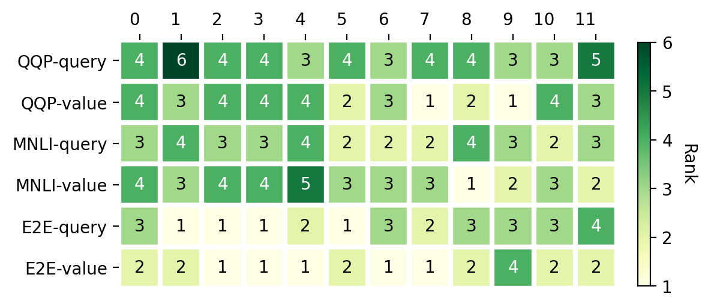

# [AutoLoRA 是一种创新方法，利用元学习技术在低秩适应场景中实现矩阵秩的自动化调优。](https://arxiv.org/abs/2403.09113)

发布时间：2024年03月14日

`LLM理论`

``

`模型优化`

> AutoLoRA: Automatically Tuning Matrix Ranks in Low-Rank Adaptation Based on Meta Learning

> 大规模预训练结合针对性微调已在众多NLP任务中取得卓越成果，但对大型预训练模型进行全面微调时面临显著的计算和内存难题。针对此问题，已出现如LoRA这样高效的方法，它在预训练权重冻结的基础上仅对低秩增量更新矩阵进行微调。不过，LoRA在所有层统一分配秩且依赖于穷举搜索寻找最优秩的方式，无疑增加了计算开销并可能导致微调效果欠佳。为此，我们提出了AutoLoRA——一个基于元学习的框架，能自动识别各LoRA层的理想秩。AutoLoRA创造性地将低秩更新矩阵中每个秩-1矩阵与一个选择变量绑定，以判断是否剔除该矩阵。借助元学习方法学习这些选择变量，并通过对变量值设置阈值确定最佳秩。我们的广泛实验证明，在自然语言理解、生成及序列标注等多个领域，AutoLoRA均表现出优越的性能。

> Large-scale pretraining followed by task-specific finetuning has achieved great success in various NLP tasks. Since finetuning all parameters of large pretrained models poses substantial computational and memory challenges, several efficient finetuning methods have been developed. Among them, low-rank adaptation (LoRA), which finetunes low-rank incremental update matrices on top of frozen pretrained weights, has proven particularly effective. Nonetheless, LoRA's uniform rank assignment across all layers, along with its reliance on an exhaustive search to find the best rank, leads to high computation costs and suboptimal finetuning performance. To address these limitations, we introduce AutoLoRA, a meta learning based framework for automatically identifying the optimal rank of each LoRA layer. AutoLoRA associates each rank-1 matrix in a low-rank update matrix with a selection variable, which determines whether the rank-1 matrix should be discarded. A meta learning based method is developed to learn these selection variables. The optimal rank is determined by thresholding the values of these variables. Our comprehensive experiments on natural language understanding, generation, and sequence labeling demonstrate the effectiveness of AutoLoRA.

