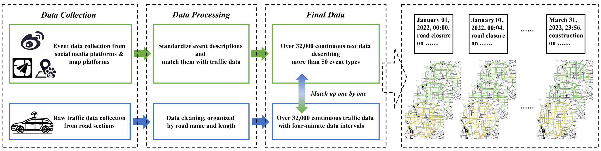
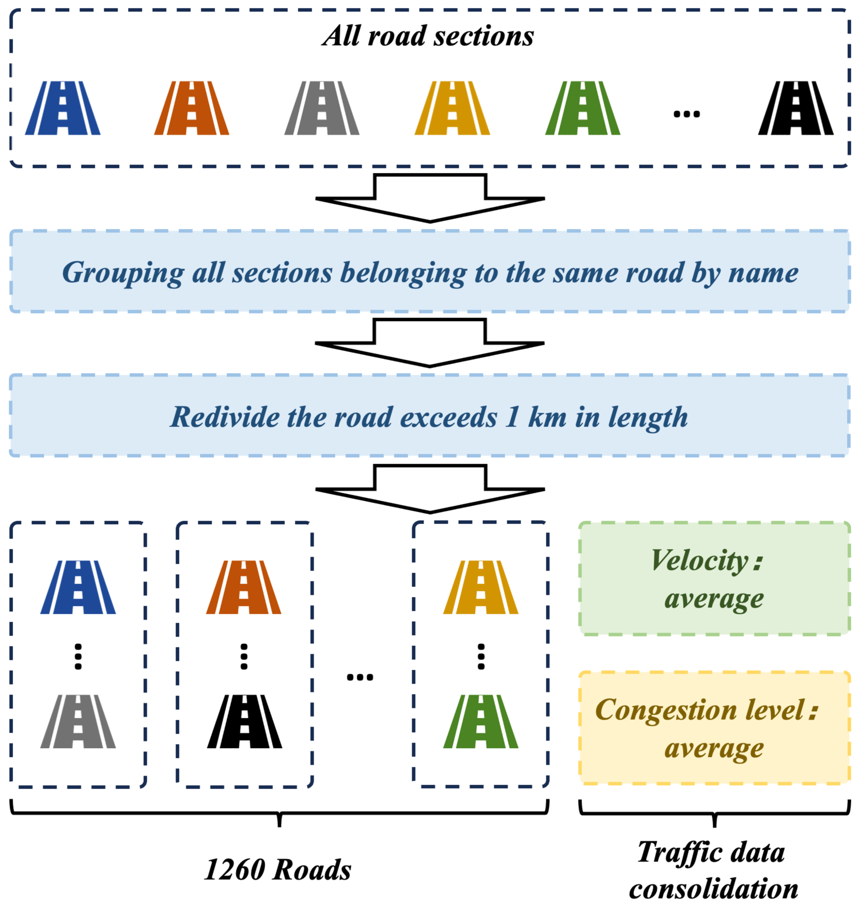
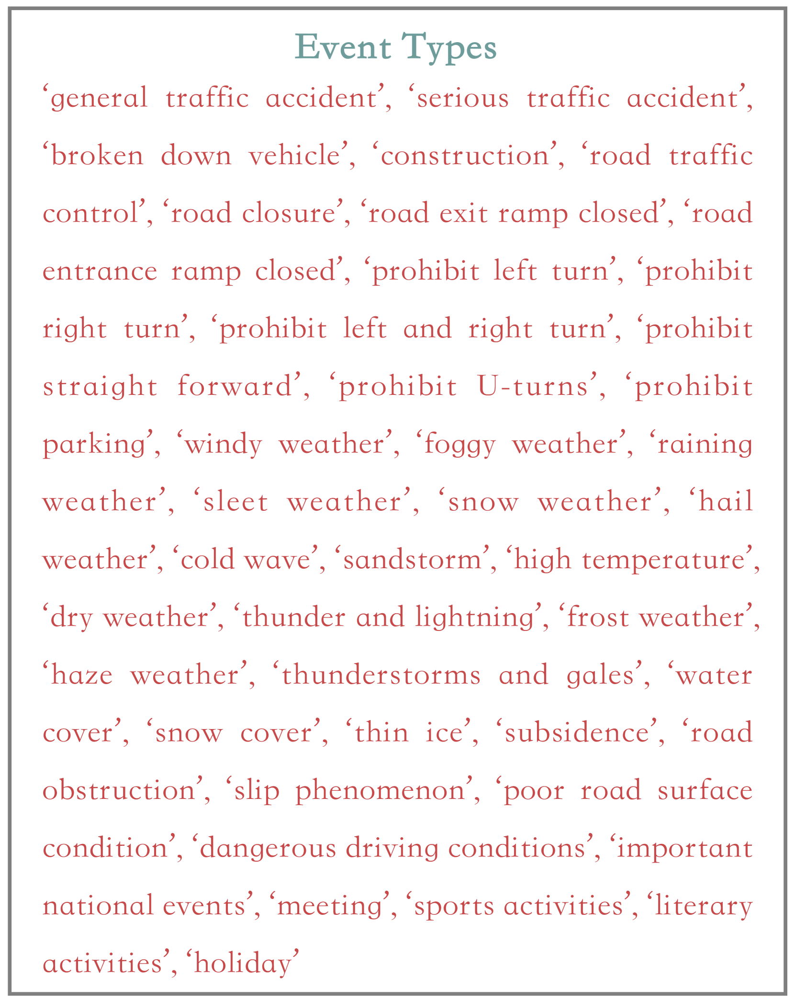
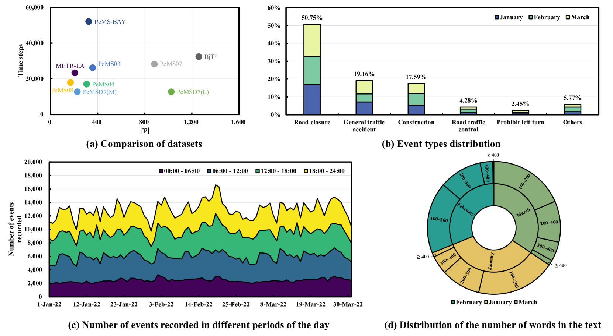
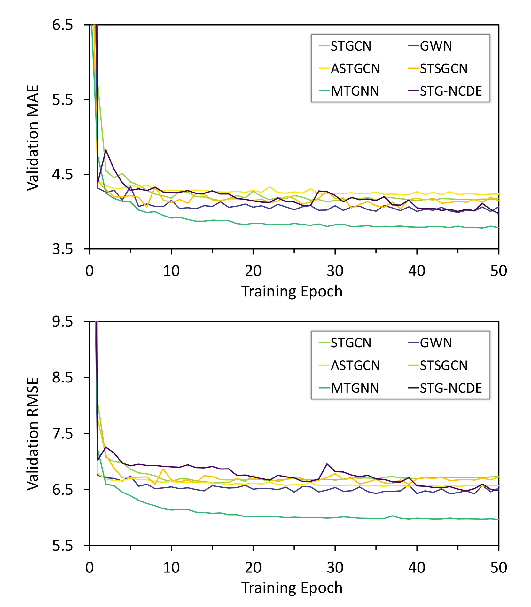

# [BjTT 是一个专为交通预测打造的大规模多模态数据集，通过整合多元信息助力提升预测准确性。](https://arxiv.org/abs/2403.05029)

发布时间：2024年03月14日

`Agent` `` `智能交通系统`

> BjTT: A Large-scale Multimodal Dataset for Traffic Prediction

> 交通预测是 ITS 的基石，但传统方法仅依据历史数据，在处理异常事件和长期预测时表现欠佳。本研究聚焦于运用生成模型结合描述交通系统的文本实现“文本到交通生成”（TTG）任务。核心难点是如何将文本信息与道路网络空间结构及交通数据相结合生成真实的交通情境。因此，我们创新提出首个应用于该领域的扩散模型 ChatTraffic，并通过融入 GCN 模块以捕捉交通数据的空间关联性，确保生成数据与真实数据保持一致。同时，我们精心构建了大规模的文本-交通配对数据集以支持 TTG 任务的研究。实验证明 ChatTraffic 能够根据文本有效生成真实的交通场景。相关代码和数据集已开放至 https://github.com/ChyaZhang/ChatTraffic。

> Traffic prediction is one of the most significant foundations in Intelligent Transportation Systems (ITS). Traditional traffic prediction methods rely only on historical traffic data to predict traffic trends and face two main challenges. 1) insensitivity to unusual events. 2) limited performance in long-term prediction. In this work, we explore how generative models combined with text describing the traffic system can be applied for traffic generation, and name the task Text-to-Traffic Generation (TTG). The key challenge of the TTG task is how to associate text with the spatial structure of the road network and traffic data for generating traffic situations. To this end, we propose ChatTraffic, the first diffusion model for text-to-traffic generation. To guarantee the consistency between synthetic and real data, we augment a diffusion model with the Graph Convolutional Network (GCN) to extract spatial correlations of traffic data. In addition, we construct a large dataset containing text-traffic pairs for the TTG task. We benchmarked our model qualitatively and quantitatively on the released dataset. The experimental results indicate that ChatTraffic can generate realistic traffic situations from the text. Our code and dataset are available at https://github.com/ChyaZhang/ChatTraffic.

[Arxiv](https://arxiv.org/abs/2403.05029)