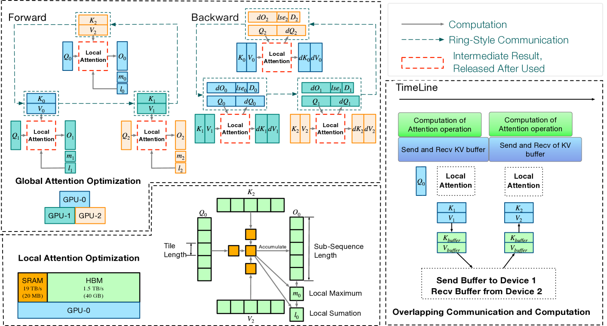
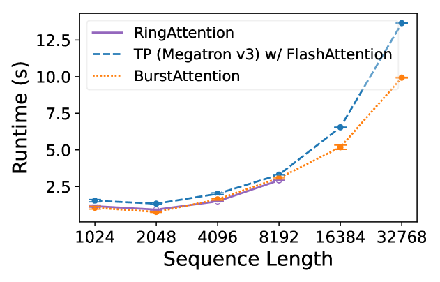
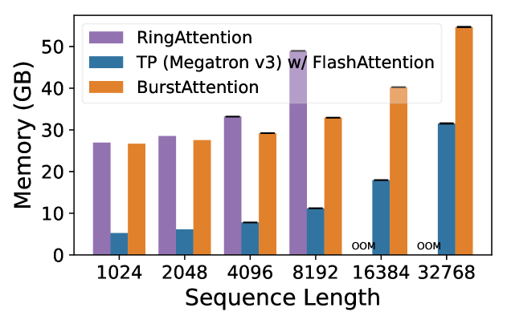
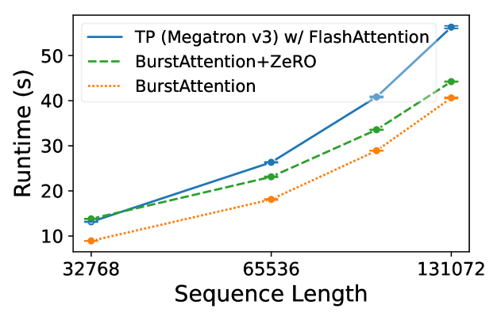
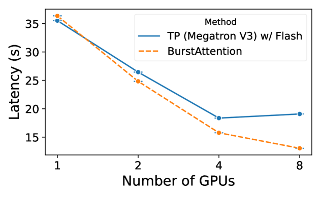
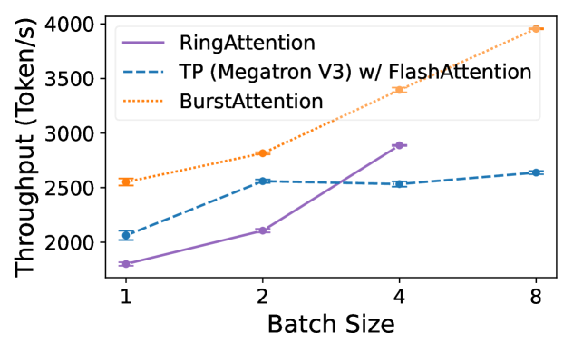

# [BurstAttention 是专为处理超长序列而设计的一种高效分布式注意力机制架构。]

发布时间：2024年03月14日

`LLM理论` `分布式计算`

> BurstAttention: An Efficient Distributed Attention Framework for Extremely Long Sequences

> 注意力机制在LLMs的成功中举足轻重，但面对长序列时，其时间与空间复杂度的平方增长成为一个难题。对此，一种利用分布式集群并行计算的策略应运而生，尽管这会导致额外的内存存储局部注意力结果及通信聚合的成本。本论文创新性地提出了名为“BurstAttention”的分布式注意力框架，旨在从全局集群到局部设备层面高效优化内存访问和通信操作。实验对比显示，在处理不同长度的长序列任务时，BurstAttention相比于其他竞品表现出显著优势，能有效降低40%通信开销，并在使用8块A100 GPU训练32K长度序列时实现两倍速度加速。

> Effective attention modules have played a crucial role in the success of Transformer-based large language models (LLMs), but the quadratic time and memory complexities of these attention modules also pose a challenge when processing long sequences. One potential solution for the long sequence problem is to utilize distributed clusters to parallelize the computation of attention modules across multiple devices (e.g., GPUs). However, adopting a distributed approach inevitably introduces extra memory overheads to store local attention results and incurs additional communication costs to aggregate local results into global ones. In this paper, we propose a distributed attention framework named ``BurstAttention'' to optimize memory access and communication operations at both the global cluster and local device levels. In our experiments, we compare BurstAttention with other competitive distributed attention solutions for long sequence processing. The experimental results under different length settings demonstrate that BurstAttention offers significant advantages for processing long sequences compared with these competitive baselines, reducing 40% communication overheads and achieving 2 X speedup during training 32K sequence length on 8 X A100.

[Arxiv](https://arxiv.org/abs/2403.09347)