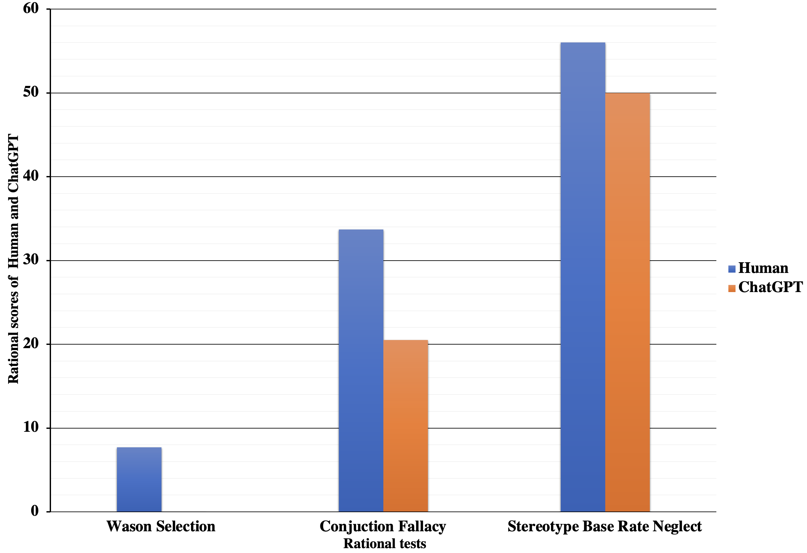

# [探究大型语言模型与人类在理性层面的对比，揭示其中的深刻洞见与亟待解答的问题。](https://arxiv.org/abs/2403.09798)

发布时间：2024年03月14日

`LLM应用`

``

``

> Comparing Rationality Between Large Language Models and Humans: Insights and Open Questions

> 本文聚焦AI领域的快速发展态势，特别是在大型语言模型（LLMs）崛起的过程中。我们着重指出，来自人类反馈的强化学习（RLHF）在提升LLMs的理智判断力和决策效能上起着关键作用。通过对人机互动与LLM行为之间错综复杂的关联进行详尽探究，我们围绕人类与LLMs在理性与表现差异上的问题进行了深入探索，尤其关注生成式预训练Transformer在对话场景下的应用。研究借助综合对比分析手段，剖析了LLMs内在非理性的难点，并给出了提升其理性的实用洞见和策略建议。这些研究成果对LLMs在各领域广泛应用以及推动人工智能进步具有深远影响。

> This paper delves into the dynamic landscape of artificial intelligence, specifically focusing on the burgeoning prominence of large language models (LLMs). We underscore the pivotal role of Reinforcement Learning from Human Feedback (RLHF) in augmenting LLMs' rationality and decision-making prowess. By meticulously examining the intricate relationship between human interaction and LLM behavior, we explore questions surrounding rationality and performance disparities between humans and LLMs, with particular attention to the Chat Generative Pre-trained Transformer. Our research employs comprehensive comparative analysis and delves into the inherent challenges of irrationality in LLMs, offering valuable insights and actionable strategies for enhancing their rationality. These findings hold significant implications for the widespread adoption of LLMs across diverse domains and applications, underscoring their potential to catalyze advancements in artificial intelligence.

