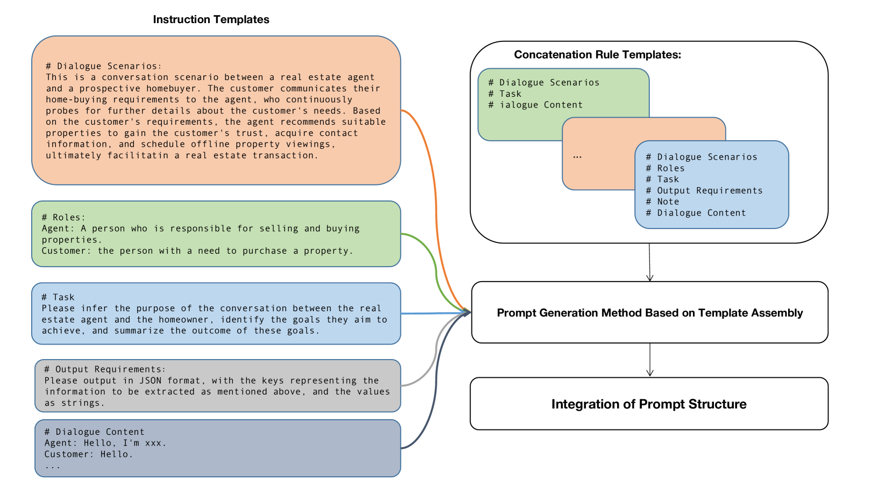
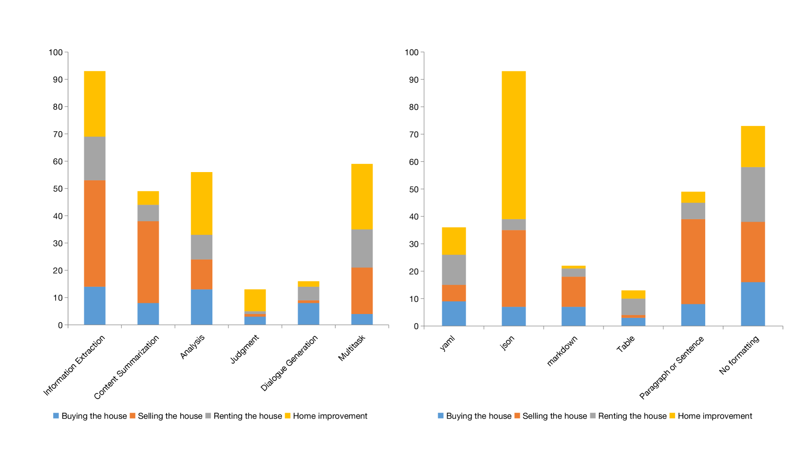

# [Dial-insight 方法，通过采用高质量的特定领域数据对大型语言模型进行微调，有效防止模型能力退化。](https://arxiv.org/abs/2403.09167)

发布时间：2024年03月14日

`LLM应用` `房地产` ``

> Dial-insight: Fine-tuning Large Language Models with High-Quality Domain-Specific Data Preventing Capability Collapse

> LLMs的表现深受底层数据质量的影响，尤其在专业细分领域。当对LLMs进行针对性微调以适应特定场景时，往往会面临模型泛化能力可能减弱的问题。为此，我们创新性地提出一种两步走的方法来创建能产出优质数据的生产型提示策略，该策略强调生成一系列广泛覆盖各类任务、表达形式多样的提示。同时，我们设计了一套经济实用、多维度的质量评价体系，确保生成标签数据的可靠性。运用来自房地产行业服务商与客户真实交互数据集，我们证实了数据质量与模型表现之间显著的正向关联。尤为突出的是，研究结果显示，利用我们所提方法生成的数据对通用LLMs进行微调，不仅能在不损害模型整体泛化能力的前提下增强其在特定领域的专业表现，即使只采用特定领域数据进行微调亦然。

> The efficacy of large language models (LLMs) is heavily dependent on the quality of the underlying data, particularly within specialized domains. A common challenge when fine-tuning LLMs for domain-specific applications is the potential degradation of the model's generalization capabilities. To address these issues, we propose a two-stage approach for the construction of production prompts designed to yield high-quality data. This method involves the generation of a diverse array of prompts that encompass a broad spectrum of tasks and exhibit a rich variety of expressions. Furthermore, we introduce a cost-effective, multi-dimensional quality assessment framework to ensure the integrity of the generated labeling data. Utilizing a dataset comprised of service provider and customer interactions from the real estate sector, we demonstrate a positive correlation between data quality and model performance. Notably, our findings indicate that the domain-specific proficiency of general LLMs can be enhanced through fine-tuning with data produced via our proposed method, without compromising their overall generalization abilities, even when exclusively domain-specific data is employed for fine-tuning.

[Arxiv](https://arxiv.org/abs/2403.09167)