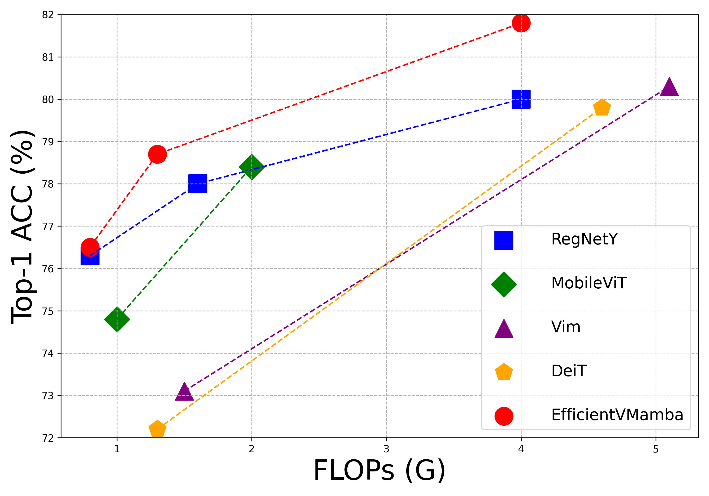
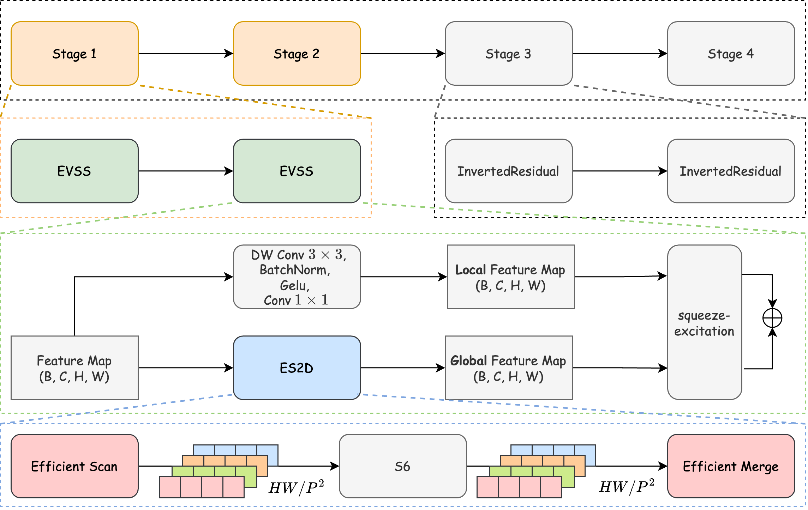

# EfficientVMamba，一种专为轻量级视觉Mamba设计的创新技术，通过采用空洞选择性扫描机制，实现高效处理。

发布时间：2024年03月14日

`Agent` `计算机视觉`

> EfficientVMamba: Atrous Selective Scan for Light Weight Visual Mamba

# 摘要

> 过去对轻量化模型的研发集中于CNN和Transformer架构，但始终存在难以克服的挑战——CNN虽精于捕捉局部特征却可能牺牲分辨率，Transformer虽能处理全局信息却导致计算复杂度高达$\mathcal{O}(N^2)$。这一精度与效率间的取舍问题一直是重要瓶颈。近期，诸如Mamba的状态空间模型（SSMs）异军突起，在语言模型及计算机视觉等领域展现出优越性能和竞争力，且成功将全局信息抽取的时间复杂度优化至$\mathcal{O}(N)$。鉴于此，本研究致力于探究视觉状态空间模型在轻量化模型设计中的潜力，并创新提出了一款名为EfficientVMamba的高效模型版本。具体来说，EfficientVMamba借助高效的跳跃采样策略实现了基于空洞选择扫描的方法，构造出兼具全局和局部特征表达能力的模块。此外，我们还深入探讨了SSM模块与卷积层的融合机制，并引入了一个整合额外卷积分支的有效视觉状态空间模块，从而有效提升了模型的整体表现。实验证明，EfficientVMamba在大幅降低计算复杂度的同时，在各类视觉任务中仍保持了强劲的竞争优势。例如，在ImageNet数据集上，仅有$1.3$G FLOPs的EfficientVMamba-S模型较之拥有$1.5$G FLOPs的Vim-Ti模型，准确率提升显著，达到了$5.6\%$。项目代码已开源，访问地址为：\url{https://github.com/TerryPei/EfficientVMamba}。

> Prior efforts in light-weight model development mainly centered on CNN and Transformer-based designs yet faced persistent challenges. CNNs adept at local feature extraction compromise resolution while Transformers offer global reach but escalate computational demands $\mathcal{O}(N^2)$. This ongoing trade-off between accuracy and efficiency remains a significant hurdle. Recently, state space models (SSMs), such as Mamba, have shown outstanding performance and competitiveness in various tasks such as language modeling and computer vision, while reducing the time complexity of global information extraction to $\mathcal{O}(N)$. Inspired by this, this work proposes to explore the potential of visual state space models in light-weight model design and introduce a novel efficient model variant dubbed EfficientVMamba. Concretely, our EfficientVMamba integrates a atrous-based selective scan approach by efficient skip sampling, constituting building blocks designed to harness both global and local representational features. Additionally, we investigate the integration between SSM blocks and convolutions, and introduce an efficient visual state space block combined with an additional convolution branch, which further elevate the model performance. Experimental results show that, EfficientVMamba scales down the computational complexity while yields competitive results across a variety of vision tasks. For example, our EfficientVMamba-S with $1.3$G FLOPs improves Vim-Ti with $1.5$G FLOPs by a large margin of $5.6\%$ accuracy on ImageNet. Code is available at: \url{https://github.com/TerryPei/EfficientVMamba}.

[Arxiv](https://arxiv.org/abs/2403.09977)