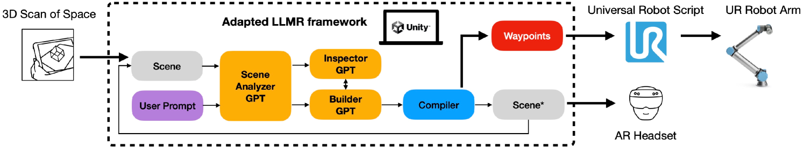
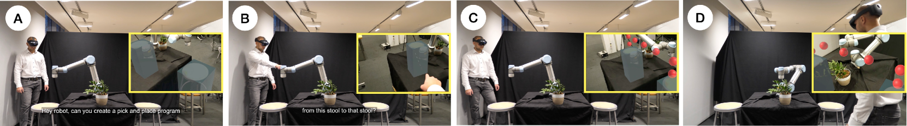
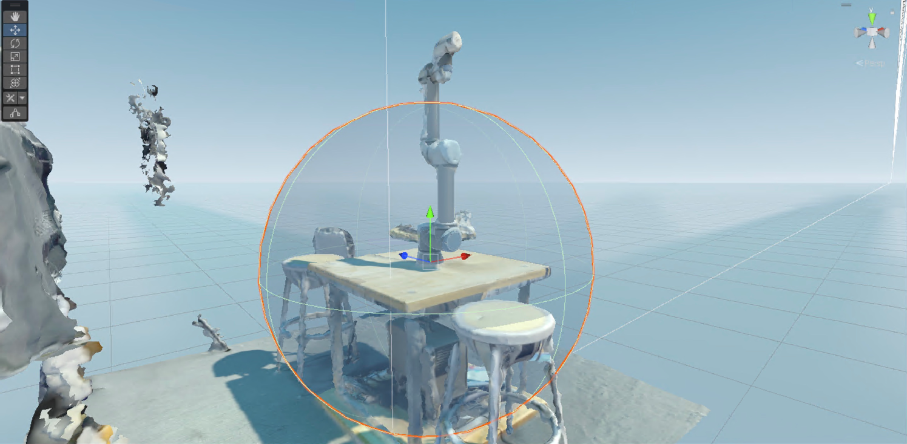
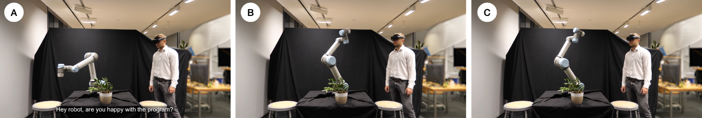

# [借助 LLM 与混合现实技术，我们助力协作机器人轻松生成行进路径点，让其在协同工作中更加智能灵活。](https://arxiv.org/abs/2403.09308)

发布时间：2024年03月14日

`Agent`

`机器人`

``

> Enabling Waypoint Generation for Collaborative Robots using LLMs and Mixed Reality

> 为了让非专业人员也能轻松操控机器人，我们设计了一个创新框架，它允许用户以自然语言直接与机器人交互，无需精通特定编程语言或深入理解机器人物理约束。该框架运用大型语言模型（LLM）智能解析指令、理解操作环境及生成运动路径，并结合增强现实（AR）技术直观呈现规划动作效果。我们通过在真实机器人上演示一个简易的抓取和放置任务，验证了该框架的强大效能。同时，我们也提出了一个初期概念——赋予机器人表达能力和自学习技能（如物体抓取），以促进更高效的用户互动与技能传授。

> Programming a robotic is a complex task, as it demands the user to have a good command of specific programming languages and awareness of the robot's physical constraints. We propose a framework that simplifies robot deployment by allowing direct communication using natural language. It uses large language models (LLM) for prompt processing, workspace understanding, and waypoint generation. It also employs Augmented Reality (AR) to provide visual feedback of the planned outcome. We showcase the effectiveness of our framework with a simple pick-and-place task, which we implement on a real robot. Moreover, we present an early concept of expressive robot behavior and skill generation that can be used to communicate with the user and learn new skills (e.g., object grasping).

