# 为提升对自主智能体的信任，我们提出了一种结合区块链技术和大型语言模型的新型架构，旨在实现自主智能体的责任追溯与可解释性。

发布时间：2024年03月14日

`Agent` `自主机器人` `可追溯性与可解释性`

> Enhancing Trust in Autonomous Agents: An Architecture for Accountability and Explainability through Blockchain and Large Language Models

> 随着自主智能体在人类交互环境中的广泛应用，安全顾虑日渐凸显。为此，透彻解析事件背后的缘由成为关键，亟需构建能向非专业人士阐述智能体行为的机制，以提升信任度与安全性，并有效防止意外、失误及误解的发生。同时，这样的解释有助于增进沟通，拉近智能体与用户间的距离，进而优化双方互动效果。本文介绍了一款专为基于ROS的移动机器人设计的可追溯与可解释架构。这套方案主要包括两大组成部分：一是借助区块链技术实现防篡改特性的黑盒式责任追踪模块；二是运用大型语言模型（LLMs）解析前述黑盒内部数据，生成自然语言解释的模块。研究在涵盖了自主导航功能的三个不同情境中对这一解决方案进行了性能测试，并对可追溯性及可解释性各项指标进行了详尽评估。结果显示，无论是在应对真实场景下使用自主智能体所固有的难题时，还是在常规情况下，我们的方法都能有效利用机器人行动产生的可追溯数据，产出连贯、精准且通俗易懂的解释。

> The deployment of autonomous agents in environments involving human interaction has increasingly raised security concerns. Consequently, understanding the circumstances behind an event becomes critical, requiring the development of capabilities to justify their behaviors to non-expert users. Such explanations are essential in enhancing trustworthiness and safety, acting as a preventive measure against failures, errors, and misunderstandings. Additionally, they contribute to improving communication, bridging the gap between the agent and the user, thereby improving the effectiveness of their interactions. This work presents an accountability and explainability architecture implemented for ROS-based mobile robots. The proposed solution consists of two main components. Firstly, a black box-like element to provide accountability, featuring anti-tampering properties achieved through blockchain technology. Secondly, a component in charge of generating natural language explanations by harnessing the capabilities of Large Language Models (LLMs) over the data contained within the previously mentioned black box. The study evaluates the performance of our solution in three different scenarios, each involving autonomous agent navigation functionalities. This evaluation includes a thorough examination of accountability and explainability metrics, demonstrating the effectiveness of our approach in using accountable data from robot actions to obtain coherent, accurate and understandable explanations, even when facing challenges inherent in the use of autonomous agents in real-world scenarios.

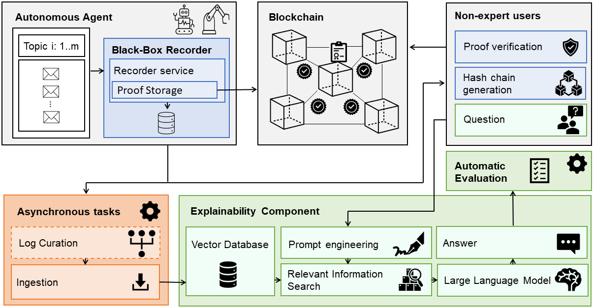

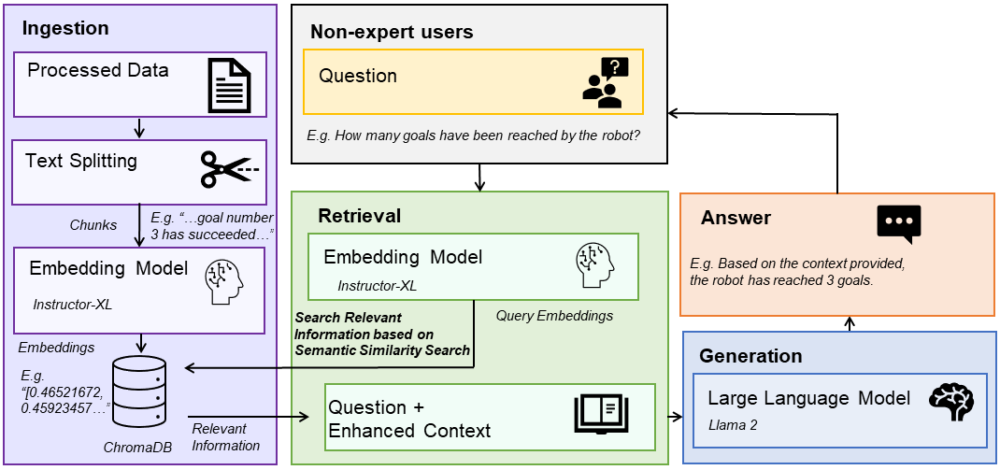

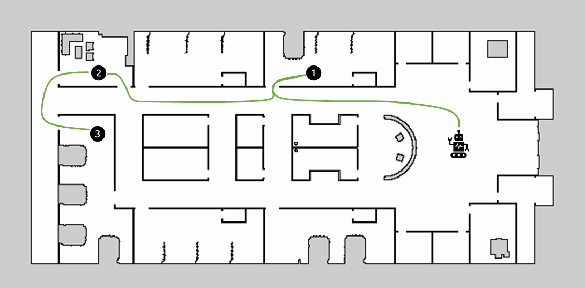

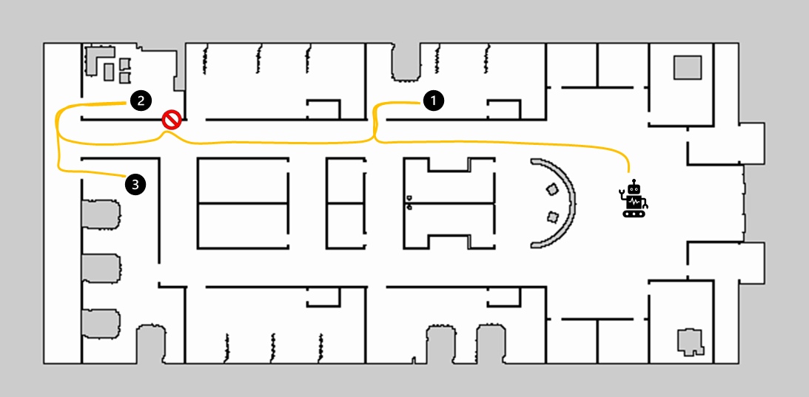

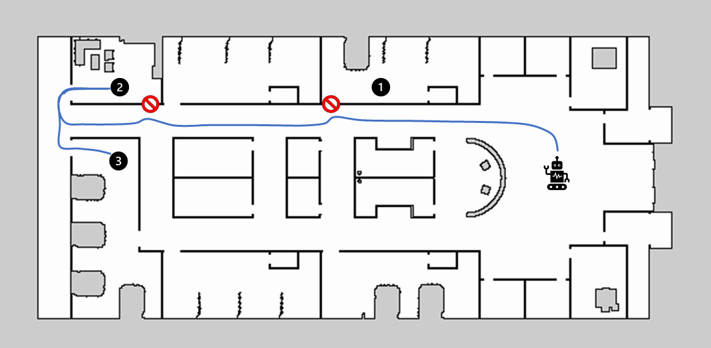

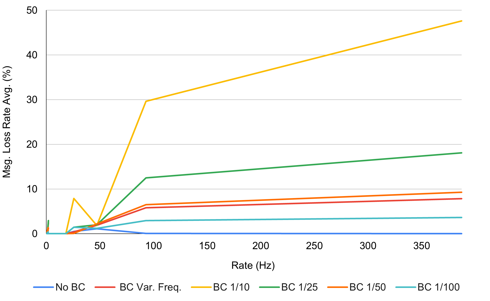

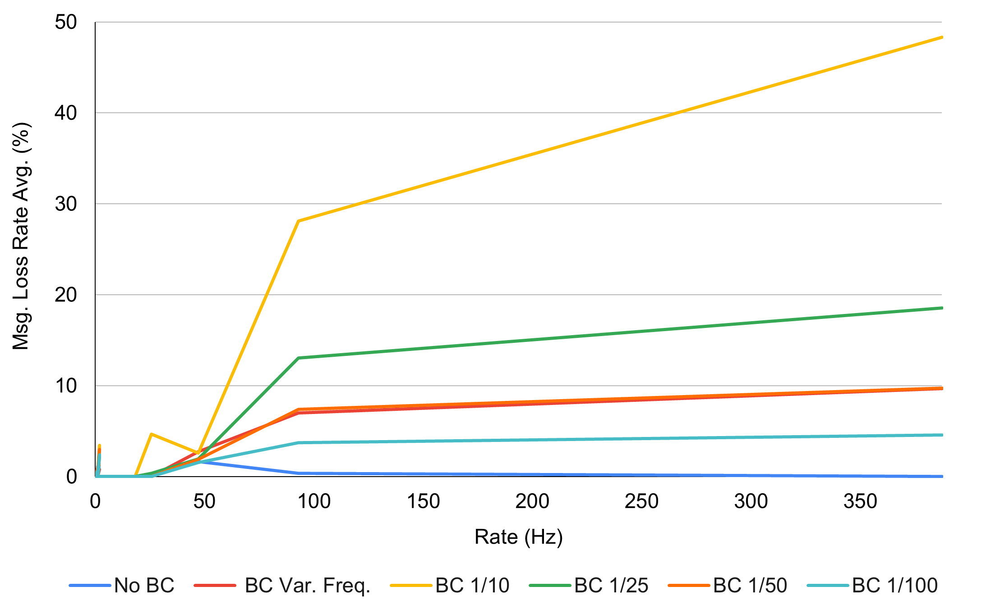

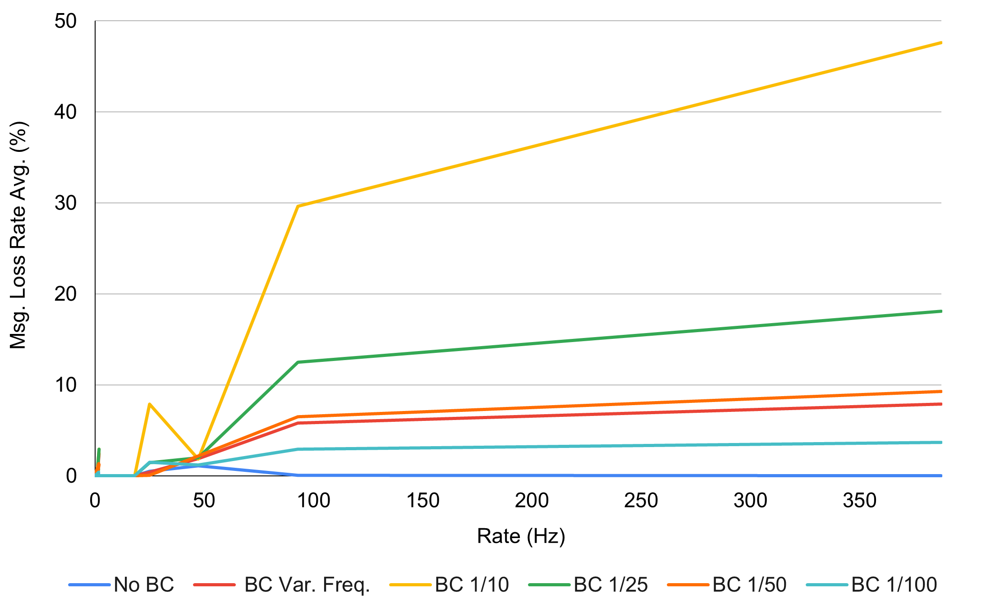

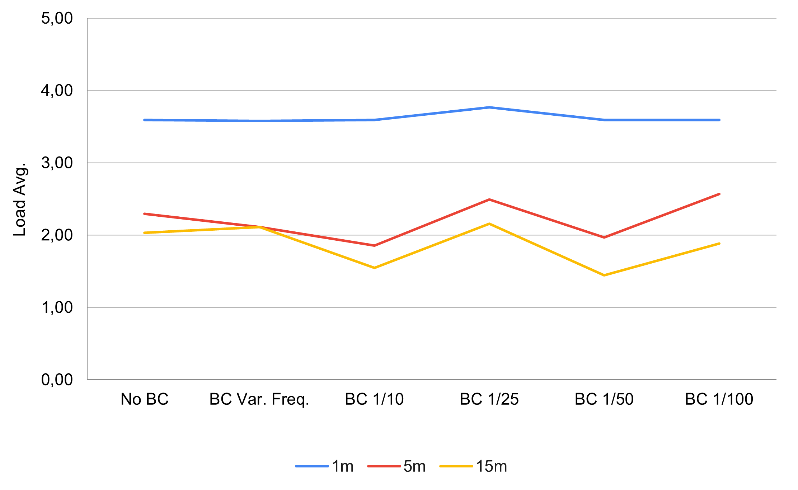

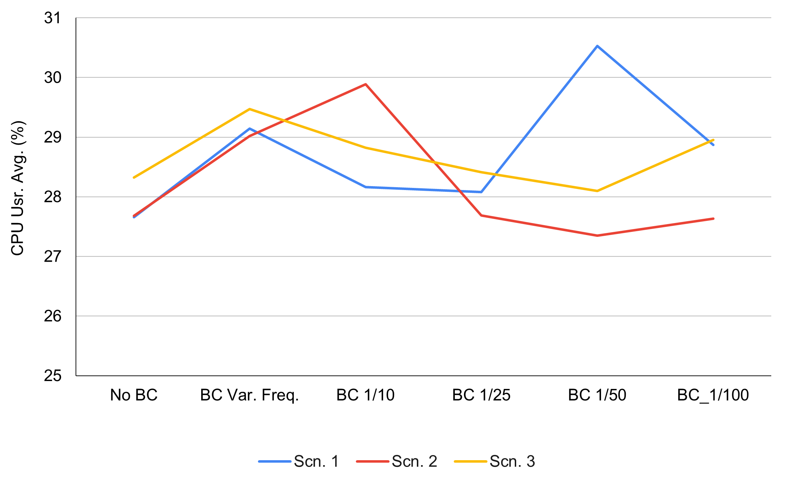

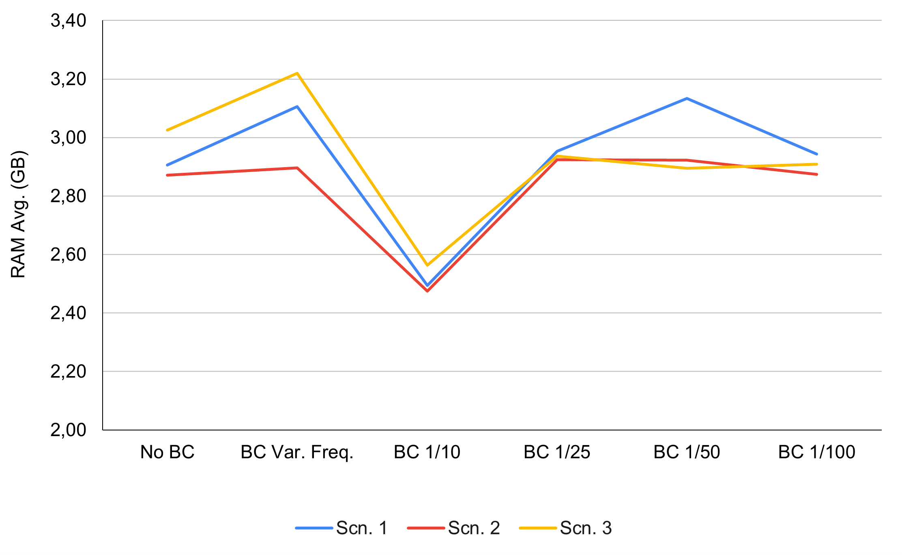

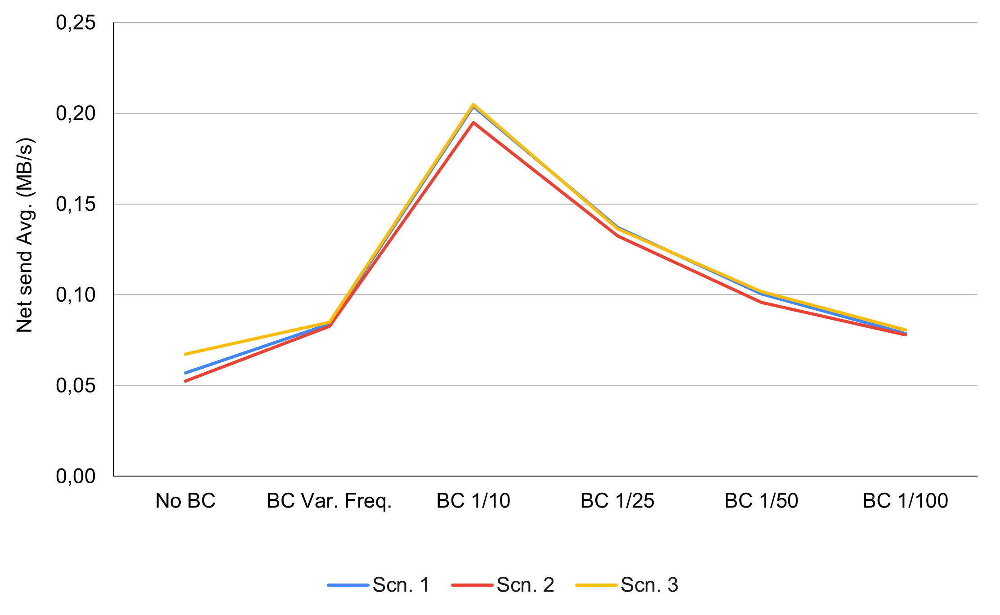

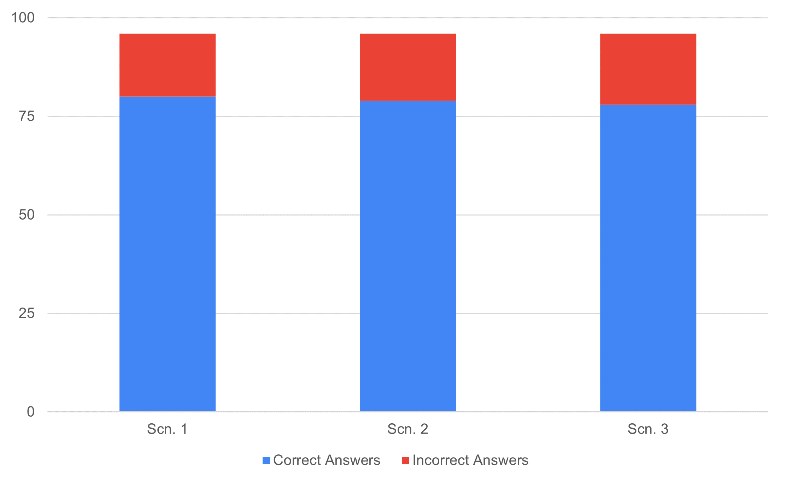

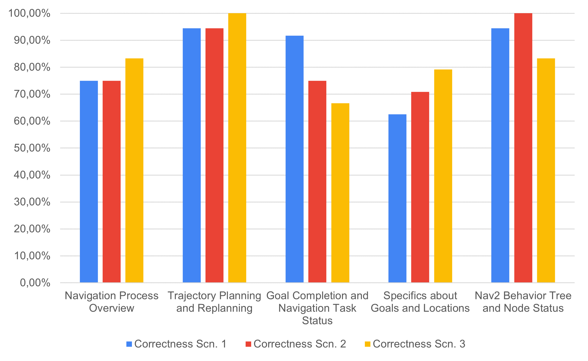

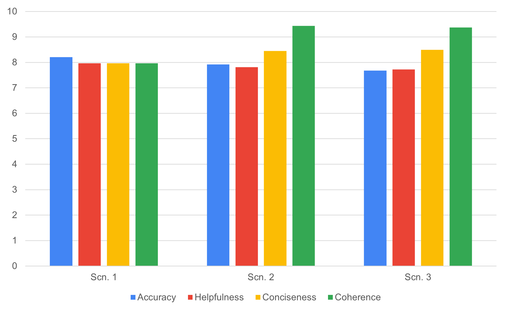

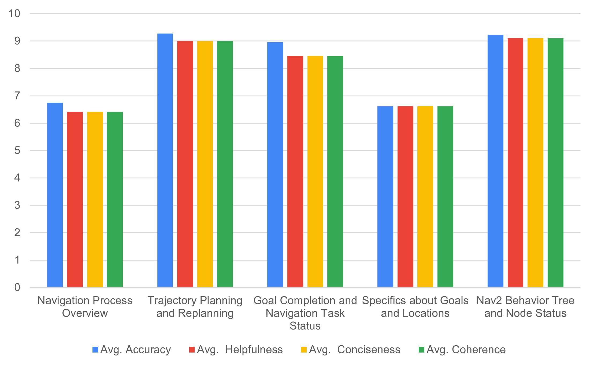

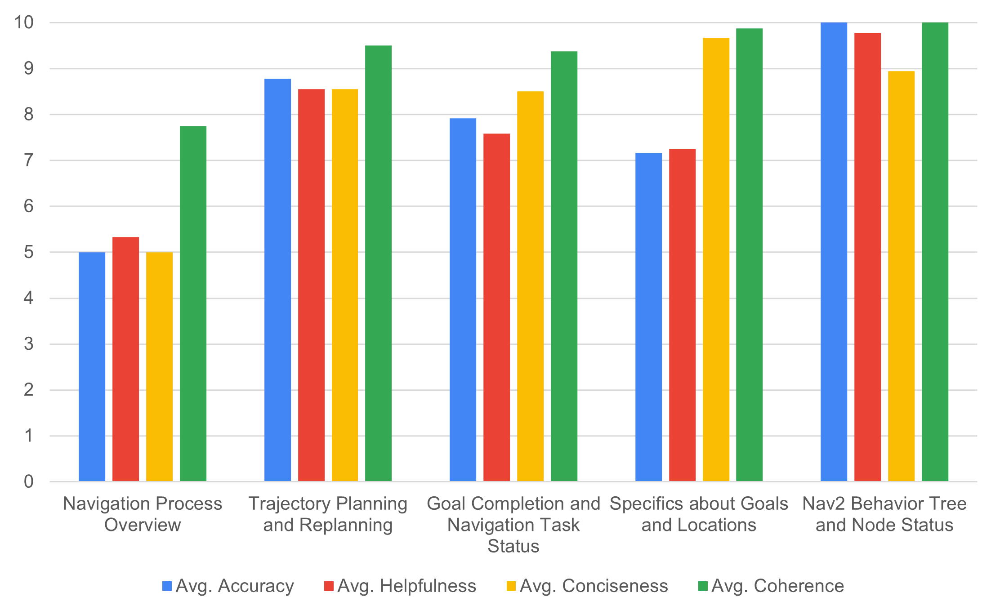

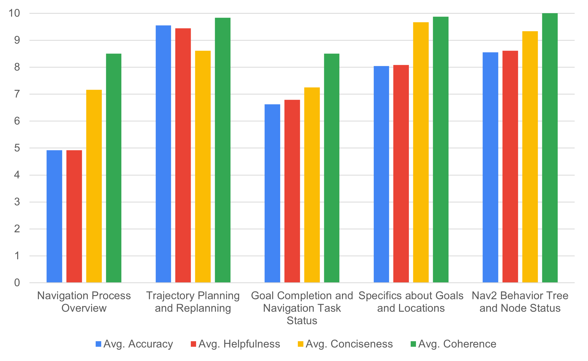

[Arxiv](https://arxiv.org/abs/2403.09567)