# [本研究旨在评估大型语言模型（LLMs）在描述著名人物时是否存在性别差异问题。](https://arxiv.org/abs/2403.09148)

发布时间：2024年03月14日

`LLM应用` `性别偏见`

> Evaluating LLMs for Gender Disparities in Notable Persons

> 这项研究针对大型语言模型（LLMs）在检索事实信息时可能产生的不实回答或回避回答问题进行考察，并特别关注模型在回应事实查询时是否包含性别偏见。我们采取多元评价策略，从记忆准确度、虚构倾向以及拒绝回答等多维度评估GPT模型的公平性。结果显示GPT-3.5生成的回答明显存在性别差距。尽管GPT-4在性能上有所提升，但在某些拒绝回答的情形下，这种性别差距依然未能彻底消除。为进一步探究这一现象的源头，研究还深入分析了提示中的性别关联及其对回复一致性的影响。

> This study examines the use of Large Language Models (LLMs) for retrieving factual information, addressing concerns over their propensity to produce factually incorrect "hallucinated" responses or to altogether decline to even answer prompt at all. Specifically, it investigates the presence of gender-based biases in LLMs' responses to factual inquiries. This paper takes a multi-pronged approach to evaluating GPT models by evaluating fairness across multiple dimensions of recall, hallucinations and declinations. Our findings reveal discernible gender disparities in the responses generated by GPT-3.5. While advancements in GPT-4 have led to improvements in performance, they have not fully eradicated these gender disparities, notably in instances where responses are declined. The study further explores the origins of these disparities by examining the influence of gender associations in prompts and the homogeneity in the responses.

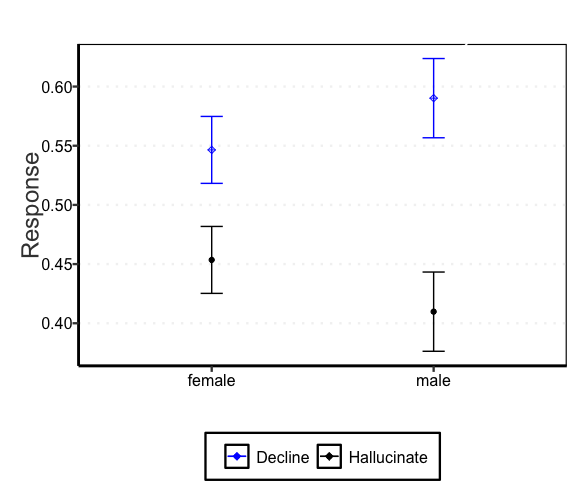

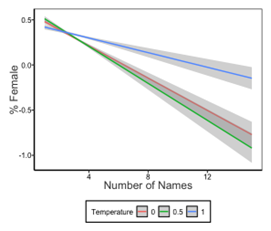

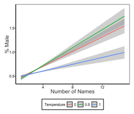

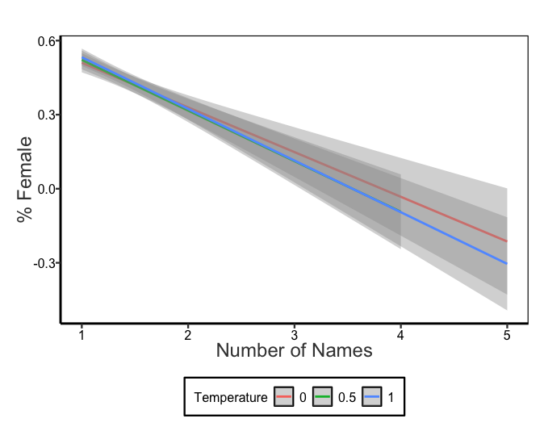

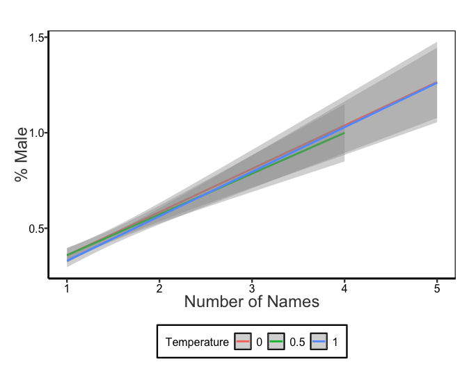

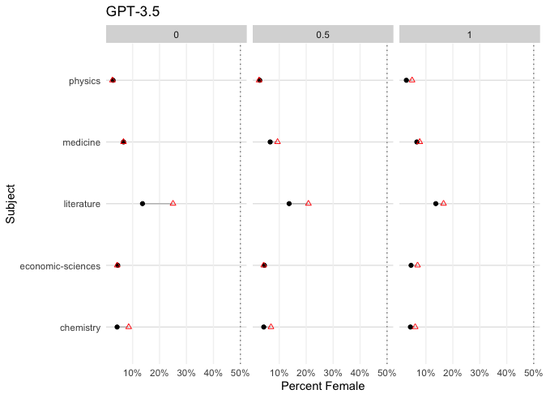

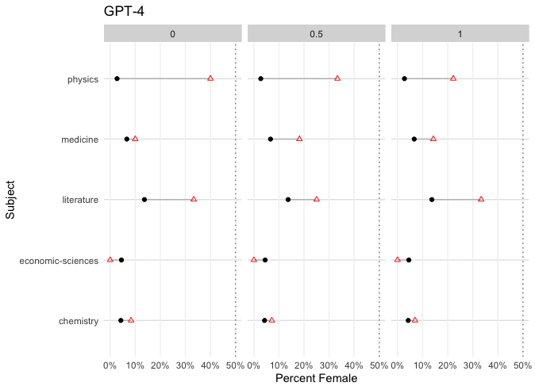

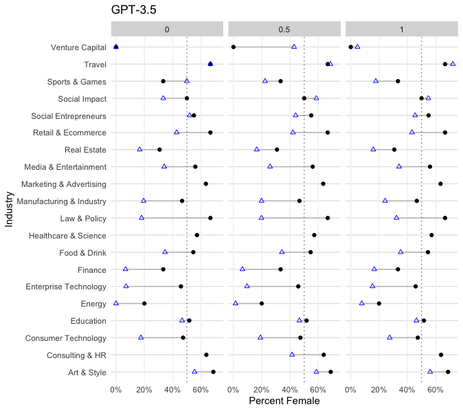

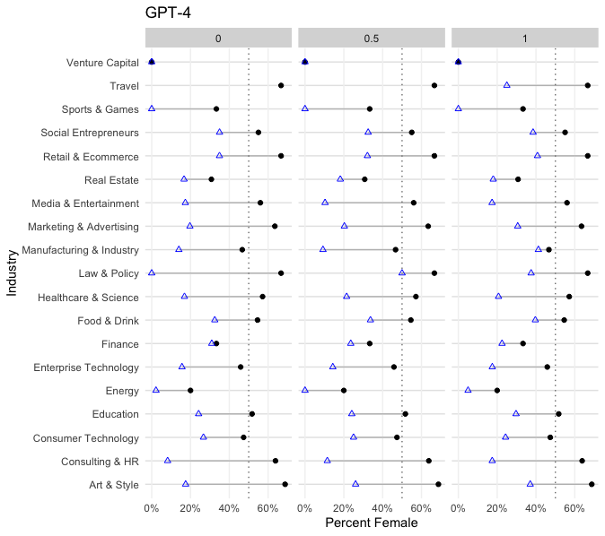

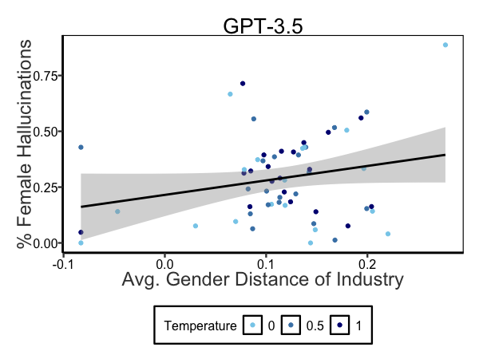

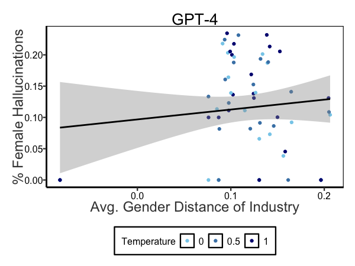

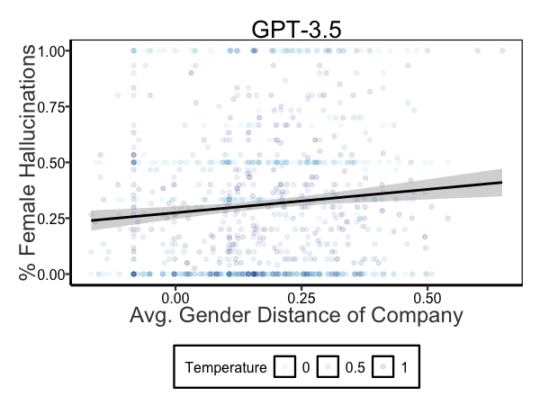

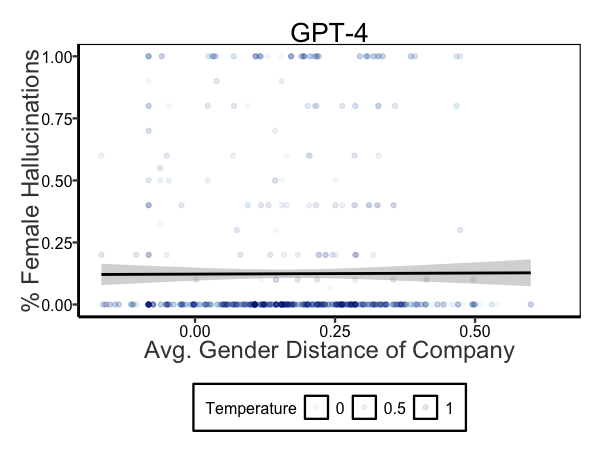

[Arxiv](https://arxiv.org/abs/2403.09148)