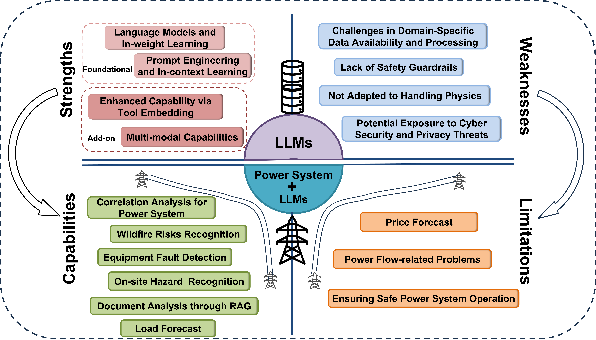
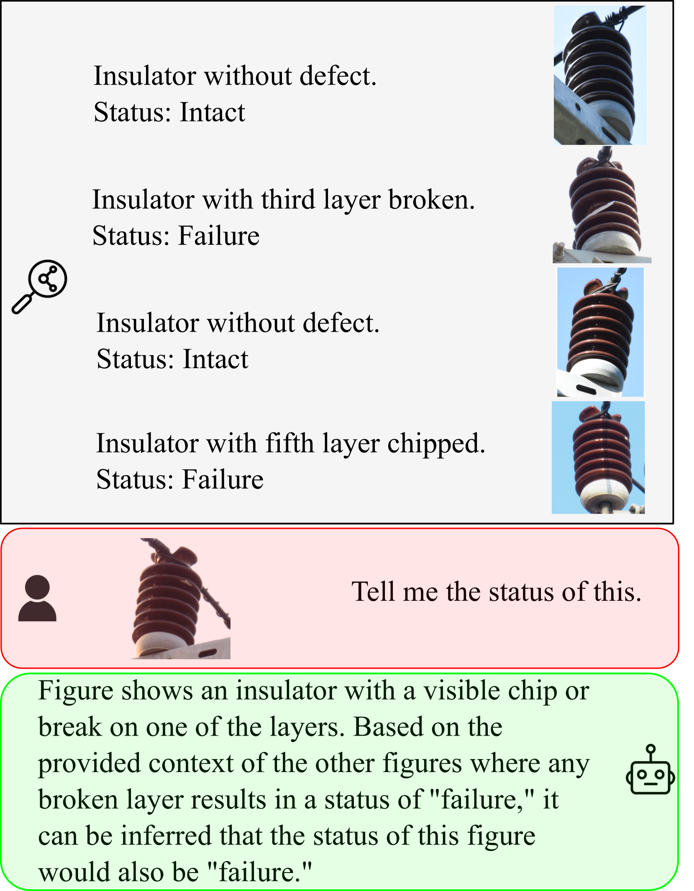
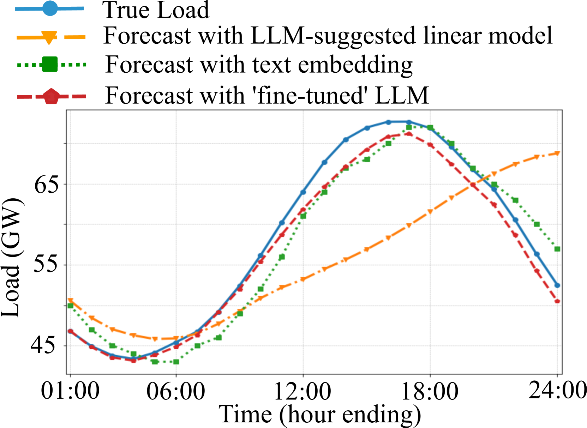
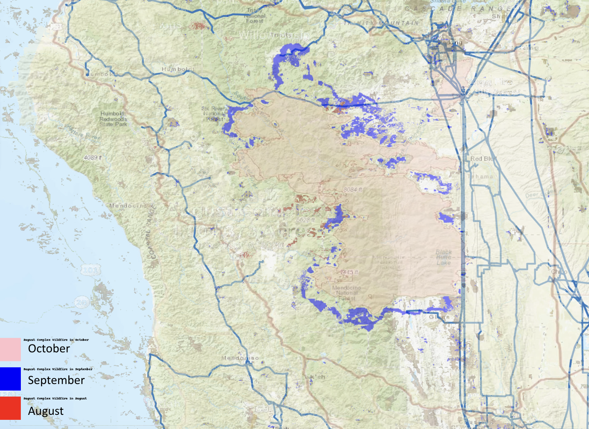

# [本研究致力于深入探讨大型语言模型在电力能源领域的潜力与局限，揭示其在该行业中的实际应用效能。](https://arxiv.org/abs/2403.09125)

发布时间：2024年03月14日

`LLM应用`

`电力能源`

``

> Exploring the Capabilities and Limitations of Large Language Models in the Electric Energy Sector

> LLMs凭借其在自然语言处理和多种任务上的全能表现，化身聊天机器人后引发了广泛关注。尽管各界对广泛应用基于基础模型的人工智能工具有极高期待，但我们亟需探究LLMs在优化电力能源行业运作时的能力界限。本文为此揭示了几个有潜力的研究路径，其中包括构建用于微调LLMs的数据采集体系、将电力系统专业工具融入LLMs内核，以及采用基于RAG的知识池技术来提升LLMs回答问题的质量，尤其是在关乎安全的关键场景应用中对LLMs的改进。

> Large Language Models (LLMs) as chatbots have drawn remarkable attention thanks to their versatile capability in natural language processing as well as in a wide range of tasks. While there has been great enthusiasm towards adopting such foundational model-based artificial intelligence tools in all sectors possible, the capabilities and limitations of such LLMs in improving the operation of the electric energy sector need to be explored, and this article identifies fruitful directions in this regard. Key future research directions include data collection systems for fine-tuning LLMs, embedding power system-specific tools in the LLMs, and retrieval augmented generation (RAG)-based knowledge pool to improve the quality of LLM responses and LLMs in safety-critical use cases.

