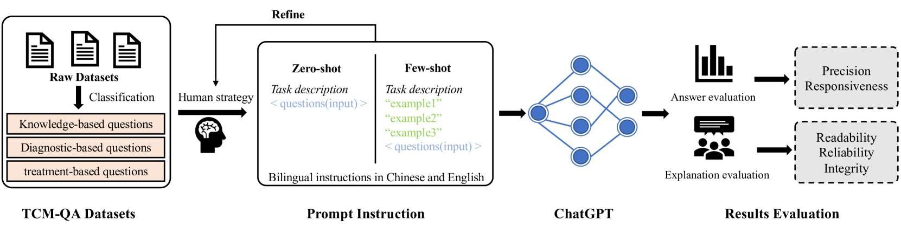
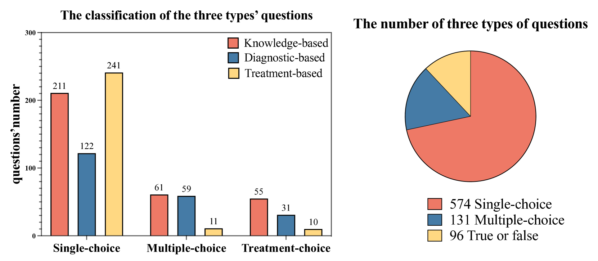
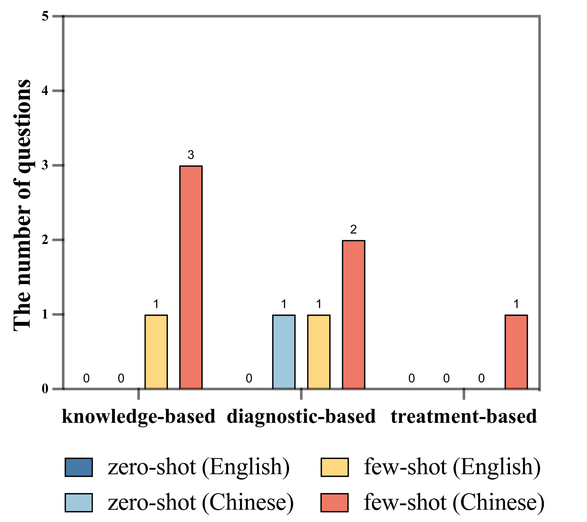
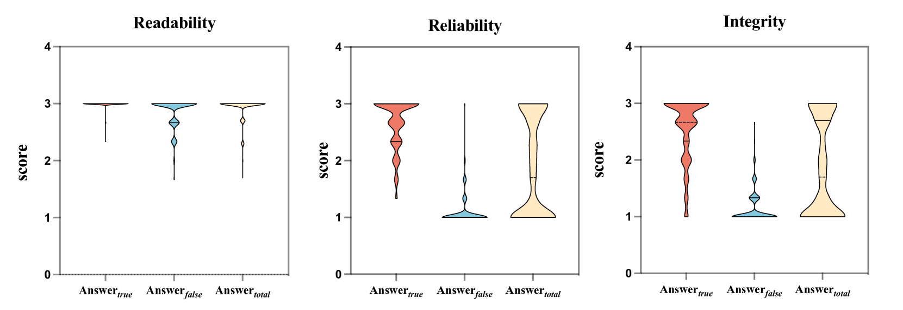
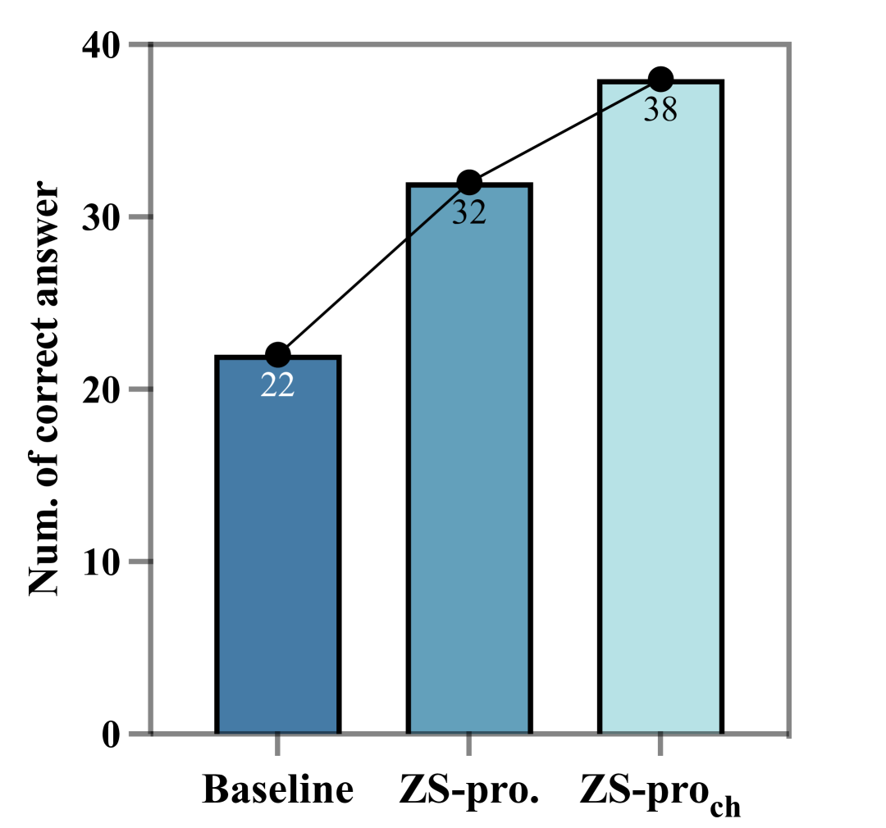

# [本研究致力于探究ChatGPT在理解中医知识方面的表现，深入探索其对于传统中医药学领域知识的掌握和应用能力。](https://arxiv.org/abs/2403.09164)

发布时间：2024年03月14日

`LLM应用` `` `问答系统`

> Exploring the Comprehension of ChatGPT in Traditional Chinese Medicine Knowledge

> 首次将大型语言模型（LLMs）应用于考察中医这一历史悠久且独具特色的医学分支，我们设计了一套名为TCM-QA的问题数据集，包括单选、多选和判断三种题型，旨在测试LLM在中医领域的知识点回忆及深度推理能力。研究过程中，我们在零样本和少量样本两种设定下对比评测了LLM的表现，并同步探讨了英文和中文提示的区别。实验结果显示，ChatGPT在判断题上的表现最为出色，精度高达0.688，但在多选题上的精度仅为0.241。此外，值得注意的是，中文提示相较于英文提示，在此次评估中展现出了更好的效果。同时，我们也深入分析了ChatGPT生成的解释质量及其对深化理解中医知识的可能助益。本文为LLMs在特定领域应用提供了重要启示，并为今后如何运用此类强大模型推进中医研究开辟了新的路径。

> No previous work has studied the performance of Large Language Models (LLMs) in the context of Traditional Chinese Medicine (TCM), an essential and distinct branch of medical knowledge with a rich history. To bridge this gap, we present a TCM question dataset named TCM-QA, which comprises three question types: single choice, multiple choice, and true or false, to examine the LLM's capacity for knowledge recall and comprehensive reasoning within the TCM domain. In our study, we evaluate two settings of the LLM, zero-shot and few-shot settings, while concurrently discussing the differences between English and Chinese prompts. Our results indicate that ChatGPT performs best in true or false questions, achieving the highest precision of 0.688 while scoring the lowest precision is 0.241 in multiple-choice questions. Furthermore, we observed that Chinese prompts outperformed English prompts in our evaluations. Additionally, we assess the quality of explanations generated by ChatGPT and their potential contribution to TCM knowledge comprehension. This paper offers valuable insights into the applicability of LLMs in specialized domains and paves the way for future research in leveraging these powerful models to advance TCM.

[Arxiv](https://arxiv.org/abs/2403.09164)