# [GPT 与量子计算的邂逅：探究 GPT 在量子计算机环境下的表现与应用]

发布时间：2024年03月14日

`LLM应用` `量子计算`

> GPT on a Quantum Computer

> ChatGPT等LLMs革新了人类与AI交互及其潜能的认知方式，而LLMs与新兴QML领域的交融才刚刚崭露头角。本文深入探讨这一前沿交叉领域，详细构建了一个将支撑ChatGPT的核心Transformer架构融入量子计算模式的综合框架。我们匠心独运地设计了一系列实现Transformer关键组件及生成预训练过程量子化版本的量子电路。期望通过量子计算与LLMs的深度融合，开启QML研究的新篇章，推动AI技术不断进化。

> Large Language Models (LLMs) such as ChatGPT have transformed how we interact with and understand the capabilities of Artificial Intelligence (AI). However, the intersection of LLMs with the burgeoning field of Quantum Machine Learning (QML) is only in its nascent stages. This paper presents an exploration of this niche by detailing a comprehensive framework for implementing the foundational Transformer architecture -- integral to ChatGPT -- within a quantum computing paradigm. We meticulously design quantum circuits that implement adapted versions of the transformer's core components and the generative pre-training phase. By integrating quantum computing with LLMs, we aspire to open new avenues for research in QML and contribute to the ongoing evolution of AI technologies.

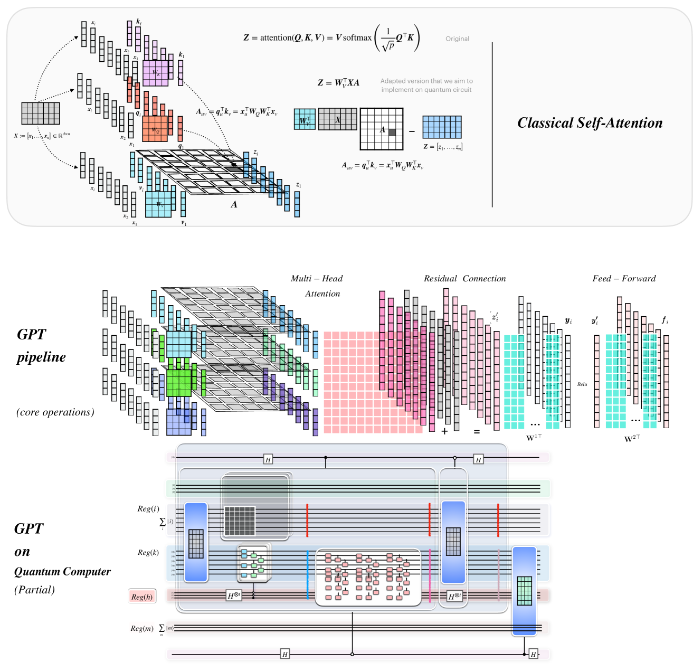

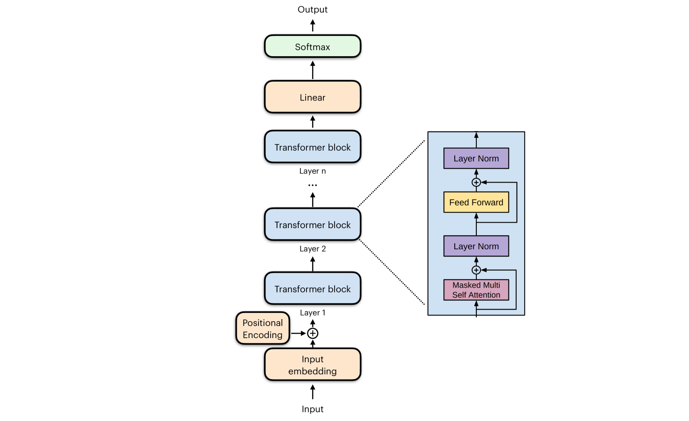

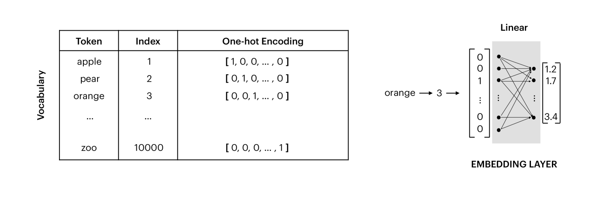

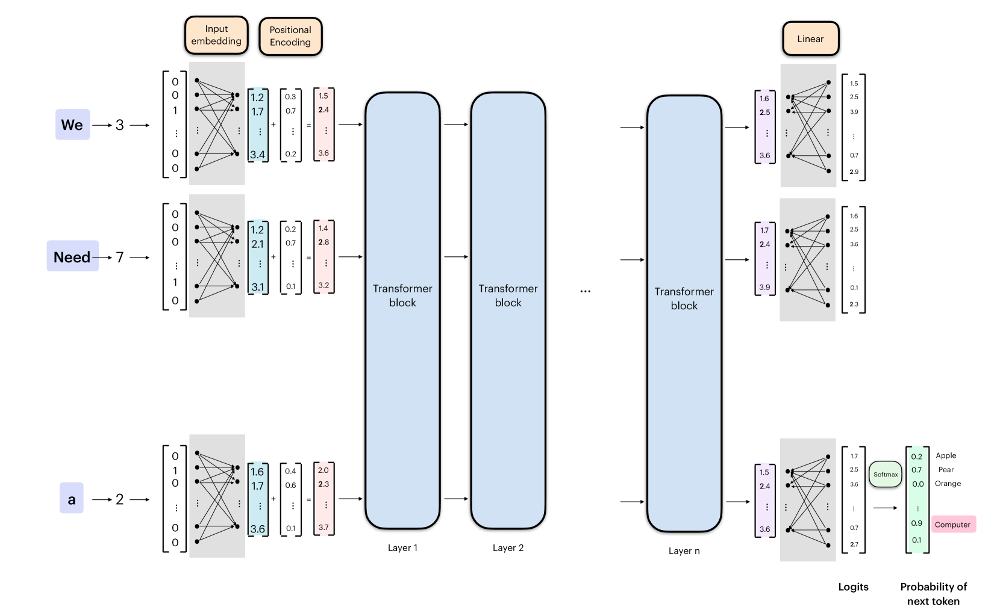

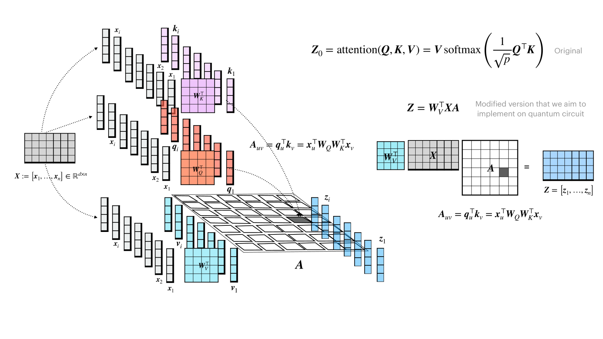

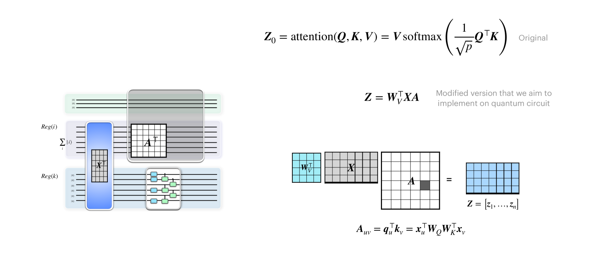

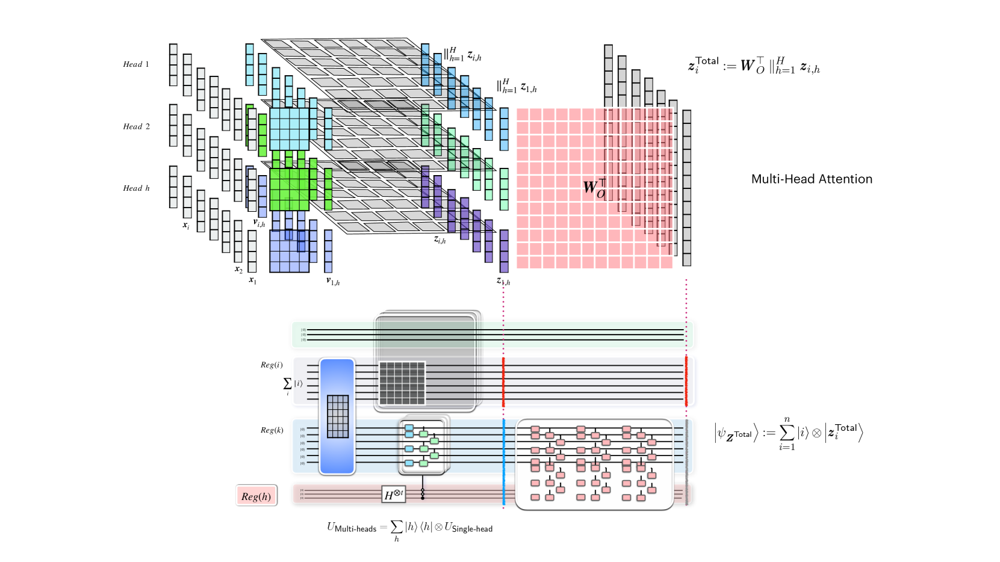

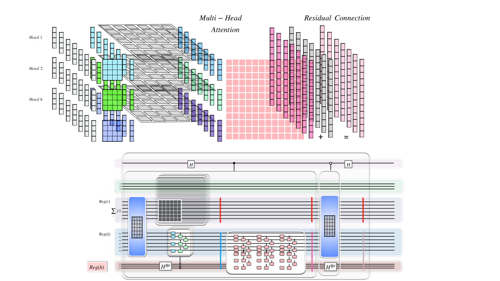

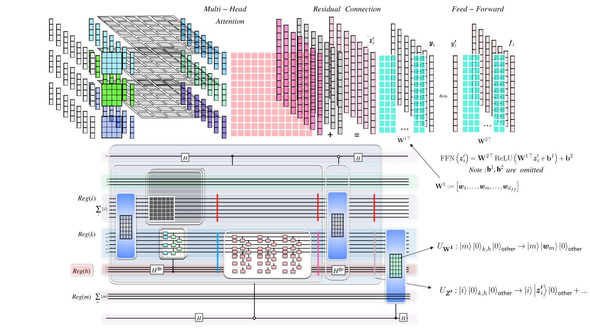

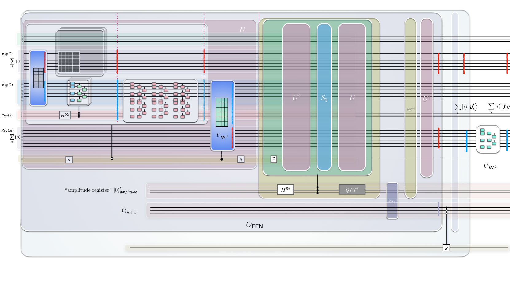

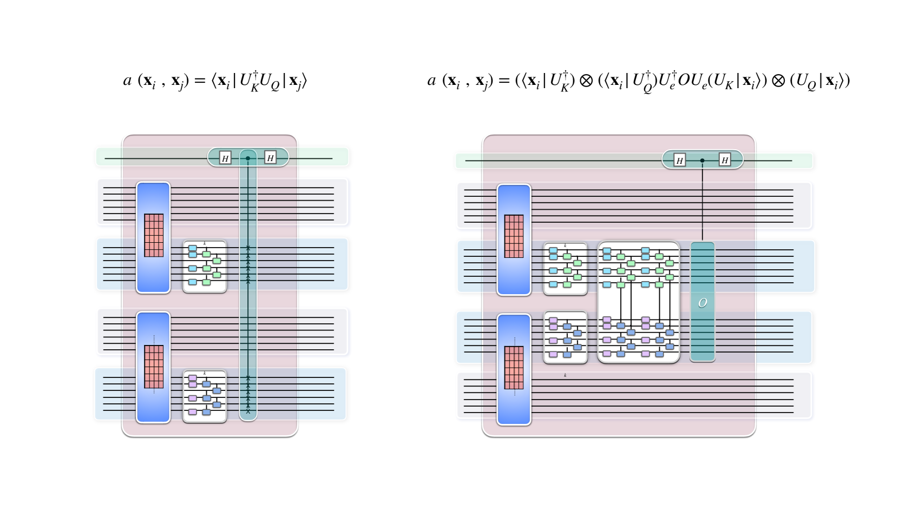

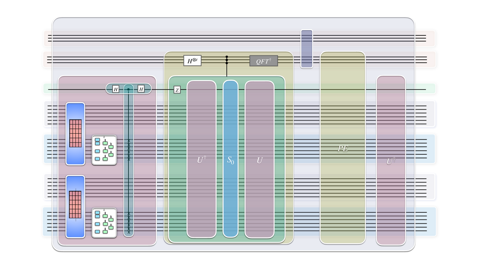

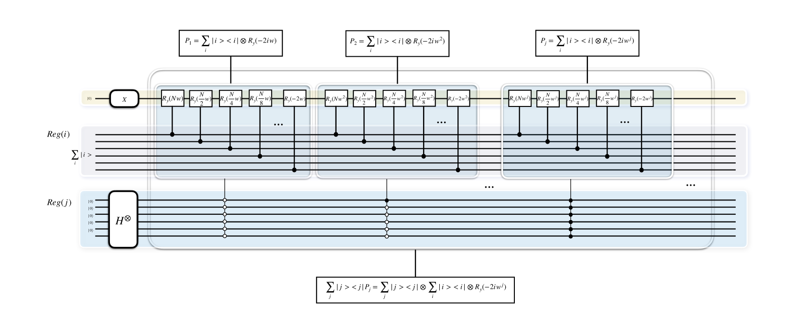

[Arxiv](https://arxiv.org/abs/2403.09418)