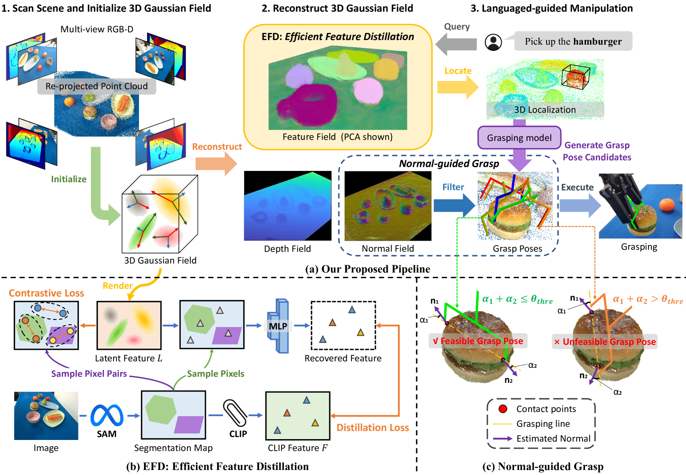
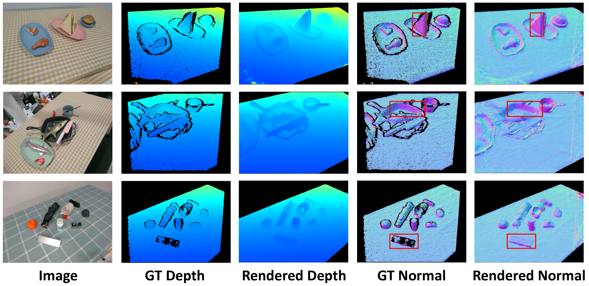
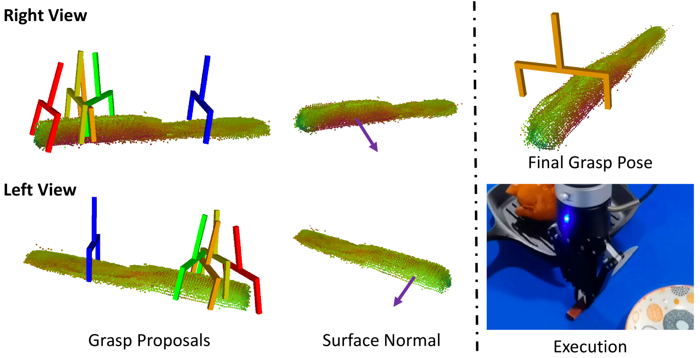
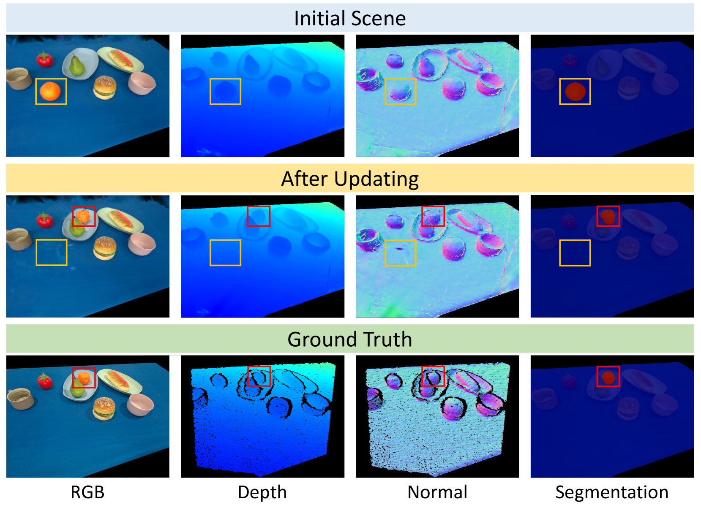

# [GaussianGrasper 是一项创新技术，通过三维语言高斯扩散方法赋予机器人以开放式词汇理解能力，从而实现更灵活精准的物体抓取。]

发布时间：2024年03月14日

`Agent` `机器人`

> GaussianGrasper: 3D Language Gaussian Splatting for Open-vocabulary Robotic Grasping

> 为了实现让机器人根据开放式的语言指令精准操控物体的目标，在机器人学界，构建能响应这类指令的三维场景成为了关键课题。已有研究尝试通过发展嵌入语言信息的隐式场技术来解决这一问题，但类似NeRF这样的隐式场方法受限于其对大量输入视角进行重建的需求及内在推理效率不高的缺陷。为此，我们创新性地推出了GaussianGrasper，它运用3D高斯散射技术，将场景明确地表达为一组高斯基本元素集合。本方法仅需少量RGB-D视图数据，采用分块散射技术构建出特征场。其中亮点在于我们设计的一种高效特征提炼模块——EFD，它借助对比学习高效精确地提炼基础模型产出的语言嵌入。利用重构出的高斯场几何特性，预先训练好的抓取模型可生成安全无碰撞的抓取姿态候选。更进一步，我们提出了一种基于法向引导的抓取策略，用于筛选最佳抓取姿态。经由广泛而深入的实际验证，GaussianGrasper成功赋能机器人依据语言指令精准定位并抓取目标物体，为语言驱动的操作任务提供了崭新的解决方案，相关数据与代码已发布在https://github.com/MrSecant/GaussianGrasper。

> Constructing a 3D scene capable of accommodating open-ended language queries, is a pivotal pursuit, particularly within the domain of robotics. Such technology facilitates robots in executing object manipulations based on human language directives. To tackle this challenge, some research efforts have been dedicated to the development of language-embedded implicit fields. However, implicit fields (e.g. NeRF) encounter limitations due to the necessity of processing a large number of input views for reconstruction, coupled with their inherent inefficiencies in inference. Thus, we present the GaussianGrasper, which utilizes 3D Gaussian Splatting to explicitly represent the scene as a collection of Gaussian primitives. Our approach takes a limited set of RGB-D views and employs a tile-based splatting technique to create a feature field. In particular, we propose an Efficient Feature Distillation (EFD) module that employs contrastive learning to efficiently and accurately distill language embeddings derived from foundational models. With the reconstructed geometry of the Gaussian field, our method enables the pre-trained grasping model to generate collision-free grasp pose candidates. Furthermore, we propose a normal-guided grasp module to select the best grasp pose. Through comprehensive real-world experiments, we demonstrate that GaussianGrasper enables robots to accurately query and grasp objects with language instructions, providing a new solution for language-guided manipulation tasks. Data and codes can be available at https://github.com/MrSecant/GaussianGrasper.

[Arxiv](https://arxiv.org/abs/2403.09637)