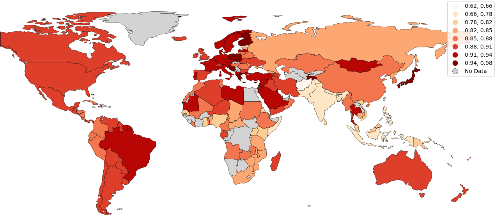

# 基于地理位置的语言识别技术

发布时间：2024年03月14日

`Agent` `语言识别` `社交媒体`

> Geographically-Informed Language Identification

> 本文创新性地研发了一种语言识别技术，其核心思想是让模型根据文本来源地动态调整候选语言集。考虑到大量数字化语料可以按国别定位，我们为此打造了16个区域专属模型，每一种都涵盖了对应区域内各国可能出现的语言，并统一纳入31种全球广泛流通的通用语言，以确保全球各地的语料均能得到有效覆盖。初步评估结果显示，在传统的语言识别测试数据上，f-score 提升幅度从东南亚地区的1.7分至北非地区的10.4分不等。进一步应用社交媒体数据进行下游评估后发现，这一性能增强对大规模真实语料库的语言标注准确性产生了重大积极影响。最终，我们成功构建了一个涵盖916种语言、在50个字符样本条件下表现出色且融合了地理信息的高精度模型。

> This paper develops an approach to language identification in which the set of languages considered by the model depends on the geographic origin of the text in question. Given that many digital corpora can be geo-referenced at the country level, this paper formulates 16 region-specific models, each of which contains the languages expected to appear in countries within that region. These regional models also each include 31 widely-spoken international languages in order to ensure coverage of these linguae francae regardless of location. An upstream evaluation using traditional language identification testing data shows an improvement in f-score ranging from 1.7 points (Southeast Asia) to as much as 10.4 points (North Africa). A downstream evaluation on social media data shows that this improved performance has a significant impact on the language labels which are applied to large real-world corpora. The result is a highly-accurate model that covers 916 languages at a sample size of 50 characters, the performance improved by incorporating geographic information into the model.

[Arxiv](https://arxiv.org/abs/2403.09892)