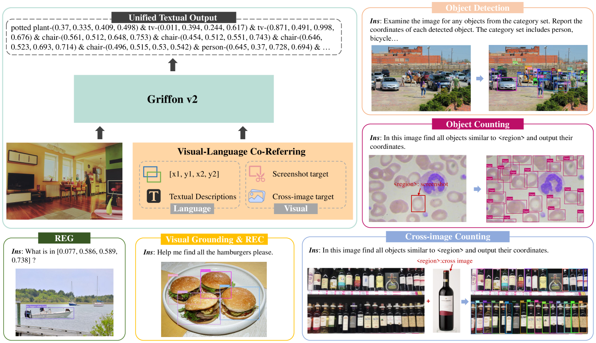
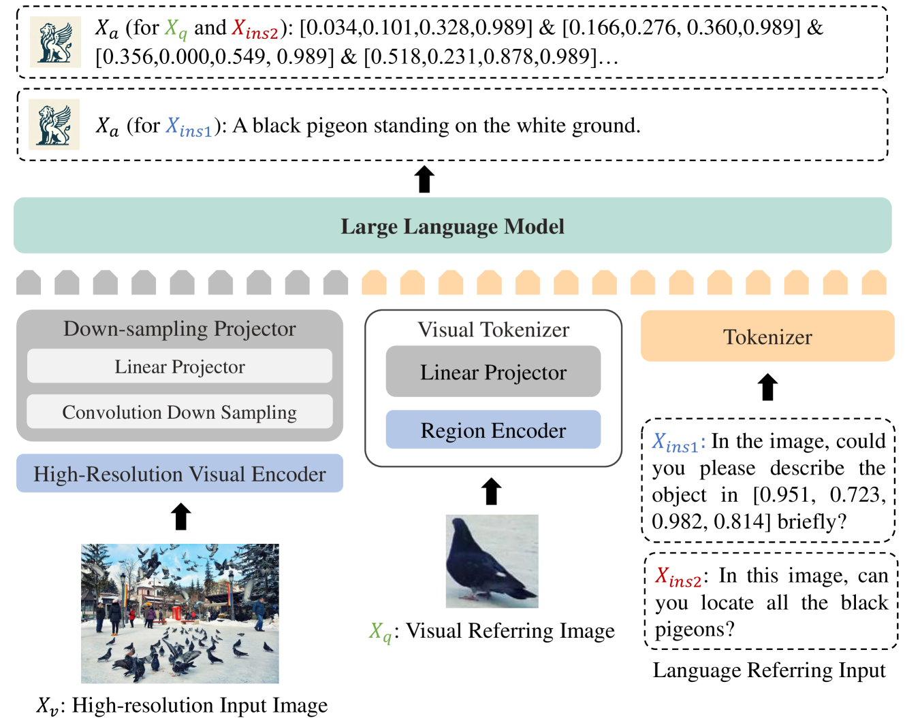
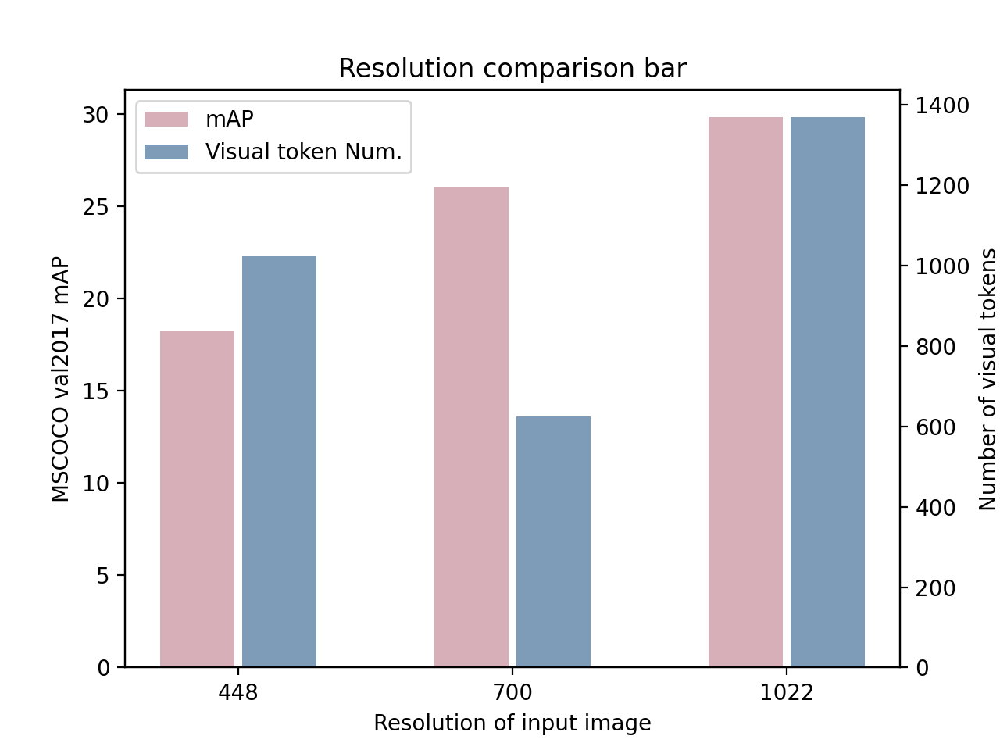
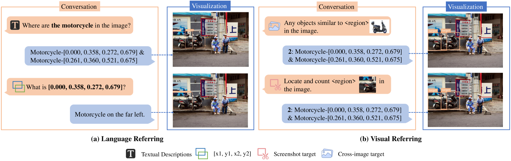

# [Griffon v2 引领进步，利用高分辨率缩放与视觉-语言共指技术提升多模态感知能力]

发布时间：2024年03月14日

`Agent` `GUI界面理解` `目标检测` `物体识别`

> Griffon v2: Advancing Multimodal Perception with High-Resolution Scaling and Visual-Language Co-Referring

> 尽管大型视觉语言模型在捕捉细粒度物体特征上表现出色，但在复杂且密集场景下，受限于图像分辨率，其性能难以超越针对特定任务训练的专家模型。这一瓶颈限制了模型在GUI界面理解、计数等领域的细微视觉及语言表达能力。因此，我们创新提出了Griffon v2——一个统一的高分辨率通才模型，它能借助视觉和文本提示轻松定位各类物体。为了高效提升图像分辨率，我们设计了一款简洁而轻巧的下采样投影器，有效突破大型语言模型对输入令牌数量的限制，同时保持了完整丰富的上下文信息和精细细节，极大地增强了对小物体等的多模态感知性能。在此基础之上，我们还通过一款即插即用的视觉分词器赋能模型进行视觉与语言的协同指代，使之能灵活处理任意目标图像、自由文本甚至是坐标点。实验证明，Griffon v2无论是通过视觉还是文本都能精准定位任意感兴趣对象，并在REC、短语定位和REG任务上刷新纪录，甚至在目标检测和物体计数领域超越了专门的专家模型。相关数据、代码和模型将于<https://github.com/jefferyZhan/Griffon>公开共享。

> Large Vision Language Models have achieved fine-grained object perception, but the limitation of image resolution remains a significant obstacle to surpass the performance of task-specific experts in complex and dense scenarios. Such limitation further restricts the model's potential to achieve nuanced visual and language referring in domains such as GUI Agents, Counting and \etc. To address this issue, we introduce a unified high-resolution generalist model, Griffon v2, enabling flexible object referring with visual and textual prompts. To efficiently scaling up image resolution, we design a simple and lightweight down-sampling projector to overcome the input tokens constraint in Large Language Models. This design inherently preserves the complete contexts and fine details, and significantly improves multimodal perception ability especially for small objects. Building upon this, we further equip the model with visual-language co-referring capabilities through a plug-and-play visual tokenizer. It enables user-friendly interaction with flexible target images, free-form texts and even coordinates. Experiments demonstrate that Griffon v2 can localize any objects of interest with visual and textual referring, achieve state-of-the-art performance on REC, phrase grounding, and REG tasks, and outperform expert models in object detection and object counting. Data, codes and models will be released at https://github.com/jefferyZhan/Griffon.

[Arxiv](https://arxiv.org/abs/2403.09333)