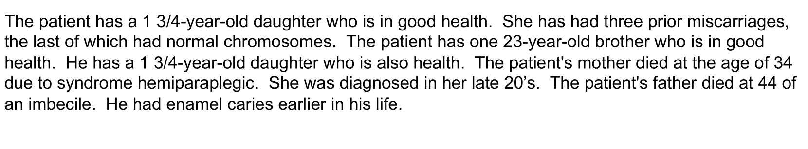
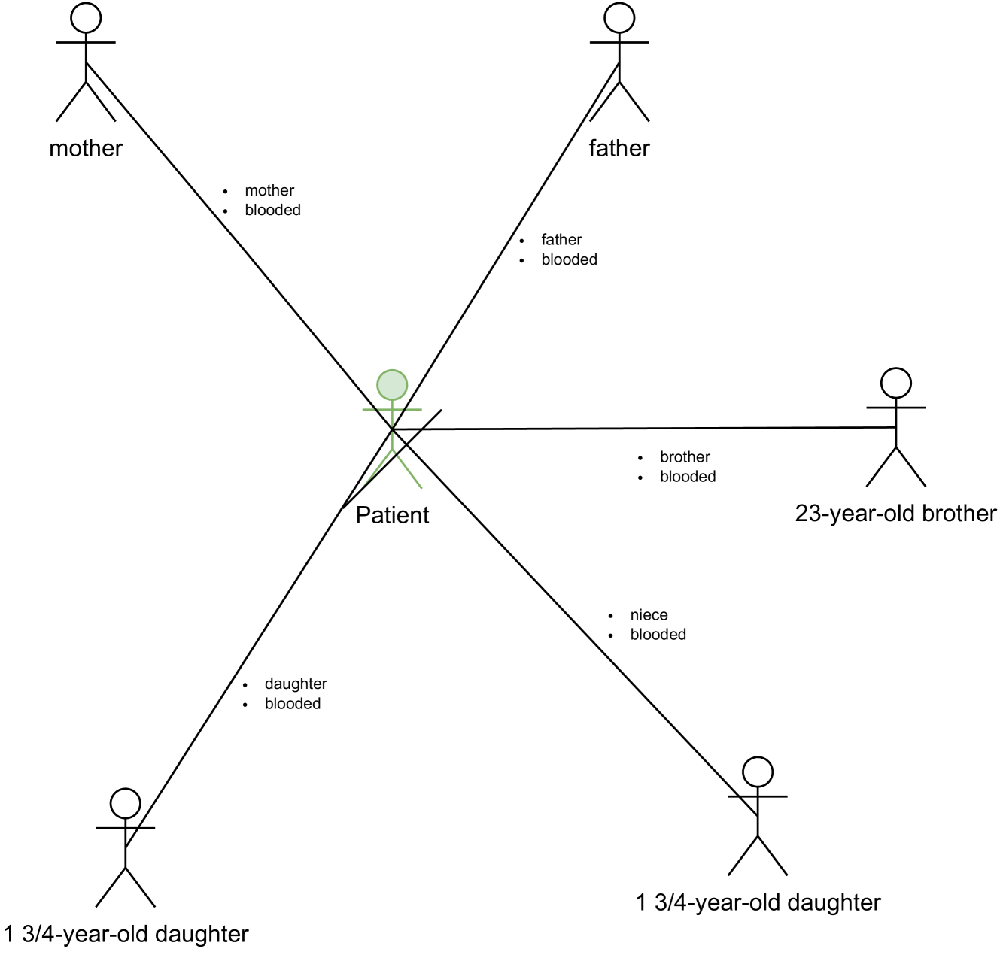

# 本研究针对通过家庭史识别健康风险这一主题，对自然语言处理技术进行了全面梳理和探讨。

发布时间：2024年03月14日

`LLM应用`

> Identifying Health Risks from Family History: A Survey of Natural Language Processing Techniques

# 摘要

> 电子健康记录中蕴含着患者的实时状态与过往病史，其中甚至包括可能具有遗传性的疾病史。这类信息在精准医疗中发挥关键作用，旨在通过预防手段守护大众健康。借助NLP技术和机器学习，可在病情恶化之前识别潜在健康风险，从而挽救生命并节省医疗成本。本文回顾了NLP领域利用数字健康记录识别家族性疾患风险的研究进展，揭示尽管基于规则的方法被广泛探究且仍在活跃使用于家族史抽取，但越来越多的注意力正转向基于大规模预训练语言模型的神经网络模型构建。此外，我们在NLP已有成效的应用领域之外，还指出了在数据采集、任务定义及下游应用场景等方面亟待进一步研究，以便充分挖掘患者病历中的宝贵价值。

> Electronic health records include information on patients' status and medical history, which could cover the history of diseases and disorders that could be hereditary. One important use of family history information is in precision health, where the goal is to keep the population healthy with preventative measures. Natural Language Processing (NLP) and machine learning techniques can assist with identifying information that could assist health professionals in identifying health risks before a condition is developed in their later years, saving lives and reducing healthcare costs.
  We survey the literature on the techniques from the NLP field that have been developed to utilise digital health records to identify risks of familial diseases. We highlight that rule-based methods are heavily investigated and are still actively used for family history extraction. Still, more recent efforts have been put into building neural models based on large-scale pre-trained language models. In addition to the areas where NLP has successfully been utilised, we also identify the areas where more research is needed to unlock the value of patients' records regarding data collection, task formulation and downstream applications.

[Arxiv](https://arxiv.org/abs/2403.09997)