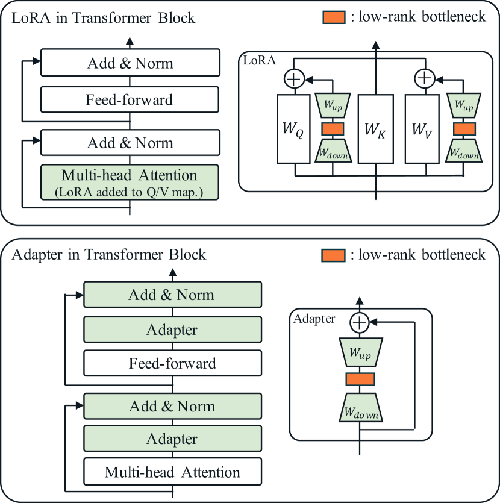
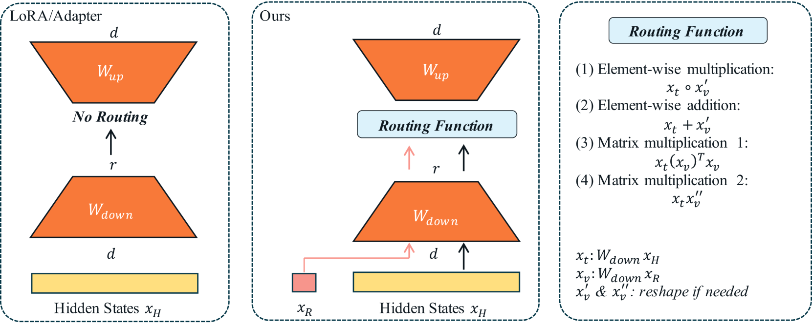
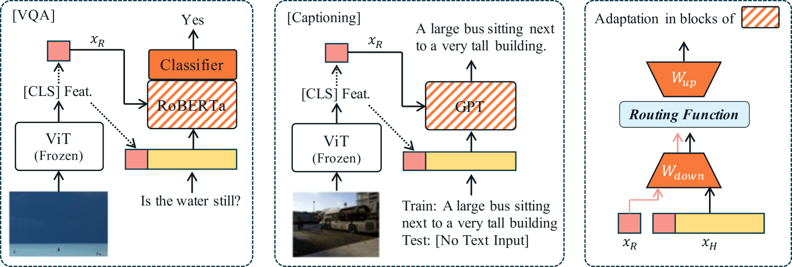
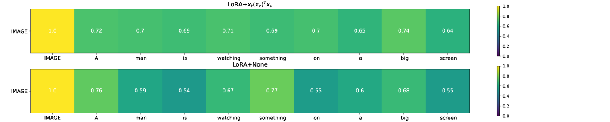
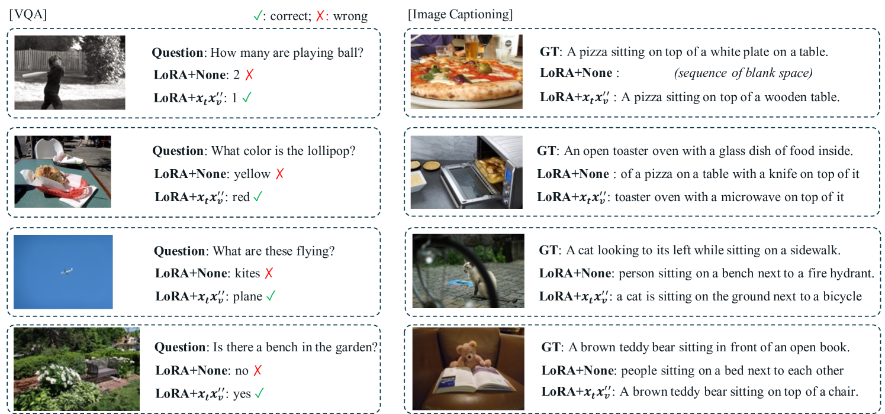
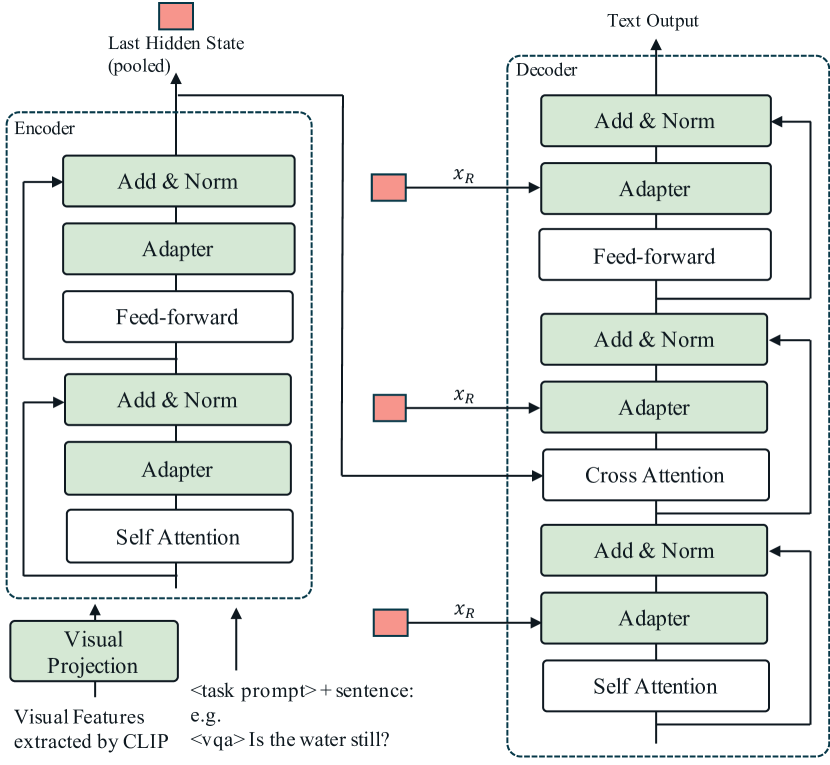
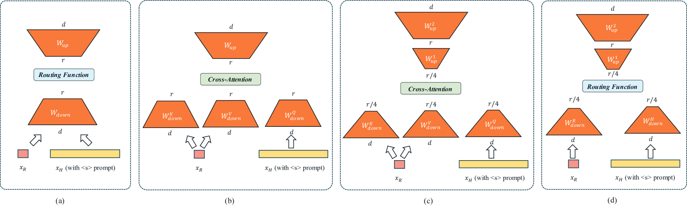
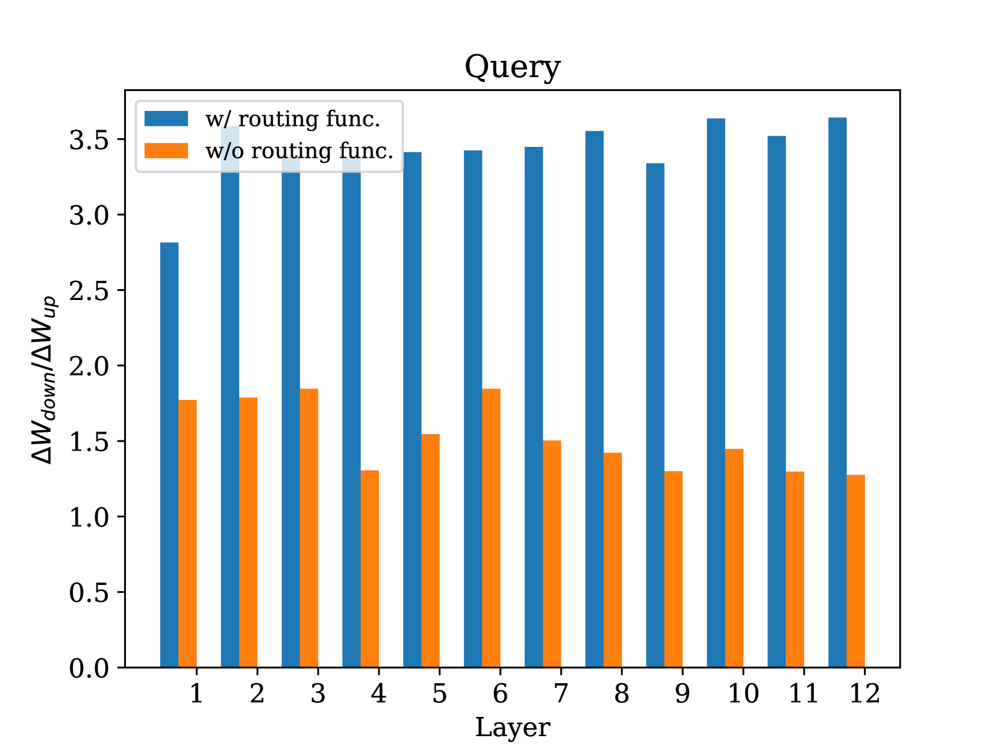
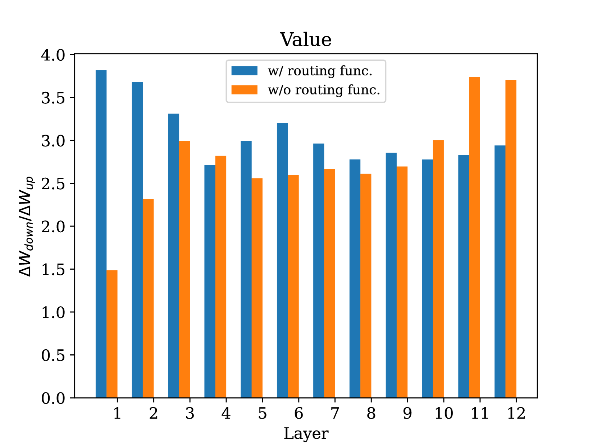

# 为了提升视觉-语言模型的参数效率与微调性能，我们提出在具有低秩瓶颈的视觉-语言模型微调过程中引入路由函数技术。

发布时间：2024年03月14日

`Agent` `跨模态` `视觉-语言` `模型优化`

> Introducing Routing Functions to Vision-Language Parameter-Efficient Fine-Tuning with Low-Rank Bottlenecks

# 摘要

> 当前流行的PEFT技术（例如LoRA或Adapter）会将模型隐藏层压缩至低维空间，让预训练模型借由这一低秩通道快速适应新数据。但在处理像视觉-语言（VL）这类跨模态的PEFT任务时，除了要适应新数据外，还需理解不同模态间的关系。为此，我们特别针对VL PEFT任务设计了一系列名为“路由函数”的操作，它能在低秩通道中强化VL间的匹配效果，且仅运用线性操作，无需新增训练参数。经过深入探究，这些路由函数在各类VL PEFT场景下表现卓越，能够为原PEFT方法带来显著提升，例如在VQAv2任务上（基于$\text{RoBERTa}_{\text{large}}$+ViT-L/16）提高了超过20%的性能，在COCO Captioning任务上（使用GPT2-medium+ViT-L/16）甚至实现了30%以上的提升。此外，在对预训练的多模态模型如CLIP-BART进行微调时，即使幅度较小，路由函数也展现出了在一系列VL PEFT任务上持续稳定的性能改善。

> Mainstream parameter-efficient fine-tuning (PEFT) methods, such as LoRA or Adapter, project a model's hidden states to a lower dimension, allowing pre-trained models to adapt to new data through this low-rank bottleneck. However, PEFT tasks involving multiple modalities, like vision-language (VL) tasks, require not only adaptation to new data but also learning the relationship between different modalities. Targeting at VL PEFT tasks, we propose a family of operations, called routing functions, to enhance VL alignment in the low-rank bottlenecks. The routing functions adopt linear operations and do not introduce new trainable parameters. In-depth analyses are conducted to study their behavior. In various VL PEFT settings, the routing functions significantly improve performance of the original PEFT methods, achieving over 20% improvement on VQAv2 ($\text{RoBERTa}_{\text{large}}$+ViT-L/16) and 30% on COCO Captioning (GPT2-medium+ViT-L/16). Also when fine-tuning a pre-trained multimodal model such as CLIP-BART, we observe smaller but consistent improvements across a range of VL PEFT tasks.

[Arxiv](https://arxiv.org/abs/2403.09377)